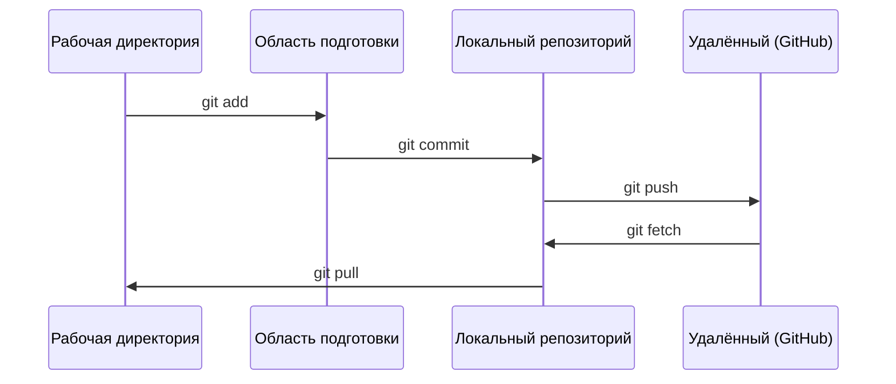

# Git и совместная работа

> Контроль версий — не опция. Каждый эксперимент, каждая модель, каждый урок, который ты здесь создашь, должны отслеживаться.

**Тип:** Теория
**Языки:** --
**Необходимые знания:** Фаза 0, Урок 01
**Время:** ~30 минут

## Цели обучения

- Настроить git-идентификацию и использовать ежедневный рабочий процесс: add, commit, push
- Создавать и сливать ветки для изолированных экспериментов без поломки main
- Написать `.gitignore`, исключающий чекпоинты моделей и большие бинарные файлы
- Ориентироваться в истории коммитов с помощью `git log`, чтобы понимать эволюцию проекта

## Проблема

Тебе предстоит написать сотни файлов кода в 20 фазах. Без контроля версий ты будешь терять работу, ломать то, что нельзя откатить, и не сможешь сотрудничать с другими.

Git — это инструмент. GitHub — место, где живёт код. Этот урок охватывает только то, что нужно для данного курса.

## Концепция



Три вещи, которые нужно запомнить:
1. Сохраняй часто (`git commit`)
2. Отправляй на удалённый сервер (`git push`)
3. Создавай ветки для экспериментов (`git checkout -b experiment`)

## Сборка

### Шаг 1: Настройка git

```bash
git config --global user.name "Твоё Имя"
git config --global user.email "ты@example.com"
```

### Шаг 2: Ежедневный рабочий процесс

```bash
git status
git add file.py
git commit -m "Добавить реализацию персептрона"
git push origin main
```

### Шаг 3: Ветки для экспериментов

```bash
git checkout -b experiment/new-optimizer

# ... вносить изменения, делать коммиты ...

git checkout main
git merge experiment/new-optimizer
```

### Шаг 4: Работа с репозиторием курса

```bash
git clone https://github.com/rohitg00/ai-engineering-from-scratch.git
cd ai-engineering-from-scratch

git checkout -b my-progress
# работать над уроками, коммитить свой код
git push origin my-progress
```

## Применение

Для этого курса тебе нужны именно эти команды:

| Команда | Когда |
|---------|-------|
| `git clone` | Получить репозиторий курса |
| `git add` + `git commit` | Сохранить работу |
| `git push` | Загрузить резервную копию на GitHub |
| `git checkout -b` | Попробовать что-то без поломки main |
| `git log --oneline` | Посмотреть, что было сделано |

Всё. Rebase, cherry-pick и submodules для этого курса не нужны.

## Упражнения

1. Склонируй этот репозиторий, создай ветку `my-progress`, создай файл, закоммить его, отправь на сервер
2. Создай `.gitignore`, исключающий файлы чекпоинтов моделей (`.pt`, `.pth`, `.safetensors`)
3. Посмотри историю коммитов этого репозитория с помощью `git log --oneline` и прочитай, как добавлялись уроки

## Ключевые термины

| Термин | Что говорят | Что это на самом деле |
|--------|------------|----------------------|
| Коммит | «Сохранение» | Снимок всего проекта в определённый момент времени |
| Ветка | «Копия» | Указатель на коммит, который движется вперёд по мере работы |
| Слияние | «Объединение кода» | Взятие изменений из одной ветки и применение их к другой |
| Удалённый репозиторий | «Облако» | Копия репозитория, размещённая где-то ещё (GitHub, GitLab) |
