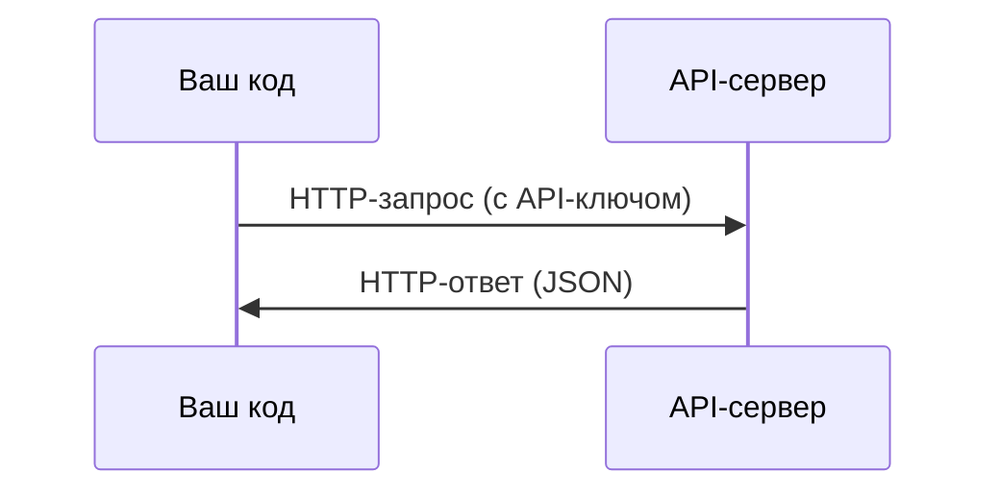

# API и ключи

> Любой AI API работает одинаково: отправляете запрос, получаете ответ. Детали меняются, паттерн — нет.

**Тип:** Практика
**Языки:** Python, TypeScript
**Пререквизиты:** Фаза 0, Урок 01
**Время:** ~30 минут

## Цели обучения

- Безопасно хранить API-ключи через переменные окружения и файлы `.env`
- Сделать вызов LLM API через Python SDK Anthropic и через сырой HTTP
- Сравнить формат запросов/ответов в SDK и raw HTTP для отладки
- Распознавать и обрабатывать частые API-ошибки, включая аутентификацию и rate limits

## Проблема

Начиная с фазы 11, вы будете вызывать LLM API (Anthropic, OpenAI, Google). В фазах 13-16 вы будете строить агентов, которые используют эти API в циклах. Нужно понимать, как работают API-ключи, как безопасно их хранить и как сделать первый API-вызов.

## Концепция



У каждого API-вызова есть:
1. Эндпоинт (URL)
2. API-ключ (аутентификация)
3. Тело запроса (что вы хотите)
4. Тело ответа (что вы получаете)

## Реализация

### Шаг 1: Храните API-ключи безопасно

Никогда не вставляйте API-ключи в код. Используйте переменные окружения.

```bash
export ANTHROPIC_API_KEY="sk-ant-..."
export OPENAI_API_KEY="sk-..."
```

Или используйте файл `.env` (добавьте его в `.gitignore`):

```
ANTHROPIC_API_KEY=sk-ant-...
OPENAI_API_KEY=sk-...
```

### Шаг 2: Первый API-вызов (Python)

```python
import anthropic

client = anthropic.Anthropic()

response = client.messages.create(
    model="claude-sonnet-4-20250514",
    max_tokens=256,
    messages=[{"role": "user", "content": "Что такое нейросеть в одном предложении?"}]
)

print(response.content[0].text)
```

### Шаг 3: Первый API-вызов (TypeScript)

```typescript
import Anthropic from "@anthropic-ai/sdk";

const client = new Anthropic();

const response = await client.messages.create({
  model: "claude-sonnet-4-20250514",
  max_tokens: 256,
  messages: [{ role: "user", content: "Что такое нейросеть в одном предложении?" }],
});

console.log(response.content[0].text);
```

### Шаг 4: Raw HTTP (без SDK)

```python
import os
import urllib.request
import json

url = "https://api.anthropic.com/v1/messages"
headers = {
    "Content-Type": "application/json",
    "x-api-key": os.environ["ANTHROPIC_API_KEY"],
    "anthropic-version": "2023-06-01",
}
body = json.dumps({
    "model": "claude-sonnet-4-20250514",
    "max_tokens": 256,
    "messages": [{"role": "user", "content": "Что такое нейросеть в одном предложении?"}],
}).encode()

req = urllib.request.Request(url, data=body, headers=headers, method="POST")
with urllib.request.urlopen(req) as resp:
    result = json.loads(resp.read())
    print(result["content"][0]["text"])
```

Именно это SDK делают «под капотом». Понимание raw HTTP-вызова помогает при отладке.

## Применение

Для этого курса:

| API | Когда нужен | Бесплатный уровень |
|-----|-------------|--------------------|
| Anthropic (Claude) | Фазы 11-16 (агенты, инструменты) | $5 кредита при регистрации |
| OpenAI | Фаза 11 (сравнение) | $5 кредита при регистрации |
| Hugging Face | Фазы 4-10 (модели, датасеты) | Бесплатно |

Сейчас не нужно настраивать всё сразу. Подключайте по мере требований уроков.

## Результат

Этот урок создаёт:
- `outputs/prompt-api-troubleshooter.md` - диагностика типичных API-ошибок

## Упражнения

1. Получите API-ключ Anthropic и сделайте первый API-вызов
2. Попробуйте версию с raw HTTP и сравните формат ответа с версией через SDK
3. Намеренно используйте неверный API-ключ и прочитайте сообщение об ошибке

## Ключевые термины

| Термин | Что говорят | Что это на самом деле |
|--------|-------------|-----------------------|
| API key | «Пароль для API» | Уникальная строка, которая идентифицирует ваш аккаунт и авторизует запросы |
| Rate limit | «Меня троттлят» | Максимум запросов в минуту/час для защиты от злоупотреблений и справедливого доступа |
| Token | «Слово» (в контексте API) | Единица биллинга: входные и выходные токены считаются и тарифицируются отдельно |
| Streaming | «Ответы в реальном времени» | Получение ответа по частям (слово за словом), а не ожидание полного ответа |
