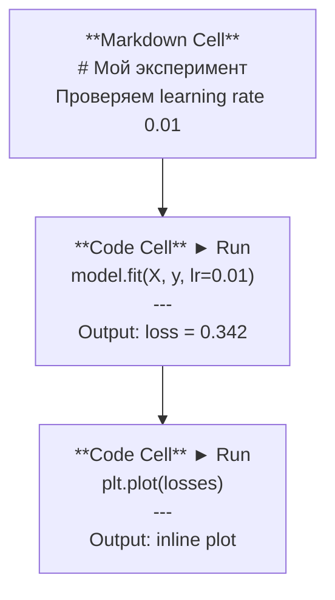
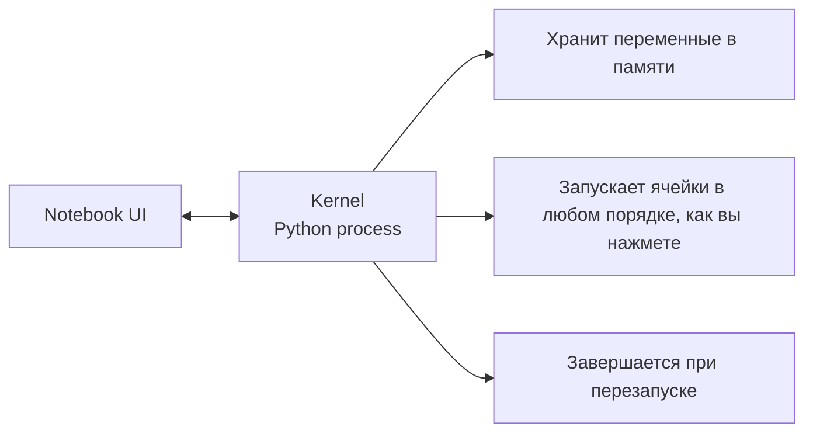

# Jupyter Notebook

> Ноутбуки — это лабораторный стол AI-инженера. Здесь вы прототипируете, а затем переносите рабочее решение в продакшен.

**Тип:** Практика
**Язык:** Python
**Пререквизиты:** Фаза 0, Урок 01
**Время:** ~30 минут

## Цели обучения

- Установить и запустить JupyterLab, Jupyter Notebook или VS Code с расширением Jupyter
- Использовать magic-команды (`%timeit`, `%%time`, `%matplotlib inline`) для бенчмаркинга и inline-визуализации
- Понимать, когда использовать ноутбуки, а когда скрипты, и применять workflow «исследуем в ноутбуках, поставляем в скриптах»
- Распознавать и избегать типичных ловушек ноутбуков: запуск не по порядку, скрытое состояние и утечки памяти

## Проблема

Каждая AI-статья, туториал и соревнование Kaggle используют Jupyter-ноутбуки. Они позволяют запускать код по частям, видеть вывод прямо в документе, смешивать код с пояснениями и быстро итерироваться. Если пытаться изучать AI без ноутбуков, это как делать математику без черновика.

Но у ноутбуков есть реальные ловушки. Люди используют их для всего подряд, включая задачи, для которых они плохо подходят. Понимание, когда нужен ноутбук, а когда скрипт, сбережет вам много нервов при отладке позже.

## Концепция

Ноутбук — это список ячеек. Каждая ячейка содержит либо код, либо текст.



Kernel — это Python-процесс в фоне. Когда вы запускаете ячейку, код отправляется в kernel, тот выполняет его и возвращает результат. Все ячейки используют один и тот же kernel, поэтому переменные сохраняются между ячейками.



Часть про «любой порядок» — и суперсила, и источник проблем.

## Реализация

### Шаг 1: Выберите интерфейс

Три варианта, один формат:

| Интерфейс | Установка | Лучше всего для |
|-----------|-----------|-----------------|
| JupyterLab | `pip install jupyterlab`, затем `jupyter lab` | Полноценный IDE-опыт, вкладки, файловый браузер, терминал |
| Jupyter Notebook | `pip install notebook`, затем `jupyter notebook` | Просто и легко, один ноутбук за раз |
| VS Code | Установить расширение "Jupyter" | Все в одном редакторе, git-интеграция, отладка |

Все три читают и записывают один и тот же файл `.ipynb`. Выбирайте то, что нравится. В AI-практике чаще всего используют JupyterLab.

```bash
pip install jupyterlab
jupyter lab
```

### Шаг 2: Важные горячие клавиши

Есть два режима. Нажмите `Escape` для command mode (синяя полоска слева), `Enter` для edit mode (зеленая полоска).

**Command mode (чаще всего):**

| Клавиша | Действие |
|---------|----------|
| `Shift+Enter` | Запустить ячейку, перейти к следующей |
| `A` | Вставить ячейку выше |
| `B` | Вставить ячейку ниже |
| `DD` | Удалить ячейку |
| `M` | Преобразовать в markdown |
| `Y` | Преобразовать в code |
| `Z` | Отменить операцию с ячейкой |
| `Ctrl+Shift+H` | Показать все шорткаты |

**Edit mode:**

| Клавиша | Действие |
|---------|----------|
| `Tab` | Автодополнение |
| `Shift+Tab` | Показать сигнатуру функции |
| `Ctrl+/` | Переключить комментарий |

`Shift+Enter` вы будете нажимать тысячи раз в день. Освойте его первым.

### Шаг 3: Типы ячеек

**Code cells** выполняют Python-код и показывают результат:

```python
import numpy as np
data = np.random.randn(1000)
data.mean(), data.std()
```

Вывод: `(0.0032, 0.9987)`

**Markdown cells** отображают форматированный текст. Используйте их, чтобы документировать, что и зачем вы делаете. Поддерживаются заголовки, жирный/курсив, LaTeX-формулы (`$E = mc^2$`), таблицы и изображения.

### Шаг 4: Magic-команды

Это не Python. Это специальные команды Jupyter, которые начинаются с `%` (line magic) или `%%` (cell magic).

**Измерение времени кода:**

```python
%timeit np.random.randn(10000)
```

Вывод: `45.2 us +/- 1.3 us per loop`

```python
%%time
model.fit(X_train, y_train, epochs=10)
```

Вывод: `Wall time: 2.34 s`

`%timeit` запускает код много раз и усредняет результат. `%%time` запускает один раз. Используйте `%timeit` для микробенчмарков, `%%time` для тренировочных прогонов.

**Включить inline-графики:**

```python
%matplotlib inline
```

Теперь каждый `plt.plot()` или `plt.show()` рендерится прямо в ноутбуке.

**Устанавливать пакеты, не выходя из ноутбука:**

```python
!pip install scikit-learn
```

Префикс `!` запускает любую shell-команду.

**Проверять переменные окружения:**

```python
%env CUDA_VISIBLE_DEVICES
```

### Шаг 5: Богатый inline-вывод

Ноутбуки автоматически показывают последнее выражение в ячейке. Но вы можете это контролировать:

```python
import pandas as pd

df = pd.DataFrame({
    "model": ["Linear", "Random Forest", "Neural Net"],
    "accuracy": [0.72, 0.89, 0.94],
    "training_time": [0.1, 2.3, 45.6]
})
df
```

Это даст форматированную HTML-таблицу, а не текстовую «простыню». То же с графиками:

```python
import matplotlib.pyplot as plt

plt.figure(figsize=(8, 4))
plt.plot([1, 2, 3, 4], [1, 4, 2, 3])
plt.title("Inline Plot")
plt.show()
```

График появится прямо под ячейкой. Поэтому ноутбуки так популярны в AI: вы видите данные, график и код вместе.

Для изображений:

```python
from IPython.display import Image, display
display(Image(filename="architecture.png"))
```

### Шаг 6: Google Colab

Colab — это бесплатный Jupyter-ноутбук в облаке. Он дает GPU, предустановленные библиотеки и интеграцию с Google Drive. Настройка не нужна.

1. Откройте [colab.research.google.com](https://colab.research.google.com)
2. Загрузите любой `.ipynb` из этого курса
3. Runtime > Change runtime type > T4 GPU (бесплатно)

Чем Colab отличается от локального Jupyter:
- Файлы не сохраняются между сессиями (сохраняйте в Drive или скачивайте)
- Предустановлены: numpy, pandas, matplotlib, torch, tensorflow, sklearn
- `from google.colab import files` для загрузки/скачивания файлов
- `from google.colab import drive; drive.mount('/content/drive')` для постоянного хранения
- Сессии завершаются после 90 минут неактивности (free tier)

## Применение

### Ноутбуки vs скрипты: что когда использовать

| Используйте ноутбуки для | Используйте скрипты для |
|--------------------------|-------------------------|
| Исследования датасета | Тренировочных пайплайнов |
| Прототипирования модели | Переиспользуемых утилит |
| Визуализации результатов | Всего, где есть `if __name__` |
| Пояснения вашей работы | Кода, который запускается по расписанию |
| Быстрых экспериментов | Продакшен-кода |
| Упражнений курса | Пакетов и библиотек |

Правило: **исследуем в ноутбуках, поставляем в скриптах**.

Частый workflow в AI:
1. Исследуете данные в ноутбуке
2. Прототипируете модель в ноутбуке
3. Когда всё работает, переносите код в `.py` файлы
4. Импортируете эти `.py` файлы обратно в ноутбук для дальнейших экспериментов

### Частые ловушки

**Запуск не по порядку.** Вы запускаете ячейку 5, потом 2, потом 7. У вас всё работает, а у другого человека при запуске сверху вниз ломается. Решение: Kernel > Restart & Run All перед тем как делиться.

**Скрытое состояние.** Вы удалили ячейку, но созданная ею переменная осталась в памяти. Ноутбук выглядит чистым, но зависит от «призрачной» ячейки. Решение: регулярно перезапускайте kernel.

**Утечки памяти.** Загрузили датасет 4 GB, обучили модель, загрузили еще один датасет. Память не освобождается. Решение: `del variable_name` и `gc.collect()`, либо перезапуск kernel.

## Результат

Этот урок создает:
- `outputs/prompt-notebook-helper.md` для отладки проблем с ноутбуками

## Упражнения

1. Откройте JupyterLab, создайте ноутбук и с помощью `%timeit` сравните list comprehension и numpy при создании массива из 100 000 случайных чисел
2. Создайте ноутбук с markdown- и code-ячейками: загрузите CSV, покажите dataframe и постройте график. Затем запустите Kernel > Restart & Run All, чтобы проверить выполнение сверху вниз
3. Возьмите код из `code/notebook_tips.py`, вставьте его в Colab-ноутбук и запустите на бесплатном GPU

## Ключевые термины

| Термин | Как обычно говорят | Что это на самом деле |
|--------|--------------------|-----------------------|
| Kernel | "Штука, которая запускает мой код" | Отдельный Python-процесс, который выполняет ячейки и хранит переменные в памяти |
| Cell | "Блок кода" | Независимая выполняемая единица в ноутбуке: код или markdown |
| Magic command | "Jupyter-фишки" | Специальные команды с префиксом `%` или `%%`, управляющие окружением ноутбука |
| `.ipynb` | "Файл ноутбука" | JSON-файл с ячейками, выводами и метаданными. Расшифровывается как IPython Notebook |

## Дополнительно

- [JupyterLab Docs](https://jupyterlab.readthedocs.io/) для полного набора возможностей
- [Google Colab FAQ](https://research.google.com/colaboratory/faq.html) для ограничений и особенностей Colab
- [28 Jupyter Notebook Tips](https://www.dataquest.io/blog/jupyter-notebook-tips-tricks-shortcuts/) для продвинутых шорткатов
