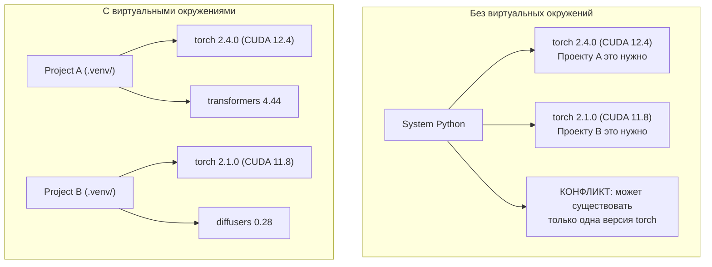

# Python-окружения

> Dependency hell реален. Виртуальные окружения — лекарство.

**Тип:** Практика
**Язык:** Python
**Пререквизиты:** Фаза 0, Урок 01
**Время:** ~30 минут

## Цели обучения

- Создавать изолированные виртуальные окружения с помощью `uv`, `venv` или `conda`
- Писать `pyproject.toml` с опциональными группами зависимостей и генерировать lockfile для воспроизводимости
- Диагностировать и исправлять типичные проблемы: глобальные установки, смешивание pip/conda, несовместимость версий CUDA
- Применять стратегию «окружение на фазу» для проектов с конфликтующими зависимостями

## Проблема

Вы ставите PyTorch 2.4 для проекта с fine-tuning. Через неделю другой проект требует PyTorch 2.1, потому что у него зафиксирована CUDA-сборка. Обновили глобально — сломался первый проект. Откатили — сломался второй.

Это dependency hell. В AI/ML такое случается постоянно, потому что:

- PyTorch, JAX и TensorFlow поставляются со своими CUDA-привязками
- Библиотеки моделей фиксируют конкретные версии фреймворков
- Глобальный `pip install` перезаписывает то, что было установлено до этого
- Сборки под CUDA 11.8 не работают с драйверами CUDA 12.x (и наоборот)

Решение: у каждого проекта должно быть свое изолированное окружение с собственным набором пакетов.

## Концепция



## Реализация

### Вариант 1: uv venv (рекомендуется)

`uv` — самый быстрый менеджер Python-пакетов (в 10-100 раз быстрее pip). Он в одном инструменте управляет виртуальными окружениями, версиями Python и разрешением зависимостей.

```bash
curl -LsSf https://astral.sh/uv/install.sh | sh

uv python install 3.12

cd your-project
uv venv
source .venv/bin/activate
```

Установка пакетов:

```bash
uv pip install torch numpy
```

Создание проекта с `pyproject.toml` за один шаг:

```bash
uv init my-ai-project
cd my-ai-project
uv add torch numpy matplotlib
```

### Вариант 2: venv (встроенный)

Если `uv` поставить нельзя, в Python есть встроенный `venv`:

```bash
python3 -m venv .venv
source .venv/bin/activate  # Linux/macOS
.venv\Scripts\activate     # Windows

pip install torch numpy
```

Медленнее `uv`, но работает везде, где установлен Python.

### Вариант 3: conda (когда это нужно)

Conda управляет не только Python-пакетами, но и системными зависимостями: CUDA toolkits, cuDNN, C-библиотеками. Используйте её, когда:

- Нужна конкретная версия CUDA toolkit без системной установки
- Вы на shared-кластере и не можете ставить системные пакеты
- В инструкции библиотеки прямо написано «use conda»

```bash
# Установите miniconda (не полный Anaconda)
curl -LsSf https://repo.anaconda.com/miniconda/Miniconda3-latest-Linux-x86_64.sh -o miniconda.sh
bash miniconda.sh -b

conda create -n myproject python=3.12
conda activate myproject

conda install pytorch torchvision torchaudio pytorch-cuda=12.4 -c pytorch -c nvidia
```

Одно правило: если используете conda-окружение, ставьте в нем пакеты через conda. Смешивание `pip install` в conda-окружении часто приводит к сложным конфликтам зависимостей.

### Для этого курса: стратегия «по окружению на фазу»

Можно сделать одно окружение на весь курс. Но не стоит. Разным фазам нужны разные (и иногда конфликтующие) зависимости.

Стратегия:

```
ai-engineering-from-scratch/
├── .venv/                    <-- общее легкое окружение для фаз 0-3
├── phases/
│   ├── 04-neural-networks/
│   │   └── .venv/            <-- окружение PyTorch
│   ├── 05-cnns/
│   │   └── .venv/            <-- то же окружение PyTorch (symlink или shared)
│   ├── 08-transformers/
│   │   └── .venv/            <-- может потребоваться другая версия transformers
│   └── 11-llm-apis/
│       └── .venv/            <-- API SDK, torch не нужен
```

Скрипт в `code/env_setup.sh` создает базовое окружение для этого курса.

## Основы pyproject.toml

У каждого Python-проекта должен быть `pyproject.toml`. Он заменяет `setup.py`, `setup.cfg` и `requirements.txt` одним файлом.

```toml
[project]
name = "ai-engineering-from-scratch"
version = "0.1.0"
requires-python = ">=3.11"
dependencies = [
    "numpy>=1.26",
    "matplotlib>=3.8",
    "jupyter>=1.0",
    "scikit-learn>=1.4",
]

[project.optional-dependencies]
torch = ["torch>=2.3", "torchvision>=0.18"]
llm = ["anthropic>=0.39", "openai>=1.50"]
```

Затем установка:

```bash
uv pip install -e ".[torch]"    # базовые + PyTorch
uv pip install -e ".[llm]"      # базовые + LLM SDK
uv pip install -e ".[torch,llm]" # все вместе
```

## Lockfile

Lockfile фиксирует каждую зависимость (включая транзитивные) до точной версии. Это гарантирует воспроизводимость: любой, кто ставит по lockfile, получает ровно тот же набор пакетов.

```bash
# uv генерирует uv.lock автоматически при использовании uv add
uv add numpy

# подход через pip-tools
uv pip compile pyproject.toml -o requirements.lock
uv pip install -r requirements.lock
```

Коммитьте lockfile в git. Тогда при клоне репозитория все получают идентичные версии.

## Частые ошибки

### 1. Глобальная установка

```bash
pip install torch  # BAD: ставит в системный Python

source .venv/bin/activate
pip install torch  # GOOD: ставит в виртуальное окружение
```

Проверьте, куда ставятся пакеты:

```bash
which python       # должен показывать .venv/bin/python, а не /usr/bin/python
which pip          # должен показывать .venv/bin/pip
```

### 2. Смешивание pip и conda

```bash
conda create -n myenv python=3.12
conda activate myenv
conda install pytorch -c pytorch
pip install some-other-package   # BAD: может сломать conda dependency tracking
conda install some-other-package # GOOD: пусть conda управляет всем
```

Если pip внутри conda все же необходим (некоторые пакеты есть только в pip), сначала ставьте все через conda, а pip-пакеты ставьте последними.

### 3. Забыли активировать окружение

```bash
python train.py           # используется системный Python, пакетов нет
source .venv/bin/activate
python train.py           # используется Python проекта, пакеты найдены
```

В prompt shell должно отображаться имя окружения:

```
(.venv) $ python train.py
```

### 4. Коммит .venv в git

```bash
echo ".venv/" >> .gitignore
```

Виртуальные окружения занимают 200MB-2GB. Это локальные файлы, они не переносимы между машинами. Коммитьте `pyproject.toml` и lockfile.

### 5. Несовместимость версий CUDA

```bash
nvidia-smi                # показывает CUDA-версию драйвера (например, 12.4)
python -c "import torch; print(torch.version.cuda)"  # показывает CUDA-версию PyTorch

# Эти версии должны быть совместимы.
# CUDA-версия PyTorch должна быть <= CUDA-версии драйвера.
```

## Применение

Запустите setup-скрипт, чтобы создать окружение курса:

```bash
bash phases/00-setup-and-tooling/06-python-environments/code/env_setup.sh
```

Он создаст `.venv` в корне репозитория с установленными и проверенными базовыми зависимостями.

## Упражнения

1. Запустите `env_setup.sh` и убедитесь, что все проверки проходят
2. Создайте второе виртуальное окружение, установите в нем другую версию numpy и подтвердите, что окружения изолированы
3. Напишите `pyproject.toml` для проекта, где нужен и PyTorch, и Anthropic SDK
4. Специально установите пакет глобально (без активации venv), посмотрите, куда он поставился, затем удалите его

## Ключевые термины

| Термин | Как обычно говорят | Что это на самом деле |
|--------|--------------------|-----------------------|
| Virtual environment | "venv" | Изолированная директория с Python-интерпретатором и пакетами, отдельная от системного Python |
| Lockfile | "Pinned dependencies" | Файл со списком всех пакетов и их точных версий, гарантирующий одинаковую установку на разных машинах |
| pyproject.toml | "Новый setup.py" | Стандартный файл конфигурации Python-проекта, заменяющий setup.py/setup.cfg/requirements.txt |
| Transitive dependency | "Зависимость зависимости" | Пакет B зависит от C; если вы ставите A, который зависит от B, то C — транзитивная зависимость A |
| CUDA mismatch | "GPU не работает" | PyTorch собран под версию CUDA, несовместимую с версией, поддерживаемой GPU-драйвером |
