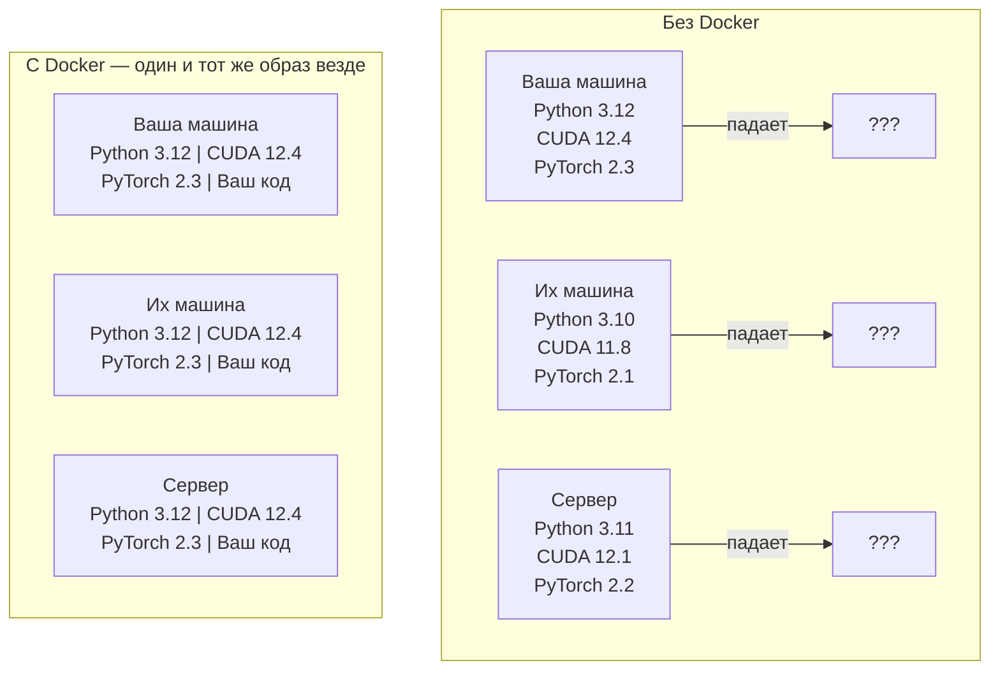

# Docker для AI

> Контейнеры делают «у меня работает» проблемой прошлого.

**Тип:** Практика
**Язык:** Python
**Пререквизиты:** Фаза 0, Уроки 01 и 03
**Время:** ~60 минут

## Цели обучения

- Собрать Docker-образ с поддержкой GPU, CUDA, PyTorch и AI-библиотеками из Dockerfile
- Монтировать директории хоста как volumes, чтобы сохранять модели, датасеты и код между пересборками контейнера
- Настроить NVIDIA Container Toolkit для доступа к GPU внутри контейнеров
- Оркестрировать многосервисные AI-приложения (inference server + vector database) через Docker Compose

## Проблема

Вы обучили модель на ноутбуке с PyTorch 2.3, CUDA 12.4 и Python 3.12. У коллеги PyTorch 2.1, CUDA 11.8 и Python 3.10. На его машине модель падает. Ваш Dockerfile работает везде.

AI-проекты — это кошмар зависимостей. Типичный стек: Python, PyTorch, CUDA-драйверы, cuDNN, системные C-библиотеки и специализированные пакеты вроде flash-attn, которым нужны точные версии компиляторов. Docker упаковывает все это в один образ, который одинаково запускается везде.

## Концепция

Docker упаковывает ваш код, runtime, библиотеки и системные инструменты в изолированную единицу — контейнер. Это похоже на легковесную виртуальную машину, но контейнер делит ядро ОС с хостом, поэтому стартует за секунды, а не за минуты.



### Почему AI-проектам Docker нужен особенно сильно

1. **GPU-драйверы хрупкие.** Код под CUDA 12.4 не запускается на CUDA 11.8. Docker изолирует CUDA toolkit внутри контейнера, а доступ к драйверу хоста дает через NVIDIA Container Toolkit.

2. **Веса моделей большие.** Модель на 7B параметров занимает 14 GB в fp16. Не хочется скачивать ее заново при каждой пересборке. Docker volumes позволяют монтировать директорию моделей с хоста.

3. **Многосервисная архитектура — норма.** Реальное AI-приложение — это не только Python-скрипт. Это inference server, vector database для RAG и, возможно, web frontend. Docker Compose поднимает все это одной командой.

### Ключевые термины

| Термин | Что это значит |
|--------|----------------|
| Image | Read-only шаблон. Ваш рецепт. Собирается из Dockerfile. |
| Container | Запущенный экземпляр image. Ваша кухня. |
| Dockerfile | Инструкции для сборки образа. Слой за слоем. |
| Volume | Постоянное хранилище, которое сохраняется после перезапуска контейнера. |
| docker-compose | Инструмент для описания многоконтейнерных приложений в YAML. |

### Типовые паттерны контейнеров в AI

```
Dev Container
  Полный toolkit. Поддержка редактора. Jupyter. Инструменты отладки.
  Используется в разработке и экспериментах.

Training Container
  Минималистичный. Только тренировочный скрипт и зависимости.
  Запускается на GPU-кластерах. Без редактора и Jupyter.

Inference Container
  Оптимизирован под serving. Небольшой образ. Быстрый cold start.
  Работает за load balancer в продакшене.
```

## Реализация

### Шаг 1: Установите Docker

```bash
# macOS
brew install --cask docker
open /Applications/Docker.app

# Ubuntu
curl -fsSL https://get.docker.com | sh
sudo usermod -aG docker $USER
# Перелогиньтесь, чтобы изменение группы вступило в силу
```

Проверка:

```bash
docker --version
docker run hello-world
```

### Шаг 2: Установите NVIDIA Container Toolkit (Linux + NVIDIA GPU)

Он дает контейнерам Docker доступ к GPU. Пользователи macOS и Windows (WSL2) могут пропустить этот шаг: Docker Desktop на этих платформах делает GPU passthrough иначе.

```bash
distribution=$(. /etc/os-release;echo $ID$VERSION_ID)
curl -fsSL https://nvidia.github.io/libnvidia-container/gpgkey | sudo gpg --dearmor -o /usr/share/keyrings/nvidia-container-toolkit-keyring.gpg
curl -s -L https://nvidia.github.io/libnvidia-container/$distribution/libnvidia-container.list | \
    sed 's#deb https://#deb [signed-by=/usr/share/keyrings/nvidia-container-toolkit-keyring.gpg] https://#g' | \
    sudo tee /etc/apt/sources.list.d/nvidia-container-toolkit.list

sudo apt-get update
sudo apt-get install -y nvidia-container-toolkit
sudo nvidia-ctk runtime configure --runtime=docker
sudo systemctl restart docker
```

Проверьте доступ к GPU внутри контейнера:

```bash
docker run --rm --gpus all nvidia/cuda:12.4.1-base-ubuntu22.04 nvidia-smi
```

Если видите информацию о GPU, toolkit работает.

### Шаг 3: Понимание базовых образов

Правильный base image экономит часы отладки.

```
nvidia/cuda:12.4.1-devel-ubuntu22.04
  Полный CUDA toolkit. Включены компиляторы.
  Для: сборки пакетов, которым нужен nvcc (flash-attn, bitsandbytes)
  Размер: ~4 GB

nvidia/cuda:12.4.1-runtime-ubuntu22.04
  Только CUDA runtime. Без компиляторов.
  Для: запуска уже собранного кода
  Размер: ~1.5 GB

pytorch/pytorch:2.3.1-cuda12.4-cudnn9-runtime
  Предустановленный PyTorch поверх CUDA.
  Для: пропустить шаг установки PyTorch
  Размер: ~6 GB

python:3.12-slim
  Без CUDA. Только CPU.
  Для: CPU inference, легкие инструменты
  Размер: ~150 MB
```

### Шаг 4: Напишите Dockerfile для AI-разработки

Вот Dockerfile в `code/Dockerfile`. Разберем его:

```dockerfile
FROM nvidia/cuda:12.4.1-devel-ubuntu22.04

ENV DEBIAN_FRONTEND=noninteractive
ENV PYTHONUNBUFFERED=1

RUN apt-get update && apt-get install -y --no-install-recommends \
    python3.12 \
    python3.12-venv \
    python3.12-dev \
    python3-pip \
    git \
    curl \
    build-essential \
    && rm -rf /var/lib/apt/lists/*

RUN update-alternatives --install /usr/bin/python python /usr/bin/python3.12 1

RUN python -m pip install --no-cache-dir --upgrade pip setuptools wheel

RUN python -m pip install --no-cache-dir \
    torch==2.3.1 \
    torchvision==0.18.1 \
    torchaudio==2.3.1 \
    --index-url https://download.pytorch.org/whl/cu124

RUN python -m pip install --no-cache-dir \
    numpy \
    pandas \
    scikit-learn \
    matplotlib \
    jupyter \
    transformers \
    datasets \
    accelerate \
    safetensors

WORKDIR /workspace

VOLUME ["/workspace", "/models"]

EXPOSE 8888

CMD ["python"]
```

Соберите образ:

```bash
docker build -t ai-dev -f phases/00-setup-and-tooling/07-docker-for-ai/code/Dockerfile .
```

Первый раз это долго (скачивание CUDA base image + PyTorch). Следующие сборки используют кеш слоев.

Запуск:

```bash
docker run --rm -it --gpus all \
    -v $(pwd):/workspace \
    -v ~/models:/models \
    ai-dev python -c "import torch; print(f'PyTorch {torch.__version__}, CUDA: {torch.cuda.is_available()}')"
```

Запуск Jupyter внутри контейнера:

```bash
docker run --rm -it --gpus all \
    -v $(pwd):/workspace \
    -v ~/models:/models \
    -p 8888:8888 \
    ai-dev jupyter notebook --ip=0.0.0.0 --port=8888 --no-browser --allow-root
```

### Шаг 5: Volume mounts для данных и моделей

Монтирование volumes критично для AI-задач. Иначе ваши 14 GB модели исчезнут после остановки контейнера.

```bash
# Монтируем код
-v $(pwd):/workspace

# Монтируем общую директорию моделей
-v ~/models:/models

# Монтируем датасеты
-v ~/datasets:/data
```

Внутри тренировочного скрипта грузите из смонтированного пути:

```python
from transformers import AutoModel

model = AutoModel.from_pretrained("/models/llama-7b")
```

Модель хранится в файловой системе хоста. Контейнер можно пересобирать сколько угодно без повторной загрузки.

### Шаг 6: Docker Compose для многосервисных AI-приложений

Реальному RAG-приложению нужны inference server и vector database. Docker Compose поднимает оба сервиса одной командой.

Смотрите `code/docker-compose.yml`:

```yaml
services:
  ai-dev:
    build:
      context: .
      dockerfile: Dockerfile
    deploy:
      resources:
        reservations:
          devices:
            - driver: nvidia
              count: all
              capabilities: [gpu]
    volumes:
      - ../../../:/workspace
      - ~/models:/models
      - ~/datasets:/data
    ports:
      - "8888:8888"
    stdin_open: true
    tty: true
    command: jupyter notebook --ip=0.0.0.0 --port=8888 --no-browser --allow-root

  qdrant:
    image: qdrant/qdrant:v1.12.5
    ports:
      - "6333:6333"
      - "6334:6334"
    volumes:
      - qdrant_data:/qdrant/storage

volumes:
  qdrant_data:
```

Запустите всё:

```bash
cd phases/00-setup-and-tooling/07-docker-for-ai/code
docker compose up -d
```

Теперь AI-контейнер может обращаться к векторной БД по адресу `http://qdrant:6333` по имени сервиса. Docker Compose автоматически создает общую сеть.

Проверьте соединение из AI-контейнера:

```python
from qdrant_client import QdrantClient

client = QdrantClient(host="qdrant", port=6333)
print(client.get_collections())
```

Остановка:

```bash
docker compose down
```

Добавьте `-v`, чтобы удалить и volume qdrant:

```bash
docker compose down -v
```
