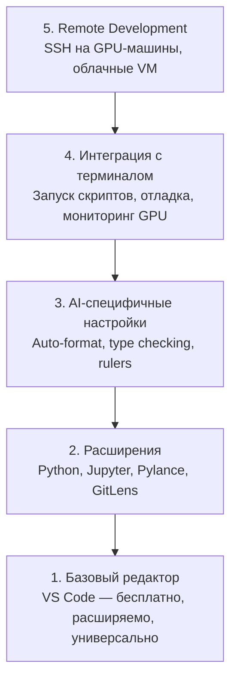

# Настройка редактора

> Ваш редактор — ваш копилот. Настройте его один раз, чтобы он не мешал и действительно помогал.

**Тип:** Практика
**Языки:** --
**Пререквизиты:** Фаза 0, Урок 01
**Время:** ~20 минут

## Цели обучения

- Установить VS Code с обязательными расширениями для Python, Jupyter, линтинга и Remote SSH
- Настроить format-on-save, type checking и прокрутку notebook-вывода для AI-задач
- Настроить Remote SSH, чтобы редактировать и отлаживать код на удаленных GPU-машинах как локально
- Оценить альтернативы редактора (Cursor, Windsurf, Neovim) и их компромиссы для AI-работы

## Проблема

Вы проведете тысячи часов в редакторе: писать Python, запускать ноутбуки, отлаживать training loops и работать по SSH на GPU-серверах. Плохо настроенный редактор превращает каждую сессию в трение: нет автодополнения, нет type hints, нет inline-ошибок, ручное форматирование и неудобный терминал.

Правильная настройка занимает 20 минут. Пропуск этой настройки будет стоить вам 20 минут каждый день.

## Концепция

Для AI-инжиниринга редактор должен закрывать пять вещей:



## Реализация

### Шаг 1: Установите VS Code

VS Code — рекомендуемый редактор. Он бесплатный, работает на любой ОС, имеет первоклассную поддержку Jupyter-ноутбуков, а экосистема расширений покрывает всё, что нужно для AI-работы.

Скачайте с [code.visualstudio.com](https://code.visualstudio.com/).

Проверка в терминале:

```bash
code --version
```

Если на macOS команда `code` не найдена, откройте VS Code, нажмите `Cmd+Shift+P`, введите "Shell Command" и выберите "Install 'code' command in PATH".

### Шаг 2: Установите ключевые расширения

Откройте встроенный терминал в VS Code (`Ctrl+`` ` или `` Cmd+` ``) и установите расширения, которые важны для AI:

```bash
code --install-extension ms-python.python
code --install-extension ms-python.vscode-pylance
code --install-extension ms-toolsai.jupyter
code --install-extension eamodio.gitlens
code --install-extension ms-vscode-remote.remote-ssh
code --install-extension ms-python.debugpy
code --install-extension ms-python.black-formatter
code --install-extension charliermarsh.ruff
```

Для чего каждое:

| Расширение | Зачем |
|------------|-------|
| Python | Поддержка языка, обнаружение виртуальных окружений, run/debug |
| Pylance | Быстрый type checking, автодополнение, разрешение импортов |
| Jupyter | Запуск ноутбуков в VS Code, variable explorer |
| GitLens | Показ кто и что изменял, inline git blame |
| Remote SSH | Открывать папку на удаленном GPU-сервере как локальную |
| Debugpy | Пошаговая отладка Python |
| Black Formatter | Автоформатирование при сохранении, единый стиль |
| Ruff | Быстрый линтинг, ловит частые ошибки |

Файл `code/.vscode/extensions.json` в этом уроке содержит полный список рекомендаций. Когда откроете папку проекта, VS Code предложит установить их.

### Шаг 3: Настройте параметры

Скопируйте настройки из `code/.vscode/settings.json` в этом уроке или внесите их вручную через `Settings > Open Settings (JSON)`.

Ключевые настройки для AI-работы:

```jsonc
{
    "python.analysis.typeCheckingMode": "basic",
    "editor.formatOnSave": true,
    "editor.rulers": [88, 120],
    "notebook.output.scrolling": true,
    "files.autoSave": "afterDelay"
}
```

Почему это важно:

- **Type checking basic**: ловит неверные типы аргументов до запуска. Экономит время при ошибках с формами тензоров и параметрами API.
- **Format on save**: больше не думаете о форматировании. Black делает это за вас.
- **Rulers на 88 и 120**: Black переносит на 88. Маркер 120 показывает, когда docstring и комментарии становятся слишком длинными.
- **Прокрутка вывода notebook**: training loops печатают тысячи строк. Без прокрутки панель вывода раздувается.
- **Auto-save**: вы будете забывать сохранять. Скрипт будет запускаться на старой версии. Auto-save это предотвращает.

### Шаг 4: Интеграция терминала

Встроенный терминал VS Code — место, где вы запускаете training scripts, мониторите GPU и управляете окружениями.

Настройте его правильно:

```jsonc
{
    "terminal.integrated.defaultProfile.osx": "zsh",
    "terminal.integrated.defaultProfile.linux": "bash",
    "terminal.integrated.fontSize": 13,
    "terminal.integrated.scrollback": 10000
}
```

Полезные шорткаты:

| Действие | macOS | Linux/Windows |
|----------|-------|---------------|
| Переключить терминал | `` Ctrl+` `` | `` Ctrl+` `` |
| Новый терминал | `Ctrl+Shift+`` ` | `Ctrl+Shift+`` ` |
| Разделить терминал | `Cmd+\` | `Ctrl+\` |

Split-терминалы удобны: в одном идет скрипт, в другом мониторинг GPU через `nvidia-smi -l 1` или `watch -n 1 nvidia-smi`.

### Шаг 5: Удаленная разработка (SSH на GPU-сервер)

Это самое важное расширение для AI-работы. Вы будете обучать модели на удаленных машинах (cloud VM, lab servers, Lambda, Vast.ai). Remote SSH позволяет открыть удаленную файловую систему, редактировать файлы, запускать терминалы и отлаживать так, будто всё локально.

Настройка:

1. Установите расширение Remote SSH (сделано на шаге 2).
2. Нажмите `Ctrl+Shift+P` (или `Cmd+Shift+P`), введите "Remote-SSH: Connect to Host".
3. Введите `user@your-gpu-box-ip`.
4. VS Code автоматически установит свой серверный компонент на удаленной машине.

Для входа без пароля настройте SSH-ключи:

```bash
ssh-keygen -t ed25519 -C "your-email@example.com"
ssh-copy-id user@your-gpu-box-ip
```

Добавьте хост в `~/.ssh/config` для удобства:

```
Host gpu-box
    HostName 203.0.113.50
    User ubuntu
    IdentityFile ~/.ssh/id_ed25519
    ForwardAgent yes
```

Теперь `Remote-SSH: Connect to Host > gpu-box` подключает сразу.

## Альтернативы

### Cursor

[cursor.com](https://cursor.com) — форк VS Code со встроенной AI-генерацией кода. Использует те же расширения и формат настроек. Если вы в Cursor, всё из этого урока тоже применимо. Импортируйте те же `settings.json` и `extensions.json`.

### Windsurf

[windsurf.com](https://windsurf.com) — еще один AI-first форк VS Code. Та же история: те же расширения, тот же формат настроек, та же поддержка Remote SSH.

### Vim/Neovim

Если вы уже продуктивно используете Vim или Neovim, оставайтесь на нем. Минимальный набор для AI Python:

- **pyright** или **pylsp** для type checking (через Mason или ручную установку)
- **nvim-lspconfig** для интеграции language server
- **jupyter-vim** или **molten-nvim** для notebook-подобного выполнения
- **telescope.nvim** для поиска файлов/символов
- **none-ls.nvim** с black и ruff для форматирования/линтинга

Если вы не пользуетесь Vim сейчас, не начинайте в этот момент. Крутая кривая обучения будет конкурировать с обучением AI-инжинирингу. Используйте VS Code.

## Применение

С такой настройкой ваш ежедневный workflow выглядит так:

1. Открываете папку проекта в VS Code (или подключаетесь к GPU-серверу через Remote SSH).
2. Пишете Python-код с автодополнением, type hints и inline-ошибками.
3. Запускаете Jupyter-ноутбуки прямо в редакторе.
4. Используете встроенный терминал для training scripts, `uv pip install` и мониторинга GPU.
5. Проверяете изменения через GitLens перед коммитом.

## Упражнения

1. Установите VS Code и все расширения из шага 2
2. Скопируйте `settings.json` из этого урока в свою конфигурацию VS Code
3. Откройте Python-файл и проверьте, что Pylance показывает type hints, а Black форматирует при сохранении
4. Если есть доступ к удаленной машине, настройте Remote SSH и откройте на ней папку

## Ключевые термины

| Термин | Как обычно говорят | Что это на самом деле |
|--------|--------------------|-----------------------|
| LSP | "Движок автодополнения" | Language Server Protocol: стандарт, по которому редакторы получают type info, completions и diagnostics от language-specific сервера |
| Pylance | "Python-плагин" | Python language server от Microsoft на основе Pyright для type checking и IntelliSense |
| Remote SSH | "Работа на сервере" | Расширение VS Code, запускающее легковесный сервер на удаленной машине и стримящее UI в локальный редактор |
| Format on save | "Автопричесывание" | При сохранении редактор запускает форматтер (Black, Ruff), поэтому стиль кода всегда единообразный |
