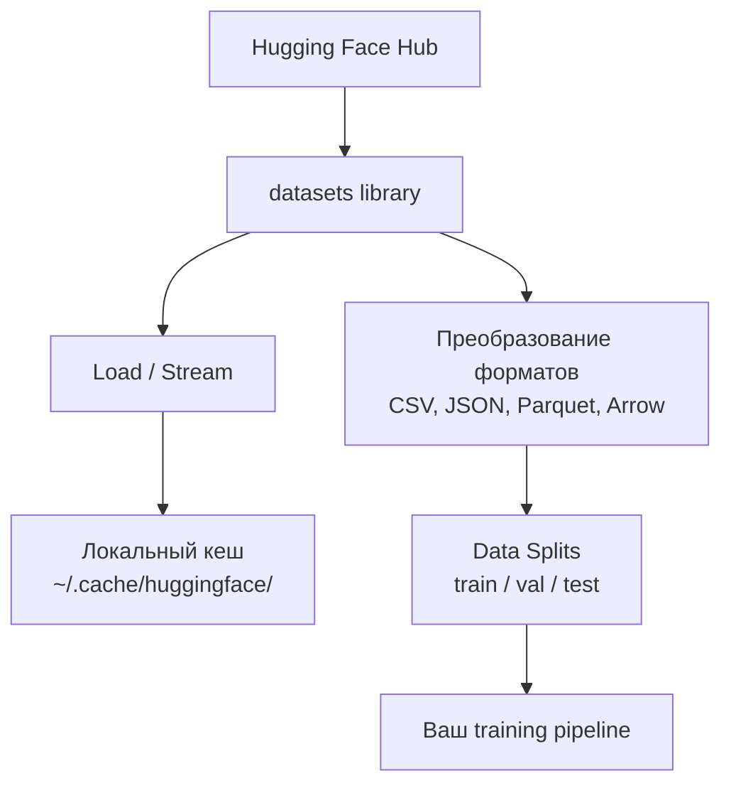

# Управление данными

> Данные — это топливо. То, как вы ими управляете, определяет, насколько быстро вы движетесь.

**Тип:** Практика
**Язык:** Python
**Пререквизиты:** Фаза 0, Урок 01
**Время:** ~45 минут

## Цели обучения

- Загружать, стримить и кешировать датасеты с помощью библиотеки Hugging Face `datasets`
- Конвертировать между форматами CSV, JSON, Parquet и Arrow и понимать их компромиссы
- Создавать воспроизводимые train/validation/test-сплиты с фиксированными random seed
- Управлять большими файлами моделей и датасетов через `.gitignore`, Git LFS или DVC

## Проблема

Любой AI-проект начинается с данных. Нужно находить датасеты, скачивать их, конвертировать форматы, делить для обучения и оценки, версионировать, чтобы эксперименты были воспроизводимы. Делать это вручную каждый раз медленно и чревато ошибками. Нужен повторяемый workflow.

## Концепция



Библиотека Hugging Face `datasets` — стандартный способ загрузки данных для AI-задач. Она из коробки делает скачивание, кеширование, конвертацию форматов и стриминг.

## Реализация

### Шаг 1: Установите библиотеку datasets

```bash
pip install datasets huggingface_hub
```

### Шаг 2: Загрузите датасет

```python
from datasets import load_dataset

dataset = load_dataset("imdb")
print(dataset)
print(dataset["train"][0])
```

Это скачает датасет отзывов IMDB. После первого скачивания он грузится из кеша `~/.cache/huggingface/datasets/`.

### Шаг 3: Стриминг больших датасетов

Некоторые датасеты слишком большие, чтобы поместиться на диск. Стриминг читает их построчно без полной загрузки.

```python
dataset = load_dataset("wikimedia/wikipedia", "20220301.en", split="train", streaming=True)

for i, example in enumerate(dataset):
    print(example["title"])
    if i >= 4:
        break
```

При стриминге вы получаете `IterableDataset`. Вы обрабатываете строки по мере поступления. Потребление памяти остается постоянным независимо от размера датасета.

### Шаг 4: Форматы датасетов

`datasets` использует Apache Arrow под капотом. Можно конвертировать в другие форматы в зависимости от нужд пайплайна.

```python
dataset = load_dataset("imdb", split="train")

dataset.to_csv("imdb_train.csv")
dataset.to_json("imdb_train.json")
dataset.to_parquet("imdb_train.parquet")
```

Сравнение форматов:

| Формат | Размер | Скорость чтения | Лучше всего для |
|--------|--------|-----------------|-----------------|
| CSV | Большой | Медленно | Читаемость человеком, таблицы |
| JSON | Большой | Медленно | API, вложенные структуры |
| Parquet | Маленький | Быстро | Аналитика, columnar-запросы |
| Arrow | Маленький | Самый быстрый | In-memory обработка (внутренний формат `datasets`) |

Для AI-работы лучший формат хранения — Parquet. Arrow используется в памяти. CSV и JSON — для обмена данными.

### Шаг 5: Data splits

Любому ML-проекту нужны три сплита:

- **Train**: на нем модель учится (обычно 80%)
- **Validation**: на нем вы отслеживаете прогресс во время обучения (обычно 10%)
- **Test**: финальная оценка после обучения (обычно 10%)

Часть датасетов уже разделена. Если нет — делите сами:

```python
dataset = load_dataset("imdb", split="train")

split = dataset.train_test_split(test_size=0.2, seed=42)
train_val = split["train"].train_test_split(test_size=0.125, seed=42)

train_ds = train_val["train"]
val_ds = train_val["test"]
test_ds = split["test"]

print(f"Train: {len(train_ds)}, Val: {len(val_ds)}, Test: {len(test_ds)}")
```

Всегда задавайте seed для воспроизводимости. Один и тот же seed дает один и тот же сплит.

### Шаг 6: Скачивание и кеширование моделей

Модели — большие файлы. Библиотека `huggingface_hub` управляет скачиванием и кешем.

```python
from huggingface_hub import hf_hub_download, snapshot_download

model_path = hf_hub_download(
    repo_id="sentence-transformers/all-MiniLM-L6-v2",
    filename="config.json"
)
print(f"Cached at: {model_path}")

model_dir = snapshot_download("sentence-transformers/all-MiniLM-L6-v2")
print(f"Full model at: {model_dir}")
```

Модели кешируются в `~/.cache/huggingface/hub/`. После первой загрузки последующие запуски работают почти мгновенно.

### Шаг 7: Работа с большими файлами

Веса моделей и большие датасеты не должны попадать в git. Есть три варианта:

**Вариант A: .gitignore (самый простой)**

```
*.bin
*.safetensors
*.pt
*.onnx
data/*.parquet
data/*.csv
models/
```

**Вариант B: Git LFS (хранить большие файлы в git)**

```bash
git lfs install
git lfs track "*.bin"
git lfs track "*.safetensors"
git add .gitattributes
```

Git LFS хранит в репозитории указатели, а сами файлы — на отдельном сервере. На GitHub бесплатно дается 1 GB.

**Вариант C: DVC (контроль версий данных)**

```bash
pip install dvc
dvc init
dvc add data/training_set.parquet
git add data/training_set.parquet.dvc data/.gitignore
git commit -m "Track training data with DVC"
```

DVC создает маленькие `.dvc`-файлы с указателями на данные. Сами данные хранятся в S3, GCS или другом удаленном storage.

| Подход | Сложность | Лучше всего для |
|--------|-----------|-----------------|
| .gitignore | Низкая | Личные проекты, загружаемые данные, которые можно повторно скачать |
| Git LFS | Средняя | Команды, которым нужно делиться весами моделей через git |
| DVC | Высокая | Воспроизводимые эксперименты, большие датасеты, командная работа |

Для этого курса `.gitignore` достаточно. DVC нужен, когда необходимо воспроизводить точные эксперименты на разных машинах.

### Шаг 8: Паттерны хранения

**Локальное хранение** подходит для датасетов до ~10 GB. HF-кеш закрывает это автоматически.

**Облачное хранение** нужно для всего, что больше или должно шариться между машинами:

```python
import os

local_path = os.path.expanduser("~/.cache/huggingface/datasets/")

# s3_path = "s3://my-bucket/datasets/"
# gcs_path = "gs://my-bucket/datasets/"
```

DVC напрямую интегрируется с S3 и GCS:

```bash
dvc remote add -d myremote s3://my-bucket/dvc-store
dvc push
```

Для этого курса локального хранения достаточно. Облако становится важным при fine-tuning на удаленных GPU-инстансах.

## Датасеты в этом курсе

| Датасет | Уроки | Размер | Чему учит |
|---------|-------|--------|-----------|
| IMDB | Токенизация, классификация | 84 MB | Базовая текстовая классификация |
| WikiText | Языковое моделирование | 181 MB | Предсказание следующего токена |
| SQuAD | QA-системы | 35 MB | Вопрос-ответ, spans |
| Common Crawl (subset) | Embeddings | Зависит | Обработка текста в большом масштабе |
| MNIST | База computer vision | 21 MB | Основы классификации изображений |
| COCO (subset) | Мультимодальность | Зависит | Пары изображение-текст |

Не нужно скачивать всё прямо сейчас. Каждый урок явно указывает, что именно ему требуется.

## Применение

Запустите утилиту, чтобы проверить, что всё работает:

```bash
python code/data_utils.py
```

Скрипт скачает небольшой датасет, конвертирует его, разделит и выведет сводку.

## Результат

Этот урок создает:
- `code/data_utils.py` — переиспользуемая утилита загрузки и кеширования данных
- `outputs/prompt-data-helper.md` — промпт для подбора подходящего датасета под задачу

## Упражнения

1. Загрузите датасет `glue` с конфигом `mrpc` и изучите первые 5 примеров
2. Запустите стриминг `c4` и посчитайте, сколько примеров можно обработать за 10 секунд
3. Конвертируйте датасет в Parquet и сравните размер файла с CSV
4. Создайте сплит 70/15/15 train/val/test с фиксированным seed и проверьте размеры

## Ключевые термины

| Термин | Как обычно говорят | Что это на самом деле |
|--------|--------------------|-----------------------|
| Dataset split | "Тренировочные данные" | Именованный поднабор (train/val/test), используемый на разных этапах ML-цикла |
| Streaming | "Ленивая загрузка" | Обработка данных построчно из удаленного источника без скачивания всего датасета |
| Parquet | "Сжатый CSV" | Columnar-формат файла, оптимизированный для аналитических запросов и эффективного хранения |
| Arrow | "Быстрый dataframe" | In-memory columnar-формат, который `datasets` использует внутри для zero-copy чтения |
| Git LFS | "Git для больших файлов" | Расширение, которое хранит большие файлы вне git-репозитория, оставляя в нем указатели |
| DVC | "Git для данных" | Система контроля версий для датасетов и моделей с интеграцией с облачным хранилищем |
| Cache | "Уже скачано" | Локальная копия ранее загруженных данных, по умолчанию в ~/.cache/huggingface/ |
