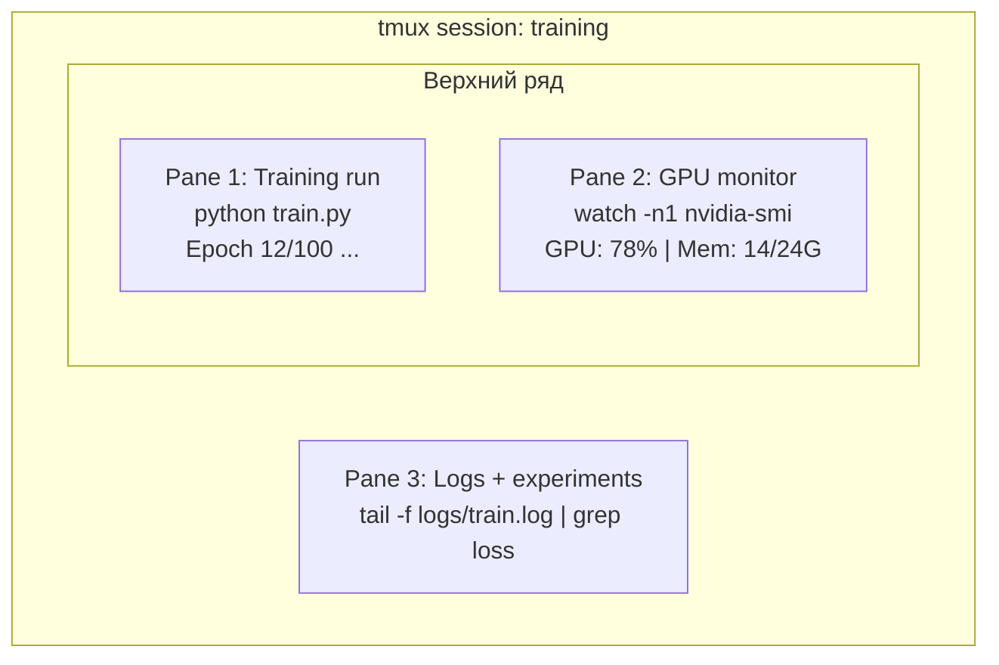

# Терминал и Shell

> Терминал — место, где живут AI-инженеры. Освойтесь в нем.

**Тип:** Теория
**Языки:** --
**Пререквизиты:** Фаза 0, Урок 01
**Время:** ~35 минут

## Цели обучения

- Использовать пайпы, редиректы и `grep` для фильтрации и обработки training-логов из командной строки
- Создавать постоянные tmux-сессии с несколькими панелями для параллельного обучения и мониторинга GPU
- Мониторить системные и GPU-ресурсы через `htop`, `nvtop` и `nvidia-smi`
- Передавать файлы между локальными и удаленными машинами с помощью SSH, `scp` и `rsync`

## Проблема

Вы проведете в терминале больше времени, чем в любом редакторе. Training runs, мониторинг GPU, просмотр логов, удаленные SSH-сессии, управление окружениями. Любой AI-workflow касается shell. Если вы медленны здесь, вы медленны везде.

Этот урок покрывает именно те terminal-навыки, которые важны для AI-работы. Без истории Unix. Без глубокого погружения в Bash scripting. Только нужное.

## Концепция



Одновременно запущены три процесса. Один терминал. Можно отсоединиться, уйти, снова подключиться по SSH и продолжить. Обучение при этом не остановится.

## Реализация

### Шаг 1: Узнайте свою оболочку

Проверьте, какая shell запущена:

```bash
echo $SHELL
```

На большинстве систем это `bash` или `zsh`. Обе подходят. Команды в этом курсе работают в обеих.

Что важно знать:

```bash
# Навигация
cd ~/projects/ai-engineering-from-scratch
pwd
ls -la

# Поиск по истории (самый полезный шорткат)
# Ctrl+R, затем введите часть предыдущей команды
# Нажимайте Ctrl+R снова, чтобы листать совпадения

# Очистить терминал
clear   # или Ctrl+L

# Остановить выполняющуюся команду
# Ctrl+C

# Приостановить команду (возврат через fg)
# Ctrl+Z
```

### Шаг 2: Пайпы и редиректы

Пайпы соединяют команды. Так вы обрабатываете логи, фильтруете вывод и связываете инструменты. Это используется постоянно.

```bash
# Посчитать, сколько раз в логе встречается "loss"
cat train.log | grep "loss" | wc -l

# Вытащить только значения loss из вывода обучения
grep "loss:" train.log | awk '{print $NF}' > losses.txt

# Следить за логом в реальном времени, фильтруя ошибки
tail -f train.log | grep --line-buffered "ERROR"

# Отсортировать эксперименты по финальной accuracy
grep "final_accuracy" results/*.log | sort -t= -k2 -n -r

# Разделить stdout и stderr по разным файлам
python train.py > output.log 2> errors.log

# Отправить stdout и stderr в один файл
python train.py > train_full.log 2>&1
```

Три ключевых редиректа:

| Символ | Что делает |
|--------|------------|
| `>` | Записывает stdout в файл (перезапись) |
| `>>` | Добавляет stdout в конец файла |
| `2>` | Записывает stderr в файл |
| `2>&1` | Отправляет stderr туда же, куда stdout |
| `\|` | Передает stdout одной команды в stdin следующей |

### Шаг 3: Фоновые процессы

Обучение длится часами. Не хочется держать терминал открытым все это время.

```bash
# Запустить в фоне (вывод все еще идет в терминал)
python train.py &

# Запустить в фоне, не убивается при закрытии терминала
nohup python train.py > train.log 2>&1 &

# Что запущено в фоне
jobs
ps aux | grep train.py

# Вернуть фоновой процесс в foreground
fg %1

# Убить фоновый процесс
kill %1
# или найти PID и убить его
kill $(pgrep -f "train.py")
```

Разница между `&`, `nohup` и `screen`/`tmux`:

| Метод | Переживет закрытие терминала? | Можно переподключиться? |
|-------|-------------------------------|--------------------------|
| `command &` | Нет | Нет |
| `nohup command &` | Да | Нет (смотреть лог-файл) |
| `screen` / `tmux` | Да | Да |

Для всего, что дольше нескольких минут, используйте tmux.

### Шаг 4: tmux

tmux позволяет создавать persistent terminal sessions с несколькими панелями. Это самый полезный инструмент для управления тренировками.

```bash
# Установка
# macOS
brew install tmux
# Ubuntu
sudo apt install tmux

# Создать именованную сессию
tmux new -s training

# Разделить горизонтально
# Ctrl+B, затем "

# Разделить вертикально
# Ctrl+B, затем %

# Перемещение между панелями
# Ctrl+B, затем стрелки

# Отсоединиться (сессия продолжит работать)
# Ctrl+B, затем d

# Подключиться обратно
tmux attach -t training

# Список сессий
tmux ls

# Удалить сессию
tmux kill-session -t training
```

Типичная AI-сессия:

```bash
tmux new -s train

# Pane 1: старт обучения
python train.py --epochs 100 --lr 1e-4

# Ctrl+B, " чтобы разделить, затем мониторинг GPU
watch -n1 nvidia-smi

# Ctrl+B, % чтобы разделить вертикально, затем просмотр логов
tail -f logs/experiment.log

# Теперь отсоединитесь Ctrl+B, d
# Выйдите по SSH, сходите за кофе, вернитесь
# tmux attach -t train
```

### Шаг 5: Мониторинг через htop и nvtop

```bash
# Системные процессы (лучше, чем top)
htop

# GPU-процессы (если есть NVIDIA GPU)
# Установка: sudo apt install nvtop (Ubuntu) или brew install nvtop (macOS)
nvtop

# Быстрая проверка GPU без nvtop
nvidia-smi

# Обновлять загрузку GPU каждую секунду
watch -n1 nvidia-smi

# Какие процессы используют GPU
nvidia-smi --query-compute-apps=pid,name,used_memory --format=csv
```

Полезные горячие клавиши `htop`:
- `F6` или `>` — сортировка по колонке (например, по памяти для поиска утечек)
- `F5` — режим дерева (видны дочерние процессы)
- `F9` — завершить процесс
- `/` — поиск процесса по имени

### Шаг 6: SSH для удаленных GPU-серверов

Когда арендуете облачный GPU (Lambda, RunPod, Vast.ai), вы подключаетесь по SSH.

```bash
# Базовое подключение
ssh user@gpu-box-ip

# С конкретным ключом
ssh -i ~/.ssh/my_gpu_key user@gpu-box-ip

# Скопировать файлы на удаленную машину
scp model.pt user@gpu-box-ip:~/models/

# Скопировать файлы с удаленной машины
scp user@gpu-box-ip:~/results/metrics.json ./

# Синхронизировать целую директорию (быстрее при множестве файлов)
rsync -avz ./data/ user@gpu-box-ip:~/data/

# Port forwarding (доступ к удаленному Jupyter/TensorBoard локально)
ssh -L 8888:localhost:8888 user@gpu-box-ip
# Теперь откройте localhost:8888 в браузере

# SSH config для удобства
# Добавьте в ~/.ssh/config:
# Host gpu
#     HostName 192.168.1.100
#     User ubuntu
#     IdentityFile ~/.ssh/gpu_key
#
# Затем просто:
# ssh gpu
```

### Шаг 7: Полезные aliases для AI-работы

Добавьте это в `~/.bashrc` или `~/.zshrc`:

```bash
source phases/00-setup-and-tooling/10-terminal-and-shell/code/shell_aliases.sh
```

Или скопируйте только нужные алиасы. Основные:

```bash
# Быстрый статус GPU
alias gpu='nvidia-smi --query-gpu=index,name,utilization.gpu,memory.used,memory.total,temperature.gpu --format=csv,noheader'

# Убить все Python-процессы обучения
alias killtraining='pkill -f "python.*train"'

# Быстрая активация виртуального окружения
alias ae='source .venv/bin/activate'

# Смотреть loss в процессе обучения
alias watchloss='tail -f logs/*.log | grep --line-buffered "loss"'
```

Полный набор — в `code/shell_aliases.sh`.

### Шаг 8: Типовые terminal-паттерны в AI

Эти шаблоны постоянно встречаются в практике:

```bash
# Запустить обучение, логировать всё, получить уведомление по завершении
python train.py 2>&1 | tee train.log; echo "DONE" | mail -s "Training complete" you@email.com

# Сравнить логи двух экспериментов
 diff <(grep "accuracy" exp1.log) <(grep "accuracy" exp2.log)

# Найти самые большие файлы моделей (почистить диск)
find . -name "*.pt" -o -name "*.safetensors" | xargs du -h | sort -rh | head -20

# Скачать модель с Hugging Face
wget https://huggingface.co/model/resolve/main/model.safetensors

# Распаковать dataset
tar xzf dataset.tar.gz -C ./data/

# Посчитать строки во всех Python-файлах
find . -name "*.py" | xargs wc -l | tail -1

# Проверить место на диске (данные быстро его заполняют)
df -h
du -sh ./data/*

# Проверить переменные окружения перед запуском
env | grep -i cuda
env | grep -i torch
```

## Применение

Когда использовать каждый инструмент в этом курсе:

| Инструмент | Когда использовать |
|------------|--------------------|
| tmux | Каждый training run (Фазы 3+) |
| `tail -f` + `grep` | Мониторинг training-логов |
| `nohup` / `&` | Быстрые фоновые задачи |
| `htop` / `nvtop` | Отладка медленного обучения, OOM-ошибок |
| SSH + `rsync` | Работа на облачных GPU |
| Пайпы + редиректы | Обработка результатов экспериментов |
| Aliases | Экономия времени на повторяющихся командах |

## Упражнения

1. Установите tmux, создайте сессию с тремя панелями и запустите `htop` в одной, `watch -n1 date` в другой и Python-скрипт в третьей. Отсоединитесь и подключитесь снова.
2. Добавьте алиасы из `code/shell_aliases.sh` в конфиг shell и перезагрузите его через `source ~/.zshrc` (или `~/.bashrc`).
3. Создайте фейковый training-лог командой `for i in $(seq 1 100); do echo "epoch $i loss: $(echo "scale=4; 1/$i" | bc)"; sleep 0.1; done > fake_train.log` и затем извлеките только значения loss через `grep`, `tail` и `awk`.
4. Добавьте запись SSH config для сервера, к которому у вас есть доступ (или используйте `localhost` для тренировки синтаксиса).

## Ключевые термины

| Термин | Как обычно говорят | Что это на самом деле |
|--------|--------------------|-----------------------|
| Shell | "Терминал" | Программа, интерпретирующая ваши команды (bash, zsh, fish) |
| tmux | "Terminal multiplexer" | Программа, позволяющая запускать несколько terminal sessions в одном окне и отсоединяться/подключаться снова |
| Pipe | "Палка между командами" | Оператор `\|`, передающий вывод одной команды на вход другой |
| PID | "ID процесса" | Уникальный номер каждого запущенного процесса, используется для мониторинга и завершения |
| nohup | "No hangup" | Запускает команду, устойчивую к сигналу hangup, чтобы закрытие терминала ее не убило |
| SSH | "Подключение к серверу" | Secure Shell, зашифрованный протокол для выполнения команд на удаленной машине |
