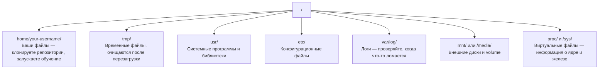

# Linux для AI

> Большая часть AI работает на Linux. Нужно знать достаточно, чтобы не застревать.

**Тип:** Теория
**Языки:** --
**Пререквизиты:** Фаза 0, Урок 01
**Время:** ~30 минут

## Цели обучения

- Навигировать по файловой системе Linux и выполнять основные операции с файлами из командной строки
- Управлять правами доступа через `chmod` и `chown`, чтобы решать ошибки "Permission denied"
- Устанавливать системные пакеты через `apt` и поднимать свежий GPU-сервер для AI-работы
- Понимать отличия macOS и Linux, которые чаще всего мешают при работе на удаленных машинах

## Проблема

Вы разрабатываете на macOS или Windows. Но как только подключаетесь по SSH к облачному GPU-серверу, арендуете Lambda-инстанс или поднимаете EC2-машину, вы попадаете в Ubuntu. Терминал — единственный интерфейс. Нет Finder, нет Explorer, нет GUI. Если вы не умеете перемещаться по файловой системе, ставить пакеты и управлять процессами из командной строки, вы тратите оплаченные часы GPU впустую, гугля «как распаковать файл в Linux».

Это руководство по выживанию. В нем только то, что нужно для работы на удаленной Linux-машине в AI-задачах. Ничего лишнего.

## Структура файловой системы

В Linux всё организовано под единым корнем `/`. Нет `C:\` и `/Volumes`. Каталоги, которые вам реально пригодятся:



Ваш домашний каталог — `~` или `/home/your-username`. Почти всё, что вы делаете, происходит здесь.

## Основные команды

Это 15 команд, которые покрывают 95% действий на удаленном GPU-сервере.

### Навигация

```bash
pwd                         # Где я?
ls                          # Что здесь?
ls -la                      # Что здесь, включая скрытые файлы, с деталями?
cd /path/to/dir             # Перейти в каталог
cd ~                        # Домой
cd ..                       # На уровень выше
```

### Файлы и директории

```bash
mkdir my-project            # Создать директорию
mkdir -p a/b/c              # Создать вложенные директории одной командой

cp file.txt backup.txt      # Копировать файл
cp -r src/ src-backup/      # Копировать директорию (рекурсивно)

mv old.txt new.txt          # Переименовать файл
mv file.txt /tmp/           # Переместить файл

rm file.txt                 # Удалить файл (без корзины)
rm -rf my-dir/              # Удалить директорию и всё внутри
```

`rm -rf` удаляет безвозвратно. Undo нет. Проверяйте путь дважды перед Enter.

### Чтение файлов

```bash
cat file.txt                # Вывести весь файл
head -20 file.txt           # Первые 20 строк
tail -20 file.txt           # Последние 20 строк
tail -f log.txt             # Следить за логом в реальном времени (Ctrl+C для остановки)
less file.txt               # Просмотр файла с прокруткой (q — выход)
```

### Поиск

```bash
grep "error" training.log           # Найти строки с "error"
grep -r "learning_rate" .           # Поиск по всем файлам текущего каталога
grep -i "cuda" config.yaml          # Поиск без учета регистра

find . -name "*.py"                 # Найти все Python-файлы в текущем каталоге и ниже
find . -name "*.ckpt" -size +1G     # Найти checkpoint-файлы больше 1GB
```

## Права доступа

У каждого файла в Linux есть владелец и биты прав. Вы столкнетесь с этим, когда скрипт не запускается или нельзя писать в директорию.

```bash
ls -l train.py
# -rwxr-xr-- 1 user group 2048 Mar 19 10:00 train.py
#  ^^^             права владельца: read, write, execute
#     ^^^          права группы: read, execute
#        ^^        для остальных: только read
```

Типичные исправления:

```bash
chmod +x train.sh           # Сделать скрипт исполняемым
chmod 755 deploy.sh         # Владелец: полный доступ, остальные: read+execute
chmod 644 config.yaml       # Владелец: read+write, остальные: только read

chown user:group file.txt   # Сменить владельца файла (требуется sudo)
```

Когда видите "Permission denied", почти всегда проблема в правах. `chmod +x` или `sudo` решают большинство случаев.

## Управление пакетами (apt)

Ubuntu использует `apt`. Так ставится системный софт.

```bash
sudo apt update             # Обновить список пакетов (делайте это первым)
sudo apt install -y htop    # Установить пакет (-y без подтверждения)
sudo apt install -y build-essential  # C-компилятор, make и т.д. Нужны многим Python-пакетам
sudo apt install -y tmux    # Терминальный мультиплексор (сессии не умирают после disconnect)

apt list --installed        # Что установлено?
sudo apt remove htop        # Удалить пакет
```

Часто ставят на свежий GPU-сервер:

```bash
sudo apt update && sudo apt install -y \
    build-essential \
    git \
    curl \
    wget \
    tmux \
    htop \
    unzip \
    python3-venv
```

## Пользователи и sudo

Обычно вы вошли как обычный пользователь. Для некоторых операций нужны root-права.

```bash
whoami                      # Кто я?
sudo command                # Выполнить одну команду как root
sudo su                     # Стать root (exit чтобы выйти, использовать с осторожностью)
```

На облачных GPU-инстансах вы чаще всего единственный пользователь и уже имеете sudo-доступ. Не запускайте всё как root. Используйте sudo только при необходимости.

## Процессы и systemd

Когда обучение зависло или нужно посмотреть, что запущено:

```bash
htop                        # Интерактивный просмотр процессов (q для выхода)
ps aux | grep python        # Найти запущенные Python-процессы
kill 12345                  # Аккуратно остановить процесс с PID 12345
kill -9 12345               # Принудительно убить (если обычный kill не помог)
nvidia-smi                  # GPU-процессы и использование памяти
```

systemd управляет сервисами (фоновые daemon-процессы). Полезно для inference-серверов:

```bash
sudo systemctl start nginx          # Запустить сервис
sudo systemctl stop nginx           # Остановить
sudo systemctl restart nginx        # Перезапустить
sudo systemctl status nginx         # Проверить статус
sudo systemctl enable nginx         # Автозапуск при загрузке
```

## Место на диске

У GPU-серверов часто ограниченный диск. Модели и датасеты заполняют его очень быстро.

```bash
df -h                       # Использование диска по всем разделам
df -h /home                 # Использование диска для /home

du -sh *                    # Размер каждого элемента в текущем каталоге
du -sh ~/.cache             # Размер кеша (pip, huggingface)
du -sh /data/checkpoints/   # Проверить размер checkpoint'ов

# Найти крупнейших "пожирателей" места
du -h --max-depth=1 / 2>/dev/null | sort -hr | head -20
```

Типичные способы освободить место:

```bash
# Очистить pip-кеш
pip cache purge

# Очистить apt-кеш
sudo apt clean

# Удалить старые checkpoint'ы
rm -rf checkpoints/epoch_01/ checkpoints/epoch_02/
```

## Сеть

Из командной строки вы будете скачивать модели, передавать файлы и обращаться к API.

```bash
# Скачивание файлов
wget https://example.com/model.bin
curl -O https://example.com/data.tar.gz
curl -s https://api.example.com/health | python3 -m json.tool

# Передача файлов между машинами
scp model.bin user@remote:/data/
scp user@remote:/data/results.csv .
scp -r user@remote:/data/checkpoints/ ./local-dir/

# Синхронизация директорий (быстрее и надежнее для больших переносов)
rsync -avz --progress ./data/ user@remote:/data/
rsync -avz --progress user@remote:/results/ ./results/
```

Для всего большого лучше `rsync`, а не `scp`: передает только измененные байты и умеет возобновляться после обрыва.

## tmux: сохраняем сессии живыми

Если вы по SSH на удаленной машине, закрытие ноутбука убивает обучение. tmux это предотвращает.

```bash
tmux new -s train           # Новая сессия "train"
# ... запускаете обучение, затем:
# Ctrl+B, затем D            # Отсоединиться (обучение продолжается)

tmux ls                     # Список сессий
tmux attach -t train        # Подключиться обратно

# Внутри tmux:
# Ctrl+B, затем %            # Разделить вертикально
# Ctrl+B, затем "            # Разделить горизонтально
# Ctrl+B, затем стрелки      # Переключать панели
```

Всегда запускайте долгие тренировки внутри tmux. Всегда.

## WSL2 для пользователей Windows

Если вы на Windows, WSL2 дает полноценный Linux без dual-boot.

```bash
# В PowerShell (админ)
wsl --install -d Ubuntu-24.04

# После перезагрузки откройте Ubuntu из Start menu
sudo apt update && sudo apt upgrade -y
```

WSL2 запускает реальное Linux-ядро. Всё из этого урока работает внутри него. Windows-файлы из WSL доступны по пути `/mnt/c/Users/YourName/`.

GPU passthrough работает при установленном NVIDIA-драйвере в Windows. Ставьте Windows-драйвер NVIDIA (не Linux-драйвер), и CUDA будет доступна внутри WSL2.

## Gotchas: переход с macOS на Linux

Что обычно ломает привычки, если вы пришли с macOS:

| macOS | Linux | Примечание |
|-------|-------|------------|
| `brew install` | `sudo apt install` | Иногда отличаются имена пакетов. `brew install htop` и `sudo apt install htop` одинаково, но `brew install readline` и `sudo apt install libreadline-dev` — нет. |
| `open file.txt` | `xdg-open file.txt` | Но на удаленном сервере GUI обычно нет. Используйте `cat` или `less`. |
| `pbcopy` / `pbpaste` | Нет | Буфер обмена через pipe по SSH обычно не доступен. |
| `~/.zshrc` | `~/.bashrc` | В macOS по умолчанию zsh. На Linux-серверах чаще bash. |
| `/opt/homebrew/` | `/usr/bin/`, `/usr/local/bin/` | Бинарники лежат в других местах. |
| `sed -i '' 's/a/b/' file` | `sed -i 's/a/b/' file` | В macOS `sed` требует пустую строку после `-i`, в Linux — нет. |
| Регистр в ФС игнорируется | Регистр учитывается | `Model.py` и `model.py` — разные файлы на Linux. |
| Концы строк `\n` | Концы строк `\n` | Здесь одинаково. Но Windows использует `\r\n`, что ломает bash-скрипты. Используйте `dos2unix`. |

## Быстрая шпаргалка

```
Навигация:      pwd, ls, cd, find
Файлы:          cp, mv, rm, mkdir, cat, head, tail, less
Поиск:          grep, find
Права:          chmod, chown, sudo
Пакеты:         apt update, apt install
Процессы:       htop, ps, kill, nvidia-smi
Сервисы:        systemctl start/stop/restart/status
Диск:           df -h, du -sh
Сеть:           curl, wget, scp, rsync
Сессии:         tmux new/attach/detach
```

## Упражнения

1. Подключитесь по SSH к любой Linux-машине (или откройте WSL2), перейдите в домашнюю директорию, создайте папку проекта, внутри создайте три пустых файла через `touch`, затем выведите их через `ls -la`.
2. Установите `htop` через apt, запустите его и найдите процесс, использующий больше всего памяти.
3. Запустите tmux-сессию, выполните `sleep 300`, отсоединитесь, выведите список сессий и подключитесь обратно.
4. Выполните `df -h` для проверки места на диске, затем `du -sh ~/.cache/*`, чтобы найти, что занимает место в кеше.
5. Передайте файл с локальной машины на удаленную через `scp`, затем повторите через `rsync` и сравните опыт.
