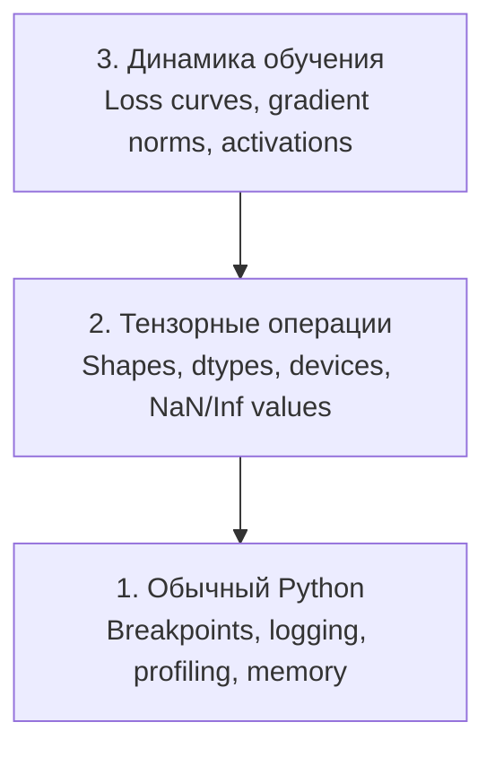

# Отладка и профилирование

> Худшие AI-баги не падают с ошибкой. Они тихо обучаются на мусоре и показывают красивую кривую loss.

**Тип:** Практика
**Язык:** Python
**Пререквизиты:** Урок 1 (Dev Environment), базовое знакомство с PyTorch
**Время:** ~60 минут

## Цели обучения

- Использовать условный `breakpoint()` и `debug_print` для проверки форм тензоров, dtype и NaN во время обучения
- Профилировать training loop через `cProfile`, `line_profiler` и `tracemalloc`, чтобы находить узкие места
- Находить типичные AI-ошибки: несовпадение shape, NaN loss, утечку данных и тензоры на неверном устройстве
- Настроить TensorBoard для визуализации loss-кривых, гистограмм весов и распределений градиентов

## Проблема

AI-код ломается иначе, чем обычный код. Веб-приложение падает со stack trace. Неправильно настроенный training loop может 8 часов жечь GPU, стоить $200 и в конце выдать модель, предсказывающую среднее значение для любого входа. Код не упал ни разу. Ошибка была в тензоре на неверном устройстве, забытом `.detach()` или утечке label в features.

Нужны инструменты отладки, которые ловят эти «тихие» поломки до того, как они сожгут ваше время и вычисления.

## Концепция

Отладка AI идет на трех уровнях:



Большинство людей сразу прыгают на уровень 3 (смотреть в TensorBoard). Но 80% AI-багов живут на уровнях 1 и 2.

## Реализация

### Часть 1: Print-отладка (да, это работает)

Print-отладку часто недооценивают. Зря. Для тензорного кода точечный print обычно полезнее пошагового дебаггера, потому что вам сразу нужны shape, dtype и диапазоны значений.

```python
def debug_print(name, tensor):
    print(f"{name}: shape={tensor.shape}, dtype={tensor.dtype}, "
          f"device={tensor.device}, "
          f"min={tensor.min().item():.4f}, max={tensor.max().item():.4f}, "
          f"mean={tensor.mean().item():.4f}, "
          f"has_nan={tensor.isnan().any().item()}")
```

Вызывайте после подозрительных операций. Нашли баг — удалили print'ы. Просто.

### Часть 2: Python debugger (pdb и breakpoint)

Встроенный дебаггер недооценивают в AI-задачах. Поставьте `breakpoint()` в training loop и исследуйте тензоры интерактивно.

```python
def training_step(model, batch, criterion, optimizer):
    inputs, labels = batch
    outputs = model(inputs)
    loss = criterion(outputs, labels)

    if loss.item() > 100 or torch.isnan(loss):
        breakpoint()

    loss.backward()
    optimizer.step()
```

Когда дебаггер остановился, полезные команды:

- `p outputs.shape` — проверить форму
- `p loss.item()` — посмотреть значение loss
- `p torch.isnan(outputs).sum()` — посчитать NaN
- `p model.fc1.weight.grad` — проверить градиенты
- `c` — продолжить, `q` — выйти

Это условная отладка: остановка только когда что-то выглядит не так. Для обучения на 10 000 шагов это критично.

### Часть 3: Python logging

Когда отладка уже не на «быстро проверить», заменяйте print на logging.

```python
import logging

logging.basicConfig(
    level=logging.INFO,
    format="%(asctime)s [%(levelname)s] %(message)s",
    handlers=[
        logging.FileHandler("training.log"),
        logging.StreamHandler()
    ]
)
logger = logging.getLogger(__name__)

logger.info("Starting training: lr=%.4f, batch_size=%d", lr, batch_size)
logger.warning("Loss spike detected: %.4f at step %d", loss.item(), step)
logger.error("NaN loss at step %d, stopping", step)
```

Logging дает timestamps, уровни важности и запись в файл. Если обучение упало в 3 часа ночи, нужен лог-файл, а не вывод, который уже прокрутился в терминале.

### Часть 4: Измерение времени участков кода

Понимание, куда уходит время, — первый шаг к оптимизации.

```python
import time

class Timer:
    def __init__(self, name=""):
        self.name = name

    def __enter__(self):
        self.start = time.perf_counter()
        return self

    def __exit__(self, *args):
        elapsed = time.perf_counter() - self.start
        print(f"[{self.name}] {elapsed:.4f}s")

with Timer("data loading"):
    batch = next(dataloader_iter)

with Timer("forward pass"):
    outputs = model(batch)

with Timer("backward pass"):
    loss.backward()
```

Частая находка: 60% времени уходит в data loading. Тогда нужен `num_workers > 0` в DataLoader, а не новый GPU.

### Часть 5: cProfile и line_profiler

Когда ручных таймеров недостаточно:

```bash
python -m cProfile -s cumtime train.py
```

Покажет все вызовы функций, отсортированные по cumulative time. Для профилирования по строкам:

```bash
pip install line_profiler
```

```python
@profile
def train_step(model, data, target):
    output = model(data)
    loss = F.cross_entropy(output, target)
    loss.backward()
    return loss

# Запуск: kernprof -l -v train.py
```

### Часть 6: Профилирование памяти

#### CPU-память через tracemalloc

```python
import tracemalloc

tracemalloc.start()

# ваш код
model = build_model()
data = load_dataset()

snapshot = tracemalloc.take_snapshot()
top_stats = snapshot.statistics("lineno")
for stat in top_stats[:10]:
    print(stat)
```

#### CPU-память через memory_profiler

```bash
pip install memory_profiler
```

```python
from memory_profiler import profile

@profile
def load_data():
    raw = read_csv("data.csv")       # здесь смотрим скачок памяти
    processed = preprocess(raw)       # и здесь
    return processed
```

Запускайте `python -m memory_profiler your_script.py`, чтобы увидеть расход памяти по строкам.

#### GPU-память через PyTorch

```python
import torch

if torch.cuda.is_available():
    print(torch.cuda.memory_summary())

    print(f"Allocated: {torch.cuda.memory_allocated() / 1e9:.2f} GB")
    print(f"Cached: {torch.cuda.memory_reserved() / 1e9:.2f} GB")
```

Когда получаете OOM (Out of Memory):

1. Уменьшите batch size (первое, что нужно попробовать)
2. Используйте `torch.cuda.empty_cache()` для освобождения кеша
3. Используйте `del tensor` и затем `torch.cuda.empty_cache()` для крупных промежуточных тензоров
4. Используйте mixed precision (`torch.cuda.amp`), чтобы снизить расход памяти примерно вдвое
5. Используйте gradient checkpointing для очень глубоких моделей

### Часть 7: Частые AI-баги и как их ловить

#### Несовпадение shape

Самый частый баг. Тензор имеет форму `[batch, features]`, а модель ожидает `[batch, channels, height, width]`.

```python
def check_shapes(model, sample_input):
    print(f"Input: {sample_input.shape}")
    hooks = []

    def make_hook(name):
        def hook(module, inp, out):
            in_shape = inp[0].shape if isinstance(inp, tuple) else inp.shape
            out_shape = out.shape if hasattr(out, "shape") else type(out)
            print(f"  {name}: {in_shape} -> {out_shape}")
        return hook

    for name, module in model.named_modules():
        hooks.append(module.register_forward_hook(make_hook(name)))

    with torch.no_grad():
        model(sample_input)

    for h in hooks:
        h.remove()
```

Запустите один раз на sample batch. Это покажет все преобразования shape внутри модели.

#### NaN loss

NaN loss означает, что вычисления «взорвались». Частые причины:

- Слишком высокий learning rate
- Деление на ноль в кастомной функции потерь
- Логарифм нуля или отрицательного числа
- Взрыв градиентов в RNN

```python
def detect_nan(model, loss, step):
    if torch.isnan(loss):
        print(f"NaN loss at step {step}")
        for name, param in model.named_parameters():
            if param.grad is not None:
                if torch.isnan(param.grad).any():
                    print(f"  NaN gradient in {name}")
                if torch.isinf(param.grad).any():
                    print(f"  Inf gradient in {name}")
        return True
    return False
```

#### Утечка данных (Data Leakage)

Модель показывает 99% accuracy на тесте. Звучит отлично. Чаще всего это баг.

```python
def check_data_leakage(train_set, test_set, id_column="id"):
    train_ids = set(train_set[id_column].tolist())
    test_ids = set(test_set[id_column].tolist())
    overlap = train_ids & test_ids
    if overlap:
        print(f"DATA LEAKAGE: {len(overlap)} samples in both train and test")
        return True
    return False
```

Также проверяйте temporal leakage: использование будущих данных для предсказания прошлого. Делите данные после сортировки по времени.

#### Неверное устройство (Wrong Device)

Тензоры на разных устройствах (CPU vs GPU) вызывают runtime-ошибки. Но иногда один тензор тихо остается на CPU, а остальное на GPU, и обучение просто становится медленным.

```python
def check_devices(model, *tensors):
    model_device = next(model.parameters()).device
    print(f"Model device: {model_device}")
    for i, t in enumerate(tensors):
        if t.device != model_device:
            print(f"  WARNING: tensor {i} on {t.device}, model on {model_device}")
```

### Часть 8: Основы TensorBoard

TensorBoard показывает, что происходит в обучении во времени.

```bash
pip install tensorboard
```

```python
from torch.utils.tensorboard import SummaryWriter

writer = SummaryWriter("runs/experiment_1")

for step in range(num_steps):
    loss = train_step(model, batch)

    writer.add_scalar("loss/train", loss.item(), step)
    writer.add_scalar("lr", optimizer.param_groups[0]["lr"], step)

    if step % 100 == 0:
        for name, param in model.named_parameters():
            writer.add_histogram(f"weights/{name}", param, step)
            if param.grad is not None:
                writer.add_histogram(f"grads/{name}", param.grad, step)

writer.close()
```

Запуск:

```bash
tensorboard --logdir=runs
```

На что смотреть:

- **Loss не уменьшается**: learning rate слишком маленький или проблема архитектуры
- **Loss сильно колеблется**: learning rate слишком высокий
- **Loss уходит в NaN**: численная нестабильность (см. раздел NaN)
- **Train loss падает, val loss растет**: переобучение
- **Гистограммы весов схлопываются к нулю**: затухающие градиенты
- **Гистограммы градиентов взрываются**: нужна gradient clipping

### Часть 9: Отладчик VS Code

Для интерактивной отладки настройте `launch.json` в VS Code:

```json
{
    "version": "0.2.0",
    "configurations": [
        {
            "name": "Debug Training",
            "type": "debugpy",
            "request": "launch",
            "program": "${file}",
            "console": "integratedTerminal",
            "justMyCode": false
        }
    ]
}
```

Ставьте breakpoints кликом по полю слева от кода. Во вкладке Variables проверяйте свойства тензоров. В Debug Console можно выполнять произвольные Python-выражения во время исполнения.

Особенно удобно для пошаговой проверки data preprocessing pipeline, когда нужно увидеть каждое преобразование.

## Применение

Вот workflow, который ловит большинство AI-багов:

1. **До начала обучения**: Запустите `check_shapes` на sample batch. Убедитесь, что входы/выходы имеют ожидаемые размеры.
2. **Первые 10 шагов**: Используйте `debug_print` для loss, outputs и gradients. Убедитесь, что нет NaN и значения в разумных диапазонах.
3. **Во время обучения**: Логируйте loss, learning rate и gradient norms. Используйте TensorBoard для визуализации.
4. **Если что-то сломалось**: Поставьте `breakpoint()` в точке ошибки. Интерактивно проверьте тензоры.
5. **Для производительности**: Замерьте время data loading vs forward vs backward. Профилируйте память, если близко к OOM.

## Результат

Запустите toolkit-скрипт отладки:

```bash
python phases/00-setup-and-tooling/12-debugging-and-profiling/code/debug_tools.py
```

Смотрите `outputs/prompt-debug-ai-code.md` для промпта, который помогает диагностировать AI-специфичные баги.

## Упражнения

1. Запустите `debug_tools.py` и изучите вывод всех секций. Измените dummy-модель так, чтобы получить NaN (подсказка: деление на ноль во `forward`) и проверьте, что детектор это поймал.
2. Профилируйте training loop через `cProfile` и найдите самую медленную функцию.
3. Используйте `tracemalloc`, чтобы найти строку в data loading pipeline, которая выделяет больше всего памяти.
4. Настройте TensorBoard для простого обучения и определите, переобучается ли модель.
5. Используйте `breakpoint()` внутри training loop и потренируйтесь проверять shape, device и значения градиентов в дебаггере.
