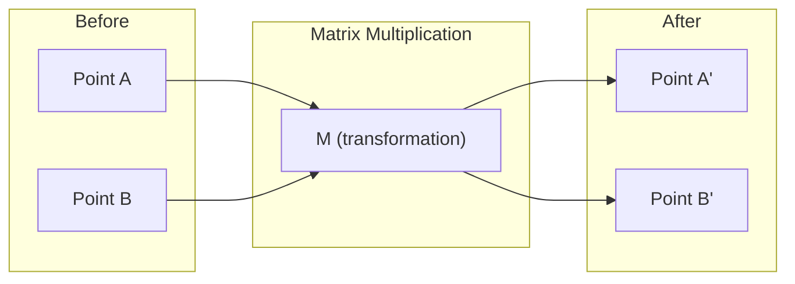
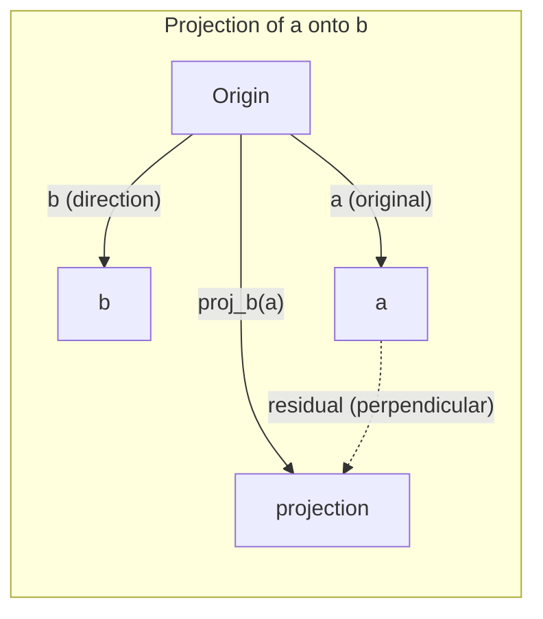

# Интуиция линейной алгебры

> Любая AI-модель — это просто матричная математика в модной шляпе.

**Тип:** Изучение  
**Языки:** Python, Julia  
**Требования:** Фаза 0  
**Время:** ~60 минут

## Цели обучения

- Реализовать операции с векторами и матрицами (сложение, скалярное произведение, умножение матриц) с нуля на Python
- Геометрически объяснить, что делают скалярное произведение, проекция и процесс Грама-Шмидта
- Определять линейную независимость, ранг и базис набора векторов с помощью приведения строк
- Связать понятия линейной алгебры с их применением в AI: эмбеддинги, оценки внимания и LoRA

## Проблема

Откройте любую статью по ML. Уже на первой странице вы увидите векторы, матрицы, скалярные произведения и преобразования. Без интуиции линейной алгебры это просто символы. С ней вы начинаете видеть, что на самом деле делает нейросеть — перемещает точки в пространстве.

Вам не нужно быть математиком. Нужно понимать геометрический смысл этих операций, а затем уметь реализовать их самостоятельно.

## Концепция

### Векторы — это точки (и направления)

Вектор — это просто список чисел. Но эти числа что-то значат: это координаты в пространстве.

**2D-вектор [3, 2]:**

| x | y | Точка |
|---|---|-------|
| 3 | 2 | Вектор направлен из начала координат (0,0) в точку (3, 2) на плоскости |

У вектора длина sqrt(3^2 + 2^2) = sqrt(13), и он направлен вверх и вправо.

В AI векторы представляют все:
- Слово → вектор из 768 чисел (его «смысл» в пространстве эмбеддингов)
- Изображение → вектор из миллионов значений пикселей
- Пользователь → вектор предпочтений

### Матрицы — это преобразования

Матрица преобразует один вектор в другой. Она может поворачивать, масштабировать, растягивать или проецировать.



В AI матрицы И ЕСТЬ модель:
- Веса нейросети → матрицы, преобразующие вход в выход
- Оценки внимания → матрицы, решающие, на что фокусироваться
- Эмбеддинги → матрицы, сопоставляющие словам векторы

### Скалярное произведение измеряет сходство

Скалярное произведение двух векторов показывает, насколько они похожи.

```
a · b = a₁×b₁ + a₂×b₂ + ... + aₙ×bₙ

Одно направление:     a · b > 0  (похожи)
Перпендикулярно:      a · b = 0  (не связаны)
Противоположно:       a · b < 0  (не похожи)
```

Именно так работают поисковики, рекомендательные системы и RAG — ищут векторы с большим скалярным произведением.

### Линейная независимость

Векторы линейно независимы, если ни один вектор из набора нельзя представить как комбинацию остальных. Если v1, v2, v3 независимы, они натягивают 3D-пространство. Если один выражается через другие, они натягивают только плоскость.

Почему это важно для AI: матрица признаков должна иметь линейно независимые столбцы. Если два признака идеально коррелируют (линейно зависимы), модель не может различить их вклад. Это вызывает мультиколлинеарность в регрессии — матрица весов становится неустойчивой, и малые изменения на входе дают резкие скачки на выходе.

**Конкретный пример:**

```
v1 = [1, 0, 0]
v2 = [0, 1, 0]
v3 = [2, 1, 0]   # v3 = 2*v1 + v2
```

v1 и v2 независимы — ни один не является скалярным множителем или комбинацией другого. Но v3 = 2*v1 + v2, значит {v1, v2, v3} — зависимый набор. Все три вектора лежат в плоскости xy. Как бы вы их ни комбинировали, вы не получите [0, 0, 1]. У вас три вектора, но только две степени свободы.

В датасете: если feature_3 = 2*feature_1 + feature_2, добавление feature_3 не дает модели новой информации. Хуже того, это делает нормальные уравнения вырожденными — для весов нет единственного решения.

### Базис и ранг

Базис — это минимальный набор линейно независимых векторов, натягивающий все пространство. Количество базисных векторов — это размерность пространства.

Стандартный базис в 3D — {[1,0,0], [0,1,0], [0,0,1]}. Но любые три независимых вектора в 3D тоже образуют корректный базис. Выбор базиса — это выбор системы координат.

Ранг матрицы = число линейно независимых столбцов = число линейно независимых строк. Если rank < min(rows, cols), матрица рангово-дефицитна. Это означает:
- У системы бесконечно много решений (или нет решений)
- При преобразовании теряется информация
- Матрицу нельзя обратить

| Ситуация | Ранг | Что это значит для ML |
|-----------|------|-----------------------|
| Полный ранг (rank = min(m, n)) | Максимально возможный | Существует единственное решение метода наименьших квадратов. Модель хорошо обусловлена. |
| Ранговый дефицит (rank < min(m, n)) | Ниже максимума | Признаки избыточны. Бесконечно много решений для весов. Нужна регуляризация. |
| Ранг 1 | 1 | Каждый столбец — масштабированная копия одного вектора. Все данные лежат на прямой. |
| Почти ранговый дефицит (малые сингулярные значения) | Численно низкий | Матрица плохо обусловлена. Малый шум на входе вызывает большие изменения на выходе. Используйте усечение SVD или ridge-регрессию. |

### Проекция

Проекция вектора **a** на вектор **b** дает компоненту **a** в направлении **b**:

```
proj_b(a) = (a dot b / b dot b) * b
```

Остаток (a - proj_b(a)) перпендикулярен b. Это ортогональное разложение — основа метода наименьших квадратов.

Проекция повсюду в ML:
- Линейная регрессия минимизирует расстояние от наблюдений до столбцового пространства — решение И ЕСТЬ проекция
- PCA проецирует данные на направления максимальной дисперсии
- Attention в трансформерах вычисляет проекции запросов на ключи



**Пример:** a = [3, 4], b = [1, 0]

proj_b(a) = (3*1 + 4*0) / (1*1 + 0*0) * [1, 0] = 3 * [1, 0] = [3, 0]

Проекция отбрасывает y-компоненту. Это простейшая форма понижения размерности — выбрасываем направления, которые нам не нужны.

### Процесс Грама-Шмидта

Преобразование любого набора независимых векторов в ортонормированный базис. Ортонормированный означает, что каждый вектор имеет длину 1, а каждая пара векторов взаимно перпендикулярна.

Алгоритм:
1. Берем первый вектор и нормализуем его
2. Берем второй вектор, вычитаем его проекцию на первый, нормализуем
3. Берем третий вектор, вычитаем его проекции на все предыдущие векторы, нормализуем
4. Повторяем для остальных векторов

```
Input:  v1, v2, v3, ... (linearly independent)

u1 = v1 / |v1|

w2 = v2 - (v2 dot u1) * u1
u2 = w2 / |w2|

w3 = v3 - (v3 dot u1) * u1 - (v3 dot u2) * u2
u3 = w3 / |w3|

Output: u1, u2, u3, ... (orthonormal basis)
```

Именно так внутри работает QR-разложение. Q — ортонормированный базис, R хранит коэффициенты проекций. QR-разложение применяют для:
- Решения линейных систем (стабильнее, чем исключение Гаусса)
- Вычисления собственных значений (QR-алгоритм)
- Регрессии методом наименьших квадратов (стандартный численный метод)

## Собери это

### Шаг 1: Векторы с нуля (Python)

```python
class Vector:
    def __init__(self, components):
        self.components = list(components)
        self.dim = len(self.components)

    def __add__(self, other):
        return Vector([a + b for a, b in zip(self.components, other.components)])

    def __sub__(self, other):
        return Vector([a - b for a, b in zip(self.components, other.components)])

    def dot(self, other):
        return sum(a * b for a, b in zip(self.components, other.components))

    def magnitude(self):
        return sum(x**2 for x in self.components) ** 0.5

    def normalize(self):
        mag = self.magnitude()
        return Vector([x / mag for x in self.components])

    def cosine_similarity(self, other):
        return self.dot(other) / (self.magnitude() * other.magnitude())

    def __repr__(self):
        return f"Vector({self.components})"


a = Vector([1, 2, 3])
b = Vector([4, 5, 6])

print(f"a + b = {a + b}")
print(f"a · b = {a.dot(b)}")
print(f"|a| = {a.magnitude():.4f}")
print(f"cosine similarity = {a.cosine_similarity(b):.4f}")
```

### Шаг 2: Матрицы с нуля (Python)

```python
class Matrix:
    def __init__(self, rows):
        self.rows = [list(row) for row in rows]
        self.shape = (len(self.rows), len(self.rows[0]))

    def __matmul__(self, other):
        if isinstance(other, Vector):
            return Vector([
                sum(self.rows[i][j] * other.components[j] for j in range(self.shape[1]))
                for i in range(self.shape[0])
            ])
        rows = []
        for i in range(self.shape[0]):
            row = []
            for j in range(other.shape[1]):
                row.append(sum(
                    self.rows[i][k] * other.rows[k][j]
                    for k in range(self.shape[1])
                ))
            rows.append(row)
        return Matrix(rows)

    def transpose(self):
        return Matrix([
            [self.rows[j][i] for j in range(self.shape[0])]
            for i in range(self.shape[1])
        ])

    def __repr__(self):
        return f"Matrix({self.rows})"


rotation_90 = Matrix([[0, -1], [1, 0]])
point = Vector([3, 1])

rotated = rotation_90 @ point
print(f"Original: {point}")
print(f"Rotated 90°: {rotated}")
```

### Шаг 3: Почему это важно для AI

```python
import random

random.seed(42)
weights = Matrix([[random.gauss(0, 0.1) for _ in range(3)] for _ in range(2)])
input_vector = Vector([1.0, 0.5, -0.3])

output = weights @ input_vector
print(f"Input (3D): {input_vector}")
print(f"Output (2D): {output}")
print("This is what a neural network layer does -- matrix multiplication.")
```

### Шаг 4: Версия на Julia

```julia
a = [1.0, 2.0, 3.0]
b = [4.0, 5.0, 6.0]

println("a + b = ", a + b)
println("a · b = ", a ⋅ b)       # Julia поддерживает unicode-операторы
println("|a| = ", √(a ⋅ a))
println("cosine = ", (a ⋅ b) / (√(a ⋅ a) * √(b ⋅ b)))

# Умножение матрицы на вектор
W = [0.1 -0.2 0.3; 0.4 0.5 -0.1]
x = [1.0, 0.5, -0.3]
println("Wx = ", W * x)
println("This is a neural network layer.")
```

### Шаг 5: Линейная независимость и проекция с нуля (Python)

```python
def is_linearly_independent(vectors):
    n = len(vectors)
    dim = len(vectors[0].components)
    mat = Matrix([v.components[:] for v in vectors])
    rows = [row[:] for row in mat.rows]
    rank = 0
    for col in range(dim):
        pivot = None
        for row in range(rank, len(rows)):
            if abs(rows[row][col]) > 1e-10:
                pivot = row
                break
        if pivot is None:
            continue
        rows[rank], rows[pivot] = rows[pivot], rows[rank]
        scale = rows[rank][col]
        rows[rank] = [x / scale for x in rows[rank]]
        for row in range(len(rows)):
            if row != rank and abs(rows[row][col]) > 1e-10:
                factor = rows[row][col]
                rows[row] = [rows[row][j] - factor * rows[rank][j] for j in range(dim)]
        rank += 1
    return rank == n


def project(a, b):
    scalar = a.dot(b) / b.dot(b)
    return Vector([scalar * x for x in b.components])


def gram_schmidt(vectors):
    orthonormal = []
    for v in vectors:
        w = v
        for u in orthonormal:
            proj = project(w, u)
            w = w - proj
        if w.magnitude() < 1e-10:
            continue
        orthonormal.append(w.normalize())
    return orthonormal


v1 = Vector([1, 0, 0])
v2 = Vector([1, 1, 0])
v3 = Vector([1, 1, 1])
basis = gram_schmidt([v1, v2, v3])
for i, u in enumerate(basis):
    print(f"u{i+1} = {u}")
    print(f"  |u{i+1}| = {u.magnitude():.6f}")

print(f"u1 · u2 = {basis[0].dot(basis[1]):.6f}")
print(f"u1 · u3 = {basis[0].dot(basis[2]):.6f}")
print(f"u2 · u3 = {basis[1].dot(basis[2]):.6f}")
```

## Применяй

Теперь то же самое с NumPy — именно это обычно используют на практике:

```python
import numpy as np

a = np.array([1, 2, 3], dtype=float)
b = np.array([4, 5, 6], dtype=float)

print(f"a + b = {a + b}")
print(f"a · b = {np.dot(a, b)}")
print(f"|a| = {np.linalg.norm(a):.4f}")
print(f"cosine = {np.dot(a, b) / (np.linalg.norm(a) * np.linalg.norm(b)):.4f}")

W = np.random.randn(2, 3) * 0.1
x = np.array([1.0, 0.5, -0.3])
print(f"Wx = {W @ x}")
```

### Ранг, проекция и QR в NumPy

```python
import numpy as np

A = np.array([[1, 2], [2, 4]])
print(f"Rank: {np.linalg.matrix_rank(A)}")

a = np.array([3, 4])
b = np.array([1, 0])
proj = (np.dot(a, b) / np.dot(b, b)) * b
print(f"Projection of {a} onto {b}: {proj}")

Q, R = np.linalg.qr(np.random.randn(3, 3))
print(f"Q is orthogonal: {np.allclose(Q @ Q.T, np.eye(3))}")
print(f"R is upper triangular: {np.allclose(R, np.triu(R))}")
```

### PyTorch — тензоры это векторы с autodiff

```python
import torch

x = torch.randn(3, requires_grad=True)
y = torch.tensor([1.0, 0.0, 0.0])

similarity = torch.dot(x, y)
similarity.backward()

print(f"x = {x.data}")
print(f"y = {y.data}")
print(f"dot product = {similarity.item():.4f}")
print(f"d(dot)/dx = {x.grad}")
```

Градиент скалярного произведения по x — это просто y. PyTorch вычислил это автоматически. Любая операция в нейросети строится из таких же блоков — умножений матриц, скалярных произведений, проекций — а autodiff отслеживает градиенты через все эти операции.

Вы только что реализовали с нуля то, что NumPy делает одной строкой. Теперь вы понимаете, что происходит под капотом.

## Ship It

Этот урок создает:
- `outputs/prompt-linear-algebra-tutor.md` — промпт для AI-ассистентов, чтобы преподавать линейную алгебру через геометрическую интуицию

## Связи

Все в этом уроке связано с конкретными частями современного AI:

| Понятие | Где встречается |
|---------|------------------|
| Скалярное произведение | Attention scores в трансформерах, cosine similarity в RAG |
| Умножение матриц | Каждый слой нейросети, каждое линейное преобразование |
| Линейная независимость | Отбор признаков, борьба с мультиколлинеарностью |
| Ранг | Проверка разрешимости системы, LoRA (low-rank adaptation) |
| Проекция | Линейная регрессия (проекция на столбцовое пространство), PCA |
| Грам-Шмидт / QR | Численные решатели, вычисление собственных значений |
| Ортонормированный базис | Стабильные численные вычисления, whitening-преобразования |

LoRA заслуживает отдельного внимания. Она дообучает большие языковые модели, раскладывая обновления весов на матрицы низкого ранга. Вместо обновления матрицы весов 4096x4096 (16M параметров), LoRA обновляет две матрицы размеров 4096x16 и 16x4096 (131K параметров). Ограничение rank-16 означает, что LoRA предполагает: обновление весов лежит в 16-мерном подпространстве полного 4096-мерного пространства. Это линейная алгебра в действии.

## Упражнения

1. Реализуйте `Vector.angle_between(other)`, возвращающий угол между двумя векторами в градусах
2. Создайте 2D-матрицу масштабирования, которая удваивает x-координату и утраивает y-координату, затем примените ее к вектору [1, 1]
3. Для 5 случайных векторов, похожих на словесные эмбеддинги (размерность 50), найдите два самых похожих по cosine similarity
4. Проверьте, что результат Gram-Schmidt действительно ортонормирован: у каждой пары скалярное произведение 0, у каждого вектора длина 1
5. Создайте матрицу 3x3 ранга 2. Проверьте это методом `rank()`. Затем объясните, какой геометрический объект натягивают ее столбцы.
6. Спроецируйте вектор [1, 2, 3] на [1, 1, 1]. Что геометрически означает результат?

## Ключевые термины

| Термин | Что обычно говорят | Что это реально значит |
|------|---------------------|-------------------------|
| Вектор | «Стрелка» | Список чисел, представляющий точку или направление в n-мерном пространстве |
| Матрица | «Таблица чисел» | Преобразование, отображающее векторы из одного пространства в другое |
| Скалярное произведение | «Умножить и сложить» | Мера того, насколько сонаправлены два вектора — основа поиска по сходству |
| Эмбеддинг | «Какая-то AI-магия» | Вектор, представляющий смысл объекта (слова, изображения, пользователя) |
| Линейная независимость | «Они не перекрываются» | Ни один вектор набора нельзя выразить через комбинацию остальных |
| Ранг | «Сколько размерностей» | Число линейно независимых столбцов (или строк) матрицы |
| Проекция | «Тень» | Компонента одного вектора в направлении другого |
| Базис | «Оси координат» | Минимальный набор независимых векторов, натягивающий пространство |
| Ортонормированный | «Перпендикулярные единичные векторы» | Векторы, попарно перпендикулярные и каждый длины 1 |
