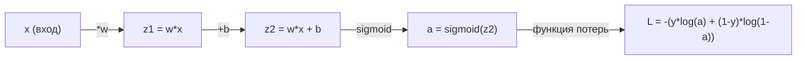
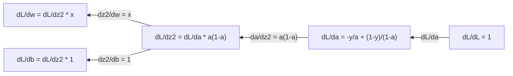
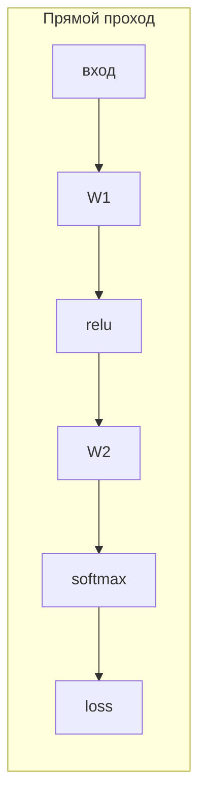
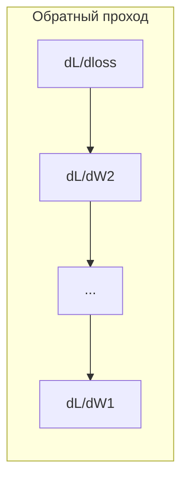

# Математический анализ для машинного обучения

> Производные показывают, в какую сторону вниз по склону. Этого достаточно, чтобы нейросеть училась.

**Тип:** Изучение
**Язык:** Python
**Требования:** Фаза 1, уроки 01-03
**Время:** ~60 минут

## Цели обучения

- Вычислять численные и аналитические производные для распространенных функций в ML (x^2, sigmoid, cross-entropy)
- Реализовать градиентный спуск с нуля для минимизации функции потерь в 1D и 2D
- Вывести градиент модели линейной регрессии и обучить ее ручными обновлениями весов
- Объяснить матрицу Гессе, приближения ряда Тейлора и их связь с методами оптимизации

## Проблема

У вас есть нейронная сеть с миллионами весов. Каждый вес - это ручка настройки. Нужно понять, в какую сторону повернуть каждую из этих ручек, чтобы модель стала чуть менее ошибочной. Математический анализ дает это направление.

Без анализа обучение нейросети выглядело бы как случайные изменения на удачу. С производными вы точно знаете, как каждый вес влияет на ошибку. Вы каждый раз поворачиваете каждую ручку в правильную сторону.

## Концепция

### Что такое производная?

Производная измеряет скорость изменения. Для функции y = f(x) производная f'(x) отвечает на вопрос: если слегка изменить x, насколько изменится y?

Геометрически производная - это наклон касательной в точке.

**f(x) = x^2:**

| x | f(x) | f'(x) (наклон) |
|---|------|----------------|
| 0 | 0    | 0 (ровно, внизу) |
| 1 | 1    | 2 |
| 2 | 4    | 4 (наклон касательной в этой точке) |
| 3 | 9    | 6 |

При x=2 наклон равен 4. Если немного сдвинуть x вправо, y увеличится примерно в 4 раза сильнее этого сдвига. При x=0 наклон равен 0. Вы на дне чаши.

Формальное определение:

```
f'(x) = lim   f(x + h) - f(x)
        h->0  -----------------
                     h
```

В коде предел не берут, а используют очень маленькое h. Это и есть численная производная.

### Частные производные: по одной переменной за раз

Реальные функции имеют много входов. Ошибка нейросети зависит от тысяч весов. Частная производная фиксирует все переменные, кроме одной, и берет производную по этой одной.

```
f(x, y) = x^2 + 3xy + y^2

df/dx = 2x + 3y     (считаем y константой)
df/dy = 3x + 2y     (считаем x константой)
```

Каждая частная производная отвечает на вопрос: если слегка изменить только этот один вес, как изменится ошибка?

### Градиент: вектор всех частных производных

Градиент собирает все частные производные в один вектор. Для функции f(x, y, z) градиент равен:

```
grad f = [ df/dx, df/dy, df/dz ]
```

Градиент указывает направление наискорейшего роста. Чтобы минимизировать функцию, нужно идти в противоположную сторону.

**Линии уровня для f(x,y) = x^2 + y^2:**

Функция образует форму чаши с концентрическими окружностями в качестве линий уровня. Минимум находится в (0, 0).

| Точка | grad f | -grad f (направление спуска) |
|-------|--------|------------------------------|
| (1, 1) | [2, 2] (указывает вверх, от минимума) | [-2, -2] (указывает вниз, к минимуму) |
| (0, 0) | [0, 0] (ровно, в минимуме) | [0, 0] |

Это и есть градиентный спуск в картинке. Вычислить градиент, сменить знак, сделать шаг.

### Связь с оптимизацией

Обучение нейросети - это оптимизация. У вас есть функция потерь L(w1, w2, ..., wn), которая измеряет, насколько ошибается модель. Вы хотите ее минимизировать.

```
Правило обновления градиентного спуска:

  w_new = w_old - learning_rate * dL/dw

Для каждого веса:
  1. Вычислить частную производную потерь по этому весу
  2. Вычесть из веса небольшую кратную этой производной
  3. Повторять
```

Скорость обучения управляет размером шага. Слишком большая - перепрыгнете минимум. Слишком маленькая - будете ползти.

**Ландшафт потерь (1D срез):**

Функция потерь L(w) образует кривую с вершинами и впадинами по мере изменения веса w.

| Особенность | Описание |
|-------------|----------|
| Глобальный минимум | Самая низкая точка на всей кривой - лучшее решение |
| Локальный минимум | Впадина, которая ниже соседних точек, но не самая низкая в целом |
| Наклон | Градиентный спуск идет вниз по наклону из любой стартовой точки |

Градиентный спуск движется вниз по склону. Он может застрять в локальных минимумах, но в пространствах большой размерности (миллионы весов) это редко становится практической проблемой.

### Численные и аналитические производные

Есть два способа вычислить производную.

Аналитический: применить правила анализа вручную. Для f(x) = x^2 производная равна f'(x) = 2x. Точно. Быстро.

Численный: приблизить по определению. Вычислить f(x+h) и f(x-h) для малого h, затем взять разность.

```
Численно (центральная разность):

f'(x) ~= f(x + h) - f(x - h)
          -----------------------
                  2h

h = 0.0001 обычно работает хорошо
```

Численные производные медленнее, но работают для любой функции. Аналитические производные быстры, но требуют вывода формулы. Фреймворки нейросетей используют третий подход: автоматическое дифференцирование, которое механически считает точные производные. Это будет в фазе 3.

### Производные вручную для простых функций

Это производные, которые в ML встречаются снова и снова.

```
Функция         Производная           Где используется
--------        ----------            -----------------
f(x) = x^2      f'(x) = 2x            Функции потерь (MSE)
f(x) = wx + b   f'(w) = x             Линейный слой (градиент по весу)
                f'(b) = 1             Линейный слой (градиент по смещению)
                f'(x) = w             Линейный слой (градиент по входу)
f(x) = e^x      f'(x) = e^x           Softmax, attention
f(x) = ln(x)    f'(x) = 1/x           Cross-entropy loss
f(x) = 1/(1+e^-x)  f'(x) = f(x)(1-f(x))   Сигмоида
```

Для f(x) = x^2:

```
f(x) = x^2    f'(x) = 2x

  x    f(x)   f'(x)   смысл
  -2    4      -4      наклон влево (убывает)
  -1    1      -2      наклон влево (убывает)
   0    0       0      ровно (минимум!)
   1    1       2      наклон вправо (возрастает)
   2    4       4      наклон вправо (возрастает)
```

Для f(w) = wx + b при x=3, b=1:

```
f(w) = 3w + 1    f'(w) = 3

Производная по w - это просто x.
Если x большой, маленькое изменение w дает большое изменение выхода.
```

### Правило цепочки

Когда функции составные, правило цепочки показывает, как их дифференцировать.

```
Если y = f(g(x)), то dy/dx = f'(g(x)) * g'(x)

Пример: y = (3x + 1)^2
  внешняя: f(u) = u^2       f'(u) = 2u
  внутренняя: g(x) = 3x + 1    g'(x) = 3
  dy/dx = 2(3x + 1) * 3 = 6(3x + 1)
```

Нейросети - это цепочки функций: input -> linear -> activation -> linear -> activation -> loss. Обратное распространение ошибки - это правило цепочки, примененное много раз от выхода ко входу. В этом и состоит весь алгоритм.

### Матрица Гессе

Градиент показывает наклон. Матрица Гессе показывает кривизну.

Матрица Гессе - это матрица вторых частных производных. Для функции f(x1, x2, ..., xn) элемент (i, j) матрицы Гессе равен:

```
H[i][j] = d^2f / (dx_i * dx_j)
```

Для функции двух переменных f(x, y):

```
H = | d^2f/dx^2    d^2f/dxdy |
    | d^2f/dydx    d^2f/dy^2 |
```

**Что матрица Гессе говорит в критической точке (где gradient = 0):**

| Свойство Гессе | Значение | Пример поверхности |
|----------------|----------|--------------------|
| Положительно определена (все собственные значения > 0) | Локальный минимум | Чаша, открытая вверх |
| Отрицательно определена (все собственные значения < 0) | Локальный максимум | Чаша, открытая вниз |
| Неопределена (смешанные знаки собственных значений) | Седловая точка | Форма седла |

**Пример:** f(x, y) = x^2 - y^2 (седловая функция)

```
df/dx = 2x       df/dy = -2y
d^2f/dx^2 = 2    d^2f/dy^2 = -2    d^2f/dxdy = 0

H = | 2   0 |
    | 0  -2 |

Собственные значения: 2 и -2 (одно положительное, одно отрицательное)
--> Седловая точка в (0, 0)
```

Сравните с f(x, y) = x^2 + y^2 (чаша):

```
H = | 2  0 |
    | 0  2 |

Собственные значения: 2 и 2 (оба положительные)
--> Локальный минимум в (0, 0)
```

**Почему матрица Гессе важна в ML:**

Метод Ньютона использует матрицу Гессе, чтобы делать более удачные шаги оптимизации, чем градиентный спуск. Вместо следования только наклону он учитывает кривизну:

```
Обновление Ньютона:   w_new = w_old - H^(-1) * gradient
Градиентный спуск:    w_new = w_old - lr * gradient
```

Метод Ньютона сходится быстрее, потому что матрица Гессе "перемасштабирует" градиент: в крутых направлениях шаги становятся меньше, в пологих - больше.

Проблема в том, что для нейросети с N параметрами матрица Гессе имеет размер N x N. Для модели с 1 миллионом параметров это матрица из 1 триллиона элементов. Поэтому используют приближения.

| Метод | Что использует | Стоимость | Сходимость |
|-------|----------------|-----------|------------|
| Градиентный спуск | Только первые производные | O(N) на шаг | Медленная (линейная) |
| Метод Ньютона | Полная матрица Гессе | O(N^3) на шаг | Быстрая (квадратичная) |
| L-BFGS | Приближенная Гессе из истории градиентов | O(N) на шаг | Средняя (сверхлинейная) |
| Adam | Адаптивные скорости для каждого параметра (диагональное приближение Гессе) | O(N) на шаг | Средняя |
| Natural gradient | Матрица Фишера (статистическая Гессе) | O(N^2) на шаг | Быстрая |

На практике Adam - оптимизатор по умолчанию в глубоком обучении. Он дешево приближает информацию второго порядка, отслеживая скользящее среднее и дисперсию градиентов для каждого параметра.

### Приближение рядом Тейлора

Любую гладкую функцию можно локально приблизить полиномом:

```
f(x + h) = f(x) + f'(x)*h + (1/2)*f''(x)*h^2 + (1/6)*f'''(x)*h^3 + ...
```

Чем больше членов вы добавляете, тем точнее приближение - но только рядом с точкой x.

**Почему ряды Тейлора важны для ML:**

- **Первый порядок Тейлора = градиентный спуск.** Когда вы используете f(x + h) ~ f(x) + f'(x)*h, вы строите линейное приближение. Градиентный спуск минимизирует эту линейную модель, выбирая h = -lr * f'(x).

- **Второй порядок Тейлора = метод Ньютона.** При f(x + h) ~ f(x) + f'(x)*h + (1/2)*f''(x)*h^2 получается квадратичная модель. Ее минимум дает h = -f'(x)/f''(x) - шаг Ньютона.

- **Проектирование функции потерь.** MSE и cross-entropy гладкие, значит их разложения Тейлора ведут себя хорошо. Это не случайность. Гладкие потери делают оптимизацию предсказуемой.

```
Порядок приближения      Что учитывает        Метод оптимизации
-------------------      -----------------    ------------------
0-й порядок (константа)  Только значение      Случайный поиск
1-й порядок (линейный)   Наклон               Градиентный спуск
2-й порядок (квадратич.) Кривизна             Метод Ньютона
Высшие порядки           Более тонкая структура  Редко применяются в ML
```

Ключевая мысль: вся градиентная оптимизация по сути локально приближает функцию потерь и делает шаг к минимуму этого приближения.

### Интегралы в ML

Производные показывают скорости изменения. Интегралы вычисляют накопление - площадь под кривой.

В ML вы редко считаете интегралы вручную, но сама идея встречается везде.

**Вероятность.** Для непрерывной случайной величины с плотностью p(x):
```
P(a < X < b) = интеграл от a до b p(x) dx
```
Площадь под кривой плотности вероятности между a и b - это вероятность попасть в этот диапазон.

**Математическое ожидание.** Средний результат, взвешенный вероятностью:
```
E[f(X)] = интеграл f(x) * p(x) dx
```
Ожидаемая ошибка по распределению данных - это интеграл. Обучение минимизирует его эмпирическое приближение.

**KL-дивергенция.** Измеряет различие двух распределений:
```
KL(p || q) = интеграл p(x) * log(p(x) / q(x)) dx
```
Используется в VAE, дистилляции знаний и байесовском выводе.

**Нормировочные константы.** В байесовском выводе:
```
p(w | data) = p(data | w) * p(w) / интеграл p(data | w) * p(w) dw
```
Знаменатель - это интеграл по всем возможным значениям параметров. Часто он невычислим аналитически, поэтому используют приближения, например MCMC и вариационный вывод.

| Понятие интеграла | Где встречается в ML |
|-------------------|----------------------|
| Площадь под кривой | Вероятности из функций плотности |
| Математическое ожидание | Функции потерь, минимизация риска |
| KL-дивергенция | VAE, оптимизация политик, дистилляция |
| Нормировка | Байесовские апостериорные распределения, знаменатель softmax |
| Маргинальное правдоподобие | Сравнение моделей, evidence lower bound (ELBO) |

### Многомерное правило цепочки в вычислительном графе

Правило цепочки применяется не только к скалярным функциям в одну линию. В нейросети переменные расходятся и сходятся. Вот как текут производные в простом прямом проходе:



Обратный проход вычисляет градиенты справа налево:



На каждой стрелке идет умножение на локальную производную. Градиент для любого параметра - это произведение всех локальных производных вдоль пути от функции потерь к этому параметру. Когда пути ветвятся и сливаются, вклады суммируются (многомерное правило цепочки).

Это и есть весь backpropagation: системное применение правила цепочки через вычислительный граф от выхода ко входам.

### Матрица Якоби

Когда функция отображает вектор в вектор (как слой нейросети), ее производная - это матрица. Матрица Якоби содержит все частные производные каждого выхода по каждому входу.

Для f: R^n -> R^m матрица Якоби J имеет размер m x n:

| | x1 | x2 | ... | xn |
|---|---|---|---|---|
| f1 | df1/dx1 | df1/dx2 | ... | df1/dxn |
| f2 | df2/dx1 | df2/dx2 | ... | df2/dxn |
| ... | ... | ... | ... | ... |
| fm | dfm/dx1 | dfm/dx2 | ... | dfm/dxn |

Для нейросетей вы не будете считать Якоби вручную. Это делает PyTorch. Но понимание, что она есть, помогает разбираться с размерностями в обратном распространении: если слой отображает R^n в R^m, его Якоби имеет размер m x n. Градиент течет назад через транспонированную матрицу.

### Почему это важно для нейросетей

Каждый вес в нейросети получает градиент. Градиент показывает, как изменить этот вес, чтобы уменьшить потери.





Каждое обновление весов:
- `W1 = W1 - lr * dL/dW1`
- `W2 = W2 - lr * dL/dW2`

Прямой проход вычисляет предсказание и функцию потерь. Обратный проход вычисляет градиент функции потерь по каждому весу. Затем каждый вес делает маленький шаг вниз по склону. Повторить миллионы раз. Это и есть deep learning.

## Практика

### Шаг 1: Численная производная с нуля

```python
def numerical_derivative(f, x, h=1e-7):
    return (f(x + h) - f(x - h)) / (2 * h)

def f(x):
    return x ** 2

for x in [-2, -1, 0, 1, 2]:
    numerical = numerical_derivative(f, x)
    analytical = 2 * x
    print(f"x={x:2d}  f'(x) numerical={numerical:.6f}  analytical={analytical:.1f}")
```

Численная производная совпадает с аналитической до многих знаков после запятой.

### Шаг 2: Частные производные и градиенты

```python
def numerical_gradient(f, point, h=1e-7):
    gradient = []
    for i in range(len(point)):
        point_plus = list(point)
        point_minus = list(point)
        point_plus[i] += h
        point_minus[i] -= h
        partial = (f(point_plus) - f(point_minus)) / (2 * h)
        gradient.append(partial)
    return gradient

def f_multi(point):
    x, y = point
    return x**2 + 3*x*y + y**2

grad = numerical_gradient(f_multi, [1.0, 2.0])
print(f"Numerical gradient at (1,2): {[f'{g:.4f}' for g in grad]}")
print(f"Analytical gradient at (1,2): [2*1+3*2, 3*1+2*2] = [{2*1+3*2}, {3*1+2*2}]")
```

### Шаг 3: Градиентный спуск для минимума f(x) = x^2

```python
x = 5.0
lr = 0.1
for step in range(20):
    grad = 2 * x
    x = x - lr * grad
    print(f"step {step:2d}  x={x:8.4f}  f(x)={x**2:10.6f}")
```

Стартуя с x=5, на каждом шаге вы приближаетесь к x=0 (минимум).

### Шаг 4: Градиентный спуск в 2D

```python
def f_2d(point):
    x, y = point
    return x**2 + y**2

point = [4.0, 3.0]
lr = 0.1
for step in range(30):
    grad = numerical_gradient(f_2d, point)
    point = [p - lr * g for p, g in zip(point, grad)]
    loss = f_2d(point)
    if step % 5 == 0 or step == 29:
        print(f"step {step:2d}  point=({point[0]:7.4f}, {point[1]:7.4f})  f={loss:.6f}")
```

### Шаг 5: Сравнение численных и аналитических производных

```python
import math

test_functions = [
    ("x^2",      lambda x: x**2,          lambda x: 2*x),
    ("x^3",      lambda x: x**3,          lambda x: 3*x**2),
    ("sin(x)",   lambda x: math.sin(x),   lambda x: math.cos(x)),
    ("e^x",      lambda x: math.exp(x),   lambda x: math.exp(x)),
    ("1/x",      lambda x: 1/x,           lambda x: -1/x**2),
]

x = 2.0
print(f"{'Function':<12} {'Numerical':>12} {'Analytical':>12} {'Error':>12}")
print("-" * 50)
for name, f, df in test_functions:
    num = numerical_derivative(f, x)
    ana = df(x)
    err = abs(num - ana)
    print(f"{name:<12} {num:12.6f} {ana:12.6f} {err:12.2e}")
```

### Шаг 6: Численное вычисление матрицы Гессе

```python
def hessian_2d(f, x, y, h=1e-5):
    fxx = (f(x + h, y) - 2 * f(x, y) + f(x - h, y)) / (h ** 2)
    fyy = (f(x, y + h) - 2 * f(x, y) + f(x, y - h)) / (h ** 2)
    fxy = (f(x + h, y + h) - f(x + h, y - h) - f(x - h, y + h) + f(x - h, y - h)) / (4 * h ** 2)
    return [[fxx, fxy], [fxy, fyy]]

def saddle(x, y):
    return x ** 2 - y ** 2

def bowl(x, y):
    return x ** 2 + y ** 2

H_saddle = hessian_2d(saddle, 0.0, 0.0)
H_bowl = hessian_2d(bowl, 0.0, 0.0)
print(f"Saddle Hessian: {H_saddle}")  # [[2, 0], [0, -2]] -- mixed signs
print(f"Bowl Hessian:   {H_bowl}")    # [[2, 0], [0, 2]]  -- both positive
```

У матрицы Гессе для седловой функции собственные значения 2 и -2 (разные знаки, что подтверждает седловую точку). У чаши собственные значения 2 и 2 (оба положительные, что подтверждает минимум).

### Шаг 7: Приближение Тейлора в действии

```python
import math

def taylor_approx(f, f_prime, f_double_prime, x0, h, order=2):
    result = f(x0)
    if order >= 1:
        result += f_prime(x0) * h
    if order >= 2:
        result += 0.5 * f_double_prime(x0) * h ** 2
    return result

x0 = 0.0
for h in [0.1, 0.5, 1.0, 2.0]:
    true_val = math.sin(h)
    t1 = taylor_approx(math.sin, math.cos, lambda x: -math.sin(x), x0, h, order=1)
    t2 = taylor_approx(math.sin, math.cos, lambda x: -math.sin(x), x0, h, order=2)
    print(f"h={h:.1f}  sin(h)={true_val:.4f}  order1={t1:.4f}  order2={t2:.4f}")
```

Рядом с x0=0 выполняется sin(x) ~ x (первый порядок Тейлора). Приближение отличное для маленьких h, но ухудшается для больших h. Поэтому градиентный спуск лучше работает с небольшими шагами обучения: каждый шаг предполагает, что линейное приближение точное.

### Шаг 8: Почему это важно для нейросети

```python
import random

random.seed(42)

w = random.gauss(0, 1)
b = random.gauss(0, 1)
lr = 0.01

xs = [1.0, 2.0, 3.0, 4.0, 5.0]
ys = [3.0, 5.0, 7.0, 9.0, 11.0]

for epoch in range(200):
    total_loss = 0
    dw = 0
    db = 0
    for x, y in zip(xs, ys):
        pred = w * x + b
        error = pred - y
        total_loss += error ** 2
        dw += 2 * error * x
        db += 2 * error
    dw /= len(xs)
    db /= len(xs)
    total_loss /= len(xs)
    w -= lr * dw
    b -= lr * db
    if epoch % 40 == 0 or epoch == 199:
        print(f"epoch {epoch:3d}  w={w:.4f}  b={b:.4f}  loss={total_loss:.6f}")

print(f"\nLearned: y = {w:.2f}x + {b:.2f}")
print(f"Actual:  y = 2x + 1")
```

Любой цикл обучения на основе градиента следует одному шаблону: предсказать, вычислить потери, вычислить градиенты, обновить веса.

## Применение

С NumPy те же операции выполняются быстрее и короче:

```python
import numpy as np

x = np.array([1, 2, 3, 4, 5], dtype=float)
y = np.array([3, 5, 7, 9, 11], dtype=float)

w, b = np.random.randn(), np.random.randn()
lr = 0.01

for epoch in range(200):
    pred = w * x + b
    error = pred - y
    loss = np.mean(error ** 2)
    dw = np.mean(2 * error * x)
    db = np.mean(2 * error)
    w -= lr * dw
    b -= lr * db

print(f"Learned: y = {w:.2f}x + {b:.2f}")
```

Вы только что собрали градиентный спуск с нуля. PyTorch автоматизирует вычисление градиентов, но цикл обновления остается тем же.

## Упражнения

1. Реализуйте `numerical_second_derivative(f, x)` через двойной вызов `numerical_derivative`. Проверьте, что вторая производная x^3 при x=2 равна 12.
2. Используйте градиентный спуск, чтобы найти минимум f(x, y) = (x - 3)^2 + (y + 1)^2. Старт из (0, 0). Ответ должен сходиться к (3, -1).
3. Добавьте momentum в цикл градиентного спуска: поддерживайте вектор скорости, который накапливает прошлые градиенты. Сравните скорость сходимости с momentum и без него на f(x) = x^4 - 3x^2.

## Ключевые термины

| Термин | Что обычно говорят | Что это на самом деле |
|--------|---------------------|-----------------------|
| Производная | "Наклон" | Скорость изменения функции в точке. Показывает, насколько меняется выход при изменении входа на единицу. |
| Частная производная | "Производная по одной переменной" | Производная по одной переменной при фиксированных остальных. |
| Градиент | "Направление наискорейшего роста" | Вектор всех частных производных. Указывает направление, в котором функция растет быстрее всего. |
| Градиентный спуск | "Иди вниз" | Вычитание градиента (умноженного на скорость обучения) из параметров для уменьшения функции потерь. Основа обучения нейросетей. |
| Скорость обучения | "Размер шага" | Скаляр, который задает размер шага градиентного спуска. Слишком большой: расходимость. Слишком маленький: медленная сходимость. |
| Правило цепочки | "Перемножаем производные" | Правило дифференцирования составных функций: df/dx = df/dg * dg/dx. Математическая основа backpropagation. |
| Матрица Якоби | "Матрица производных" | Если функция отображает векторы в векторы, матрица Якоби содержит все частные производные выходов по входам. |
| Численная производная | "Конечные разности" | Приближение производной через вычисление функции в двух близких точках и расчет наклона между ними. |
| Backpropagation | "Обратный autodiff" | Вычисление градиентов слой за слоем от выхода ко входу по правилу цепочки. Так нейросети обучаются. |
| Матрица Гессе | "Матрица вторых производных" | Матрица всех вторых частных производных. Описывает кривизну функции. Положительно определенная Гессе в критической точке означает локальный минимум. |
| Ряд Тейлора | "Полиномиальное приближение" | Приближение функции возле точки через производные: f(x+h) ~ f(x) + f'(x)h + (1/2)f''(x)h^2 + ... Основа понимания, почему работают градиентный спуск и метод Ньютона. |
| Интеграл | "Площадь под кривой" | Накопление величины по диапазону. В ML интегралы определяют вероятности, ожидания и KL-дивергенцию. |

## Дополнительные материалы

- [3Blue1Brown: Essence of Calculus](https://www.3blue1brown.com/topics/calculus) - визуальная интуиция для производных, интегралов и правила цепочки
- [Stanford CS231n: Backpropagation](https://cs231n.github.io/optimization-2/) - как градиенты проходят через слои нейросети
