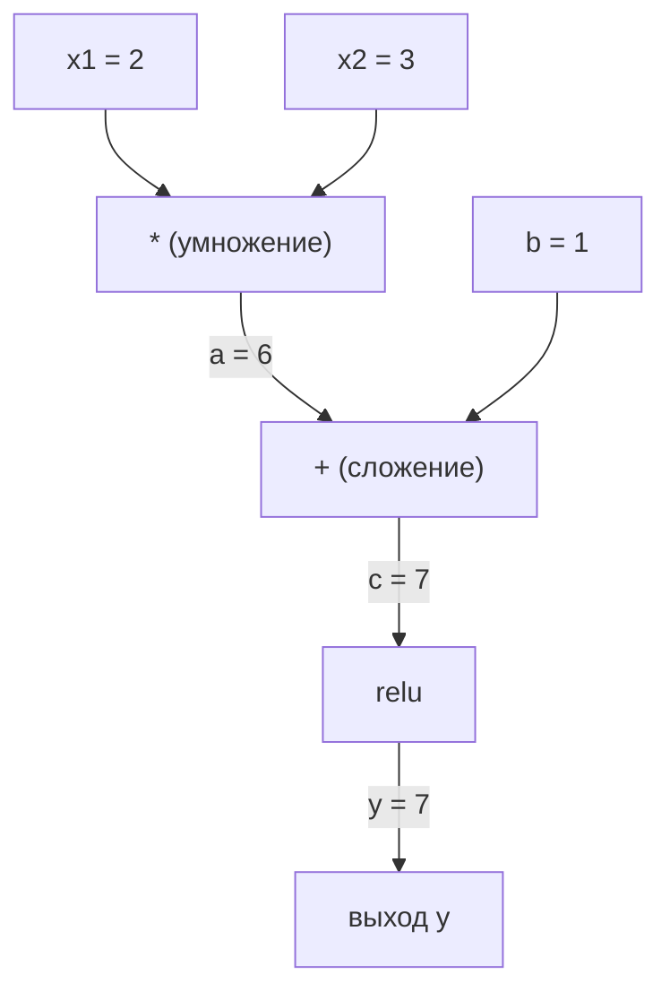
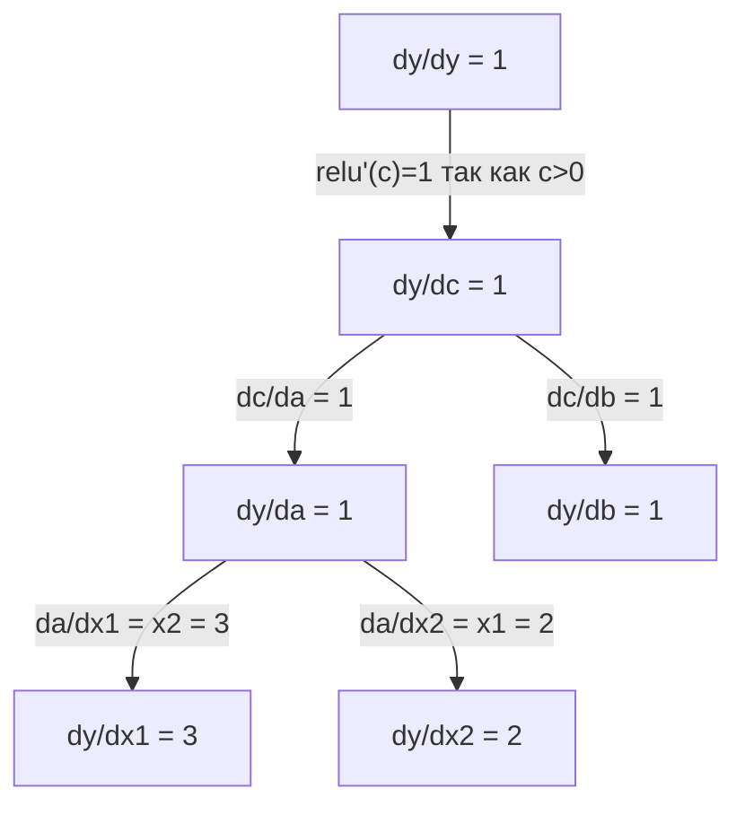

# Правило цепочки и автоматическое дифференцирование

> Правило цепочки - это двигатель каждого обучающегося нейросетевого алгоритма.

**Тип:** Практика
**Язык:** Python
**Требования:** Фаза 1, урок 04 (производные и градиенты)
**Время:** ~90 минут

## Цели обучения

- Собрать минимальный движок autograd (класс Value), который записывает операции и вычисляет градиенты через reverse-mode autodiff
- Реализовать прямой и обратный проходы по вычислительному графу с использованием топологической сортировки
- Построить и обучить многослойный перцептрон на XOR, используя только самодельный движок автодифференцирования
- Проверить корректность autodiff с помощью gradient checking против численных конечных разностей

## Проблема

Вы умеете считать производные простых функций. Но нейросеть - это не простая функция. Это сотни функций, составленных вместе: умножение матриц, добавление смещения, применение активации, снова умножение матриц, softmax, cross-entropy loss. Выход - это функция от функции от функции.

Чтобы обучать сеть, вам нужен градиент функции потерь по каждому весу. Делать это вручную невозможно для миллионов параметров. Считать численно (конечные разности) слишком медленно.

Правило цепочки дает математику. Автоматическое дифференцирование дает алгоритм. Вместе они позволяют вычислять точные градиенты через произвольные композиции функций за время, пропорциональное одному прямому проходу.

Именно так работают PyTorch, TensorFlow и JAX. Вы соберете мини-версию с нуля.

## Концепция

### Правило цепочки

Если `y = f(g(x))`, производная `y` по `x` равна:

```
dy/dx = dy/dg * dg/dx = f'(g(x)) * g'(x)
```

Перемножайте производные вдоль цепочки. Каждое звено вносит свою локальную производную.

Пример: `y = sin(x^2)`

```
g(x) = x^2       g'(x) = 2x
f(g) = sin(g)     f'(g) = cos(g)

dy/dx = cos(x^2) * 2x
```

Для более глубоких композиций цепочка расширяется:

```
y = f(g(h(x)))

dy/dx = f'(g(h(x))) * g'(h(x)) * h'(x)
```

Каждый слой нейросети - это одно звено в этой цепи.

### Вычислительные графы

Вычислительный граф делает правило цепочки наглядным. Каждая операция становится узлом. Данные идут вперед по графу. Градиенты идут назад.

**Прямой проход (вычисление значений):**



**Обратный проход (вычисление градиентов):**



Обратный проход применяет правило цепочки в каждом узле, распространяя градиенты от выхода ко входам.

### Forward mode и reverse mode

Есть два способа протащить правило цепочки через граф.

**Forward mode** стартует от входов и проталкивает производные вперед. Он задает `dx/dx = 1` и распространяет значение через каждую операцию. Удобен, когда входов мало, а выходов много.

```
Forward mode: задаем dx/dx = 1, распространяем вперед

  x = 2       (dx/dx = 1)
  a = x^2     (da/dx = 2x = 4)
  y = sin(a)  (dy/dx = cos(a) * da/dx = cos(4) * 4 = -2.615)
```

**Reverse mode** стартует от выхода и тянет градиенты назад. Он задает `dy/dy = 1` и распространяет через операции в обратном порядке. Удобен, когда входов много, а выходов мало.

```
Reverse mode: задаем dy/dy = 1, распространяем назад

  y = sin(a)  (dy/dy = 1)
  a = x^2     (dy/da = cos(a) = cos(4) = -0.654)
  x = 2       (dy/dx = dy/da * da/dx = -0.654 * 4 = -2.615)
```

В нейросетях миллионы входов (весов) и один выход (loss). Reverse mode вычисляет все градиенты за один backward-pass. Поэтому backpropagation использует именно его.

| Режим | Начальное значение | Направление | Когда лучше |
|------|---------------------|-------------|-------------|
| Forward | `dx_i/dx_i = 1` | От входа к выходу | Мало входов, много выходов |
| Reverse | `dy/dy = 1` | От выхода ко входу | Много входов, мало выходов (нейросети) |

### Дуальные числа для forward mode

Forward mode можно реализовать элегантно через дуальные числа. Дуальное число имеет вид `a + b*epsilon`, где `epsilon^2 = 0`.

```
Дуальное число: (значение, производная)

(2, 1) означает: значение 2, производная по x равна 1

Правила арифметики:
  (a, a') + (b, b') = (a+b, a'+b')
  (a, a') * (b, b') = (a*b, a'*b + a*b')
  sin(a, a')         = (sin(a), cos(a)*a')
```

Задайте для входной переменной производную 1. Производная автоматически пройдет через все операции.

### Сборка движка autograd

Движку autograd нужны три вещи:

1. **Обертка Value.** Обернуть каждое число в объект, который хранит значение и градиент.
2. **Запись графа.** Каждая операция сохраняет свои входы и локальную функцию градиента.
3. **Обратный проход.** Топологически отсортировать граф, затем пройти его в обратном порядке, применяя правило цепочки в каждом узле.

Именно это делает `autograd` в PyTorch. Класс `torch.Tensor` оборачивает значения, записывает операции при `requires_grad=True` и считает градиенты при вызове `.backward()`.

### Как устроен PyTorch Autograd под капотом

Когда вы пишете код на PyTorch:

```python
x = torch.tensor(2.0, requires_grad=True)
y = x ** 2 + 3 * x + 1
y.backward()
print(x.grad)  # 7.0 = 2*x + 3 = 2*2 + 3
```

PyTorch внутри:

1. Создает узел `Tensor` для `x` с `requires_grad=True`
2. Каждая операция (`**`, `*`, `+`) создает новый узел и сохраняет backward-функцию
3. `y.backward()` запускает reverse-mode autodiff по записанному графу
4. `grad_fn` каждого узла считает локальные градиенты и передает их родительским узлам
5. Градиенты накапливаются в атрибутах `.grad` через сложение (а не замену)

Граф динамический (define-by-run). Новый граф строится на каждом прямом проходе. Поэтому PyTorch поддерживает управляющие конструкции (if/else, циклы) внутри моделей.

## Практика

### Шаг 1: Класс Value

```python
class Value:
    def __init__(self, data, children=(), op=''):
        self.data = data
        self.grad = 0.0
        self._backward = lambda: None
        self._prev = set(children)
        self._op = op

    def __repr__(self):
        return f"Value(data={self.data:.4f}, grad={self.grad:.4f})"
```

Каждый `Value` хранит численные данные, градиент (изначально ноль), backward-функцию и ссылки на дочерние узлы, которые его породили.

### Шаг 2: Арифметические операции с отслеживанием градиента

```python
    def __add__(self, other):
        other = other if isinstance(other, Value) else Value(other)
        out = Value(self.data + other.data, (self, other), '+')
        def _backward():
            self.grad += out.grad
            other.grad += out.grad
        out._backward = _backward
        return out

    def __mul__(self, other):
        other = other if isinstance(other, Value) else Value(other)
        out = Value(self.data * other.data, (self, other), '*')
        def _backward():
            self.grad += other.data * out.grad
            other.grad += self.data * out.grad
        out._backward = _backward
        return out

    def relu(self):
        out = Value(max(0, self.data), (self,), 'relu')
        def _backward():
            self.grad += (1.0 if out.data > 0 else 0.0) * out.grad
        out._backward = _backward
        return out
```

Каждая операция создает closure, которая умеет считать локальные градиенты и умножать их на входящий градиент (`out.grad`). `+=` нужен для случая, когда одно значение участвует в нескольких операциях.

### Шаг 3: Обратный проход

```python
    def backward(self):
        topo = []
        visited = set()
        def build_topo(v):
            if v not in visited:
                visited.add(v)
                for child in v._prev:
                    build_topo(child)
                topo.append(v)
        build_topo(self)

        self.grad = 1.0
        for v in reversed(topo):
            v._backward()
```

Топологическая сортировка гарантирует, что градиент каждого узла полностью посчитан до передачи его детям. Начальный градиент равен 1.0 (dy/dy = 1).

### Шаг 4: Дополнительные операции для полноценного движка

Базовый класс Value поддерживает сложение, умножение и relu. Для реального autograd-движка нужно больше. Вот операции, нужные для сборки нейросетей:

```python
    def __neg__(self):
        return self * -1

    def __sub__(self, other):
        return self + (-other)

    def __radd__(self, other):
        return self + other

    def __rmul__(self, other):
        return self * other

    def __rsub__(self, other):
        return other + (-self)

    def __pow__(self, n):
        out = Value(self.data ** n, (self,), f'**{n}')
        def _backward():
            self.grad += n * (self.data ** (n - 1)) * out.grad
        out._backward = _backward
        return out

    def __truediv__(self, other):
        return self * (other ** -1) if isinstance(other, Value) else self * (Value(other) ** -1)

    def exp(self):
        import math
        e = math.exp(self.data)
        out = Value(e, (self,), 'exp')
        def _backward():
            self.grad += e * out.grad
        out._backward = _backward
        return out

    def log(self):
        import math
        out = Value(math.log(self.data), (self,), 'log')
        def _backward():
            self.grad += (1.0 / self.data) * out.grad
        out._backward = _backward
        return out

    def tanh(self):
        import math
        t = math.tanh(self.data)
        out = Value(t, (self,), 'tanh')
        def _backward():
            self.grad += (1 - t ** 2) * out.grad
        out._backward = _backward
        return out
```

**Зачем нужна каждая операция:**

| Операция | Правило backward | Где используется |
|----------|------------------|------------------|
| `__sub__` | Переиспользует add + neg | Вычисление потерь (pred - target) |
| `__pow__` | n * x^(n-1) | Полиномиальные активации, MSE (error^2) |
| `__truediv__` | Переиспользует mul + pow(-1) | Нормализация, масштабирование learning rate |
| `exp` | exp(x) * upstream | Softmax, log-likelihood |
| `log` | (1/x) * upstream | Cross-entropy loss, лог-вероятности |
| `tanh` | (1 - tanh^2) * upstream | Классическая функция активации |

Хитрый момент: `__sub__` и `__truediv__` определены через уже существующие операции. Они получают корректные градиенты автоматически, потому что правило цепочки проходит через базовые add/mul/pow.

### Шаг 5: Мини-MLP с нуля

С полноценным классом Value вы можете собрать нейросеть. Без PyTorch. Без NumPy. Только Value и правило цепочки.

```python
import random

class Neuron:
    def __init__(self, n_inputs):
        self.w = [Value(random.uniform(-1, 1)) for _ in range(n_inputs)]
        self.b = Value(0.0)

    def __call__(self, x):
        act = sum((wi * xi for wi, xi in zip(self.w, x)), self.b)
        return act.tanh()

    def parameters(self):
        return self.w + [self.b]

class Layer:
    def __init__(self, n_inputs, n_outputs):
        self.neurons = [Neuron(n_inputs) for _ in range(n_outputs)]

    def __call__(self, x):
        return [n(x) for n in self.neurons]

    def parameters(self):
        return [p for n in self.neurons for p in n.parameters()]

class MLP:
    def __init__(self, sizes):
        self.layers = [Layer(sizes[i], sizes[i+1]) for i in range(len(sizes)-1)]

    def __call__(self, x):
        for layer in self.layers:
            x = layer(x)
        return x[0] if len(x) == 1 else x

    def parameters(self):
        return [p for layer in self.layers for p in layer.parameters()]
```

`Neuron` считает `tanh(w1*x1 + w2*x2 + ... + b)`. `Layer` - это список нейронов. `MLP` складывает слои в стек. Каждый вес - это `Value`, поэтому вызов `loss.backward()` проталкивает градиенты ко всем параметрам.

**Обучение на XOR:**

```python
random.seed(42)
model = MLP([2, 4, 1])  # 2 входа, 4 скрытых нейрона, 1 выход

xs = [[0, 0], [0, 1], [1, 0], [1, 1]]
ys = [-1, 1, 1, -1]  # паттерн XOR (используем -1/1 для tanh)

for step in range(100):
    preds = [model(x) for x in xs]
    loss = sum((p - y) ** 2 for p, y in zip(preds, ys))

    for p in model.parameters():
        p.grad = 0.0
    loss.backward()

    lr = 0.05
    for p in model.parameters():
        p.data -= lr * p.grad

    if step % 20 == 0:
        print(f"step {step:3d}  loss = {loss.data:.4f}")

print("\nPredictions after training:")
for x, y in zip(xs, ys):
    print(f"  input={x}  target={y:2d}  pred={model(x).data:6.3f}")
```

Это и есть micrograd. Полный цикл обучения нейросети на чистом Python с автоматическим дифференцированием. Все коммерческие DL-фреймворки делают то же самое, только в огромном масштабе.

### Шаг 6: Проверка градиентов

Как понять, что autodiff работает правильно? Сравнить его с численными производными. Это и есть gradient checking.

```python
def gradient_check(build_expr, x_val, h=1e-7):
    x = Value(x_val)
    y = build_expr(x)
    y.backward()
    autodiff_grad = x.grad

    y_plus = build_expr(Value(x_val + h)).data
    y_minus = build_expr(Value(x_val - h)).data
    numerical_grad = (y_plus - y_minus) / (2 * h)

    diff = abs(autodiff_grad - numerical_grad)
    return autodiff_grad, numerical_grad, diff
```

Проверьте на более сложном выражении:

```python
def expr(x):
    return (x ** 3 + x * 2 + 1).tanh()

ad, num, diff = gradient_check(expr, 0.5)
print(f"Autodiff:  {ad:.8f}")
print(f"Numerical: {num:.8f}")
print(f"Difference: {diff:.2e}")
# Difference should be < 1e-5
```

Gradient checking критически важен при добавлении новых операций. Если в backward-проходе есть ошибка, численная проверка ее поймает. В любой серьезной реализации deep learning такие проверки запускаются во время разработки.

**Когда использовать gradient checking:**

| Ситуация | Делать проверку градиента? |
|----------|----------------------------|
| Добавляете новую операцию в autograd | Да, всегда |
| Отлаживаете обучение, которое не сходится | Да, сначала проверьте градиенты |
| Продакшен-обучение | Нет, слишком медленно (2x прямых прохода на параметр) |
| Unit-тесты для autograd-кода | Да, автоматизировать |

### Шаг 7: Сверка с ручным расчетом

```python
x1 = Value(2.0)
x2 = Value(3.0)
a = x1 * x2          # a = 6.0
b = a + Value(1.0)    # b = 7.0
y = b.relu()          # y = 7.0

y.backward()

print(f"y = {y.data}")          # 7.0
print(f"dy/dx1 = {x1.grad}")   # 3.0 (= x2)
print(f"dy/dx2 = {x2.grad}")   # 2.0 (= x1)
```

Ручная проверка: `y = relu(x1*x2 + 1)`. Так как `x1*x2 + 1 = 7 > 0`, relu здесь тождественна.
`dy/dx1 = x2 = 3`. `dy/dx2 = x1 = 2`. Движок совпадает с ручным расчетом.

## Применение

### Сверка с PyTorch

```python
import torch

x1 = torch.tensor(2.0, requires_grad=True)
x2 = torch.tensor(3.0, requires_grad=True)
a = x1 * x2
b = a + 1.0
y = torch.relu(b)
y.backward()

print(f"PyTorch dy/dx1 = {x1.grad.item()}")  # 3.0
print(f"PyTorch dy/dx2 = {x2.grad.item()}")  # 2.0
```

Градиенты те же. Ваш движок считает тот же результат, что и PyTorch, потому что математика одна и та же: reverse-mode autodiff через правило цепочки.

### Более сложное выражение

```python
a = Value(2.0)
b = Value(-3.0)
c = Value(10.0)
f = (a * b + c).relu()  # relu(2*(-3) + 10) = relu(4) = 4

f.backward()
print(f"df/da = {a.grad}")  # -3.0 (= b)
print(f"df/db = {b.grad}")  #  2.0 (= a)
print(f"df/dc = {c.grad}")  #  1.0
```

## Финал

Этот урок дает:
- `outputs/skill-autodiff.md` -- навык по сборке и отладке autograd-систем
- `code/autodiff.py` -- минимальный autograd-движок, который можно расширять

Класс Value, собранный здесь, - это фундамент цикла обучения нейросети в фазе 3.

## Упражнения

1. Добавьте `__pow__` в класс Value, чтобы вычислять `x ** n`. Проверьте, что `d/dx(x^3)` при `x=2` равно `12.0`.

2. Добавьте `tanh` как функцию активации. Проверьте, что `tanh'(0) = 1` и `tanh'(2) = 0.0707` (примерно).

3. Постройте вычислительный граф для одного нейрона: `y = relu(w1*x1 + w2*x2 + b)`. Посчитайте все пять градиентов и проверьте их с PyTorch.

4. Реализуйте forward-mode autodiff через дуальные числа. Создайте класс `Dual` и проверьте, что он дает те же производные, что и ваш reverse-mode движок.

## Ключевые термины

| Термин | Что обычно говорят | Что это на самом деле |
|--------|---------------------|-----------------------|
| Правило цепочки | "Перемножаем производные" | Производная композиции функций равна произведению локальных производных каждой функции, вычисленных в правильной точке |
| Вычислительный граф | "Схема сети" | Ориентированный ациклический граф, где узлы - операции, а ребра несут значения (вперед) или градиенты (назад) |
| Forward mode | "Проталкиваем производные вперед" | Autodiff, который распространяет производные от входов к выходам. Один проход на входную переменную. |
| Reverse mode | "Backpropagation" | Autodiff, который распространяет градиенты от выходов ко входам. Один проход на выходную переменную. |
| Autograd | "Автоматические градиенты" | Система, которая записывает операции над значениями, строит граф и вычисляет точные градиенты по правилу цепочки |
| Дуальные числа | "Значение плюс производная" | Числа вида a + b*epsilon (epsilon^2 = 0), которые переносят информацию о производной через арифметику |
| Топологическая сортировка | "Порядок зависимостей" | Упорядочивание узлов графа так, чтобы каждый узел шел после всех своих зависимостей. Нужно для корректной передачи градиентов. |
| Накопление градиента | "Складывать, не заменять" | Когда значение идет в несколько операций, его градиент равен сумме всех входящих вкладов градиента |
| Динамический граф | "Define by run" | Вычислительный граф, который строится заново на каждом прямом проходе, позволяя Python-управляющие конструкции внутри моделей (стиль PyTorch) |
| Gradient checking | "Численная верификация" | Сравнение градиентов autodiff с численными конечными разностями для проверки корректности. Критично для отладки. |
| MLP | "Многослойный перцептрон" | Нейросеть с одним или несколькими скрытыми слоями нейронов. Каждый нейрон считает взвешенную сумму плюс смещение, затем применяет активацию. |
| Нейрон | "Взвешенная сумма + активация" | Базовая единица: output = activation(w1*x1 + w2*x2 + ... + b). Веса и смещение - обучаемые параметры. |

## Дополнительные материалы

- [3Blue1Brown: Backpropagation calculus](https://www.youtube.com/watch?v=tIeHLnjs5U8) -- визуальное объяснение правила цепочки в нейросетях
- [PyTorch Autograd mechanics](https://pytorch.org/docs/stable/notes/autograd.html) -- как устроена реальная система
- [Baydin et al., Automatic Differentiation in Machine Learning: a Survey](https://arxiv.org/abs/1502.05767) -- подробный обзор
