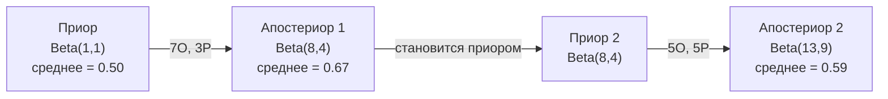

# Теорема Байеса

> Вероятность - это то, что вы ожидаете. Теорема Байеса - это то, что вы узнаете.

**Тип:** Практика
**Язык:** Python
**Требования:** Фаза 1, урок 06 (основы вероятности)
**Время:** ~75 минут

## Цели обучения

- Применять теорему Байеса для вычисления апостериорных вероятностей из приоров, правдоподобия и свидетельства
- Собрать классификатор Naive Bayes с нуля с лапласовым сглаживанием и вычислениями в логарифмическом пространстве
- Сравнить оценки MLE и MAP и объяснить, как MAP соответствует L2-регуляризации
- Реализовать последовательное байесовское обновление, используя сопряженные приоры Beta-Binomial для A/B-тестирования

## Проблема

Медицинский тест точен на 99%. Вы дали положительный результат. Какова вероятность, что вы действительно болеете?

Большинство скажут 99%. Реальный ответ зависит от того, насколько редко заболевание. Если заболевает 1 из 10 000 людей, положительный результат дает вам примерно 1% шанс быть больным. Остальные 99% положительных результатов - это ложные тревоги от здоровых людей.

Это не уловка. Это теорема Байеса. Каждый фильтр спама, каждая медицинская диагностика, каждая модель ML, которая квантифицирует неопределённость, использует именно эту логику. Вы начинаете с убеждения. Вы видите свидетельство. Вы обновляете.

Если вы строите ML-системы без понимания этого, вы неправильно интерпретируете выходы модели, устанавливаете плохие пороги и выпускаете излишне уверенные предсказания.

## Концепция

### От совместной вероятности к Байесу

Вы уже знаете из урока 06, что условная вероятность это:

```
P(A|B) = P(A и B) / P(B)
```

И симметрично:

```
P(B|A) = P(A и B) / P(A)
```

Оба выражения имеют один числитель: P(A и B). Приравняйте их и переставьте:

```
P(A и B) = P(A|B) * P(B) = P(B|A) * P(A)

Следовательно:

P(A|B) = P(B|A) * P(A) / P(B)
```

Это теорема Байеса. Четыре величины, одно уравнение.

### Четыре части

| Часть | Название | Что это значит |
|-------|----------|----------------|
| P(A\|B) | Апостериор | Ваше обновленное убеждение о A после наблюдения свидетельства B |
| P(B\|A) | Правдоподобие | Насколько вероятно свидетельство B, если A истинно |
| P(A) | Приор | Ваше убеждение о A до наблюдения любого свидетельства |
| P(B) | Свидетельство | Полная вероятность увидеть B при всех возможностях |

Член свидетельства P(B) действует как нормализатор. Вы можете расширить его, используя закон полной вероятности:

```
P(B) = P(B|A) * P(A) + P(B|не A) * P(не A)
```

### Пример с медицинским тестом

Болезнь поражает 1 из 10 000 человек. Тест точен на 99% (обнаруживает 99% больных, дает ложные положительные 1% времени).

```
P(болен)            = 0.0001     (приор: болезнь редка)
P(тест+|болен)      = 0.99       (правдоподобие: тест обнаруживает)
P(тест+|здоров)     = 0.01       (частота ложных положительных)

P(тест+) = P(тест+|болен) * P(болен) + P(тест+|здоров) * P(здоров)
          = 0.99 * 0.0001 + 0.01 * 0.9999
          = 0.000099 + 0.009999
          = 0.010098

P(болен|тест+) = P(тест+|болен) * P(болен) / P(тест+)
                = 0.99 * 0.0001 / 0.010098
                = 0.0098
                = 0.98%
```

Менее 1%. Приор преобладает. Когда условие редко, даже точные тесты дают в основном ложные положительные. Поэтому врачи назначают контрольные тесты.

### Пример фильтра спама

Вы получаете письмо, содержащее слово "лотерея". Это спам?

```
P(спам)               = 0.3      (30% писем это спам)
P("лотерея"|спам)     = 0.05     (5% спама содержат "лотерею")
P("лотерея"|не спам)  = 0.001    (0.1% легального содержат "лотерею")

P("лотерея") = 0.05 * 0.3 + 0.001 * 0.7
             = 0.015 + 0.0007
             = 0.0157

P(спам|"лотерея") = 0.05 * 0.3 / 0.0157
                   = 0.955
                   = 95.5%
```

Одно слово сдвигает вероятность с 30% на 95.5%. Реальный фильтр спама применяет Байес к сотням слов одновременно.

### Naive Bayes: предположение о независимости

Naive Bayes расширяет это на несколько признаков, предполагая, что все признаки условно независимы при наличии класса:

```
P(класс | признак_1, признак_2, ..., признак_n)
  = P(класс) * P(признак_1|класс) * P(признак_2|класс) * ... * P(признак_n|класс)
    / P(признак_1, признак_2, ..., признак_n)
```

"Наивная" часть - это предположение о независимости. В тексте вхождения слов не независимы ("Нью" и "Йорк" коррелируют). Но предположение удивительно хорошо работает на практике, потому что классификатору нужно только ранжировать классы, а не давать откалиброванные вероятности.

Так как знаменатель одинаков для всех классов, вы можете его пропустить и просто сравнивать числители:

```
оценка(класс) = P(класс) * произведение P(признак_i | класс)
```

Выбирайте класс с наивысшей оценкой.

### Оценка максимального правдоподобия (MLE)

Как получить P(признак|класс) из обучающих данных? Считайте.

```
P("свободно"|спам) = (количество спам-писем, содержащих "свободно") / (всего спам-писем)
```

Это MLE: выбрать значения параметров, которые делают наблюдаемые данные наиболее вероятными. Вы максимизируете функцию правдоподобия, которая для дискретных счетов сводится к относительной частоте.

Проблема: если слово никогда не появляется в спаме во время обучения, MLE дает ему вероятность ноль. Одно невидимое слово убивает все произведение. Исправьте это лапласовым сглаживанием:

```
P(слово|класс) = (количество(слово, класс) + 1) / (всего_слов_в_классе + размер_словаря)
```

Добавление 1 к каждому счету гарантирует, что ни одна вероятность не будет нулевой.

### Максимум апостериорной оценки (MAP)

MLE спрашивает: какие параметры максимизируют P(данные|параметры)?

MAP спрашивает: какие параметры максимизируют P(параметры|данные)?

По теореме Байеса:

```
P(параметры|данные) пропорционально P(данные|параметры) * P(параметры)
```

MAP добавляет приор над самими параметрами. Если вы верите, что параметры должны быть маленькими, вы кодируете это как приор, штрафующий большие значения. Это идентично L2-регуляризации в ML. Штраф "ridge" в ridge-регрессии буквально гауссов приор на весах.

| Оценка | Оптимизирует | ML эквивалент |
|--------|-------------|---------------|
| MLE | P(данные\|параметры) | Неурегуляризованное обучение |
| MAP | P(данные\|параметры) * P(параметры) | L2 / L1 регуляризация |

### Байесовский vs частотистский: практическая разница

Частотисты рассматривают параметры как фиксированные неизвестные. Они спрашивают: "Если я повторю этот эксперимент много раз, что произойдет?"

Байесовцы рассматривают параметры как распределения. Они спрашивают: "Учитывая то, что я наблюдал, что я верю о параметрах?"

Для построения ML-систем практическая разница:

| Аспект | Частотистский | Байесовский |
|--------|-------------|------------|
| Выход | Точечная оценка | Распределение над значениями |
| Неопределённость | Доверительные интервалы (о процедуре) | Интервалы достоверности (о параметре) |
| Мало данных | Может переобучаться | Приор действует как регуляризация |
| Вычисления | Обычно быстрее | Часто требует семплирования (MCMC) |

Большинство продакшена ML это частотистское (SGD, точечные оценки). Байесовские методы сияют когда вам нужна откалиброванная неопределённость (медицинские решения, критичные для безопасности системы) или когда данных мало (few-shot learning, холодный старт).

### Почему байесовское мышление важно для ML

Связь глубже, чем просто аналогия:

**Приоры это регуляризация.** Гауссов приор на весах это L2-регуляризация. Приор Лапласа это L1. Каждый раз, когда вы добавляете регуляризационный член, вы делаете байесовское утверждение о том, какие значения параметров вы ожидаете.

**Апостериоры это неопределённость.** Одна предсказанная вероятность ничего не говорит о том, насколько модель уверена в этой оценке. Байесовские методы дают вам распределение: "Я думаю, P(спам) между 0.8 и 0.95."

**Обновления Байеса это онлайн-обучение.** Апостериор сегодня становится приором завтра. Когда ваша модель видит новые данные, она инкрементально обновляет убеждения вместо переобучения с нуля.

**Сравнение моделей байесовское.** Байесовский информационный критерий (BIC), маргинальное правдоподобие и факторы Байеса все используют байесовскую логику для выбора между моделями без переобучения.

## Практика

### Шаг 1: Функция теоремы Байеса

```python
def bayes(prior, likelihood, false_positive_rate):
    evidence = likelihood * prior + false_positive_rate * (1 - prior)
    posterior = likelihood * prior / evidence
    return posterior

result = bayes(prior=0.0001, likelihood=0.99, false_positive_rate=0.01)
print(f"P(болен|тест+) = {result:.4f}")
```

### Шаг 2: Классификатор Naive Bayes

```python
import math
from collections import defaultdict

class NaiveBayes:
    def __init__(self, smoothing=1.0):
        self.smoothing = smoothing
        self.class_counts = defaultdict(int)
        self.word_counts = defaultdict(lambda: defaultdict(int))
        self.class_word_totals = defaultdict(int)
        self.vocab = set()

    def train(self, documents, labels):
        for doc, label in zip(documents, labels):
            self.class_counts[label] += 1
            words = doc.lower().split()
            for word in words:
                self.word_counts[label][word] += 1
                self.class_word_totals[label] += 1
                self.vocab.add(word)

    def predict(self, document):
        words = document.lower().split()
        total_docs = sum(self.class_counts.values())
        vocab_size = len(self.vocab)
        best_class = None
        best_score = float("-inf")
        for cls in self.class_counts:
            score = math.log(self.class_counts[cls] / total_docs)
            for word in words:
                count = self.word_counts[cls].get(word, 0)
                total = self.class_word_totals[cls]
                score += math.log((count + self.smoothing) / (total + self.smoothing * vocab_size))
            if score > best_score:
                best_score = score
                best_class = cls
        return best_class
```

Логарифмические вероятности предотвращают underflow. Умножение множества маленьких вероятностей дает числа слишком маленькие для floating point. Суммирование log-вероятностей численно стабильно и математически эквивалентно.

### Шаг 3: Обучение на данных спама

```python
train_docs = [
    "выиграйте бесплатные деньги сейчас",
    "бесплатный билет лотереи победитель",
    "требуется ваш приз сегодня бесплатно",
    "срочное предложение бесплатные деньги",
    "поздравляем вы выиграли бесплатно",
    "встреча завтра в полдень",
    "обновление проекта в приложении",
    "можем ли мы запланировать звонок",
    "обзор квартального отчета",
    "обед в четверг звучит хорошо",
    "заметки стендапа команды в приложении",
    "пожалуйста, проверьте pull request",
]

train_labels = [
    "спам", "спам", "спам", "спам", "спам",
    "не спам", "не спам", "не спам", "не спам", "не спам", "не спам", "не спам",
]

classifier = NaiveBayes()
classifier.train(train_docs, train_labels)

test_messages = [
    "бесплатные деньги ждут вас",
    "встреча перенесена на пятницу",
    "вы выиграли бесплатный приз",
    "пожалуйста проверьте приложенный отчет",
]

for msg in test_messages:
    print(f"  '{msg}' -> {classifier.predict(msg)}")
```

### Шаг 4: Изучение выученных вероятностей

```python
def show_top_words(classifier, cls, n=5):
    vocab_size = len(classifier.vocab)
    total = classifier.class_word_totals[cls]
    probs = {}
    for word in classifier.vocab:
        count = classifier.word_counts[cls].get(word, 0)
        probs[word] = (count + classifier.smoothing) / (total + classifier.smoothing * vocab_size)
    sorted_words = sorted(probs.items(), key=lambda x: x[1], reverse=True)
    for word, prob in sorted_words[:n]:
        print(f"    {word}: {prob:.4f}")

print("\nТоп-слова спама:")
show_top_words(classifier, "спам")
print("\nТоп-слова легитимных писем:")
show_top_words(classifier, "не спам")
```

## Применение

Scikit-learn поставляет production-ready реализации naive Bayes:

```python
from sklearn.feature_extraction.text import CountVectorizer
from sklearn.naive_bayes import MultinomialNB
from sklearn.metrics import classification_report

vectorizer = CountVectorizer()
X_train = vectorizer.fit_transform(train_docs)
clf = MultinomialNB()
clf.fit(X_train, train_labels)

X_test = vectorizer.transform(test_messages)
predictions = clf.predict(X_test)
for msg, pred in zip(test_messages, predictions):
    print(f"  '{msg}' -> {pred}")
```

Один и тот же алгоритм. CountVectorizer обрабатывает токенизацию и построение словаря. MultinomialNB обрабатывает сглаживание и log-вероятности внутри. Ваша версия с нуля делает то же самое в 40 строках.

## Финал

Класс NaiveBayes, собранный здесь, демонстрирует полный конвейер: токенизация, оценка вероятностей с лапласовым сглаживанием, предсказание в логарифмическом пространстве. Код в `code/bayes.py` работает конец в конец без зависимостей кроме Python стандартной библиотеки.

### Сопряженные приоры

Когда приор и апостериор принадлежат одному семейству распределений, приор называется "сопряженным". Это делает байесовское обновление алгебраически чистым - вы получаете закрытую форму апостериора без численного интегрирования.

| Правдоподобие | Сопряженный приор | Апостериор | Пример |
|-----------|----------------|-----------|---------|
| Бернулли | Beta(a, b) | Beta(a + успехи, b + провалы) | Оценка смещения монеты |
| Нормальное (известная дисперсия) | Normal(mu_0, sigma_0) | Normal(взвешенное среднее, меньшая дисперсия) | Калибровка сенсора |
| Пуассон | Gamma(a, b) | Gamma(a + сумма счетов, b + n) | Моделирование частоты прибытия |
| Мультиномиальное | Dirichlet(alpha) | Dirichlet(alpha + счеты) | Моделирование тем, языковые модели |

Почему это важно: без сопряженных приоров вам нужно Monte Carlo семплирование или вариационный вывод для приближения апостериора. С сопряженными приорами вы просто обновляете два числа.

Распределение Beta - самый распространённый сопряженный приор на практике. Beta(a, b) представляет ваше убеждение о параметре вероятности. Среднее это a/(a+b). Чем больше a+b, тем более сконцентрировано (уверено) распределение.

Специальные случаи приора Beta:
- Beta(1, 1) = равномерное. У вас нет мнения о параметре.
- Beta(10, 10) = пиковое при 0.5. Вы сильно верите параметр близок 0.5.
- Beta(1, 10) = смещено к 0. Вы верите параметр маленький.

Правило обновления мертвецки просто:

```
Приор:     Beta(a, b)
Данные:    s успехов, f провалов
Апостериор: Beta(a + s, b + f)
```

Нет интегралов. Нет семплирования. Просто сложение.

### Последовательное байесовское обновление

Байесовский вывод естественно последовательный. Апостериор сегодня становится приором завтра. Вот как реальные системы учатся инкрементально без переработки всех исторических данных.

Конкретный пример: оценка честности монеты.

**День 1: Нет данных еще.**
Начните с Beta(1, 1) -- равномерный приор. У вас нет мнения.
- Среднее приора: 0.5
- Приор плоский по [0, 1]

**День 2: Наблюдайте 7 орлов, 3 решки.**
Апостериор = Beta(1 + 7, 1 + 3) = Beta(8, 4)
- Среднее апостериора: 8/12 = 0.667
- Свидетельство предполагает смещение монеты к орлам

**День 3: Наблюдайте еще 5 орлов, 5 решек.**
Используйте апостериор вчера как приор сегодня.
Апостериор = Beta(8 + 5, 4 + 5) = Beta(13, 9)
- Среднее апостериора: 13/22 = 0.591
- Сбалансированные новые данные вернули оценку к 0.5



Порядок наблюдений не имеет значения. Beta(1,1) обновленный со всеми 12 орлами и 8 решками сразу дает Beta(13, 9) - тот же результат. Последовательное обновление и пакетное обновление математически эквивалентны. Но последовательное обновление позволяет принимать решения на каждом шаге без сохранения сырых данных.

Это основание онлайн-обучения в production ML-системах. Thompson sampling для бандитов, инкрементальные системы рекомендаций и потоковые детекторы аномалий все используют этот шаблон.

### Связь с A/B-тестированием

A/B-тестирование это байесовский вывод в маскировке.

Установка: вы тестируете два цвета кнопки. Вариант A (синий) и вариант B (зеленый). Вы хотите знать, какой получает больше кликов.

Байесовский A/B-тест:

1. **Приор.** Начните с Beta(1, 1) для обоих вариантов. Нет приоритета.
2. **Данные.** Вариант A: 50 кликов из 1000 просмотров. Вариант B: 65 кликов из 1000 просмотров.
3. **Апостериоры.**
   - A: Beta(1 + 50, 1 + 950) = Beta(51, 951). Среднее = 0.051
   - B: Beta(1 + 65, 1 + 935) = Beta(66, 936). Среднее = 0.066
4. **Решение.** Вычислите P(B > A) -- вероятность, что истинная частота конверсии B выше, чем A.

Вычисление P(B > A) аналитически сложно. Но Monte Carlo делает это тривиальным:

```
1. Нарисуйте 100 000 выборок из Beta(51, 951)  -> выборки_A
2. Нарисуйте 100 000 выборок из Beta(66, 936)  -> выборки_B
3. P(B > A) = доля выборок, где B > A
```

Если P(B > A) > 0.95, вы выпускаете вариант B. Если между 0.05 и 0.95, вы продолжаете собирать данные. Если P(B > A) < 0.05, вы выпускаете вариант A.

Преимущества над частотистским A/B-тестированием:
- Вы получаете прямое утверждение вероятности: "есть 97% шанс B лучше"
- Нет путаницы с p-value. Нет "не отвергаем нулевую гипотезу" неловкости.
- Вы можете проверить результаты в любое время без раздувания ложных положительных (нет "проблемы подглядывания")
- Вы можете включить предварительное знание (напр., предыдущие тесты предполагают частоты конверсии обычно 3-8%)

| Аспект | Частотистский A/B | Байесовский A/B |
|--------|----------------|----------------|
| Выход | p-value | P(B > A) |
| Интерпретация | "Насколько удивительны эти данные если A=B?" | "Насколько вероятно B лучше A?" |
| Ранняя остановка | Раздувает ложные положительные | Безопасно в любой точке (при хорошо выбранном приоре и корректно заданной модели) |
| Предварительное знание | Не используется | Кодируется как приор Beta |
| Правило решения | p < 0.05 | P(B > A) > порог |

## Упражнения

1. **Несколько тестов.** Пациент дважды дает положительный результат на независимых тестах (оба точны на 99%, распространенность болезни 1 из 10 000). Что такое P(болен) после обоих тестов? Используйте апостериор первого теста как приор для второго.

2. **Влияние сглаживания.** Запустите классификатор спама с значениями сглаживания 0.01, 0.1, 1.0 и 10.0. Как меняются вероятности топ-слов? Что происходит с smoothing=0 и словом, появляющимся только в легитимных письмах?

3. **Добавьте признаки.** Расширьте класс NaiveBayes, чтобы также использовать длину сообщения (короткое/длинное) как признак наряду со счетами слов. Оцените P(короткое|спам) и P(короткое|не спам) из обучающих данных и включите в оценку предсказания.

4. **MAP вручную.** Учитывая наблюдаемые данные (7 орлов из 10 бросков монеты), вычислите MAP-оценку смещения с приором Beta(2,2). Сравните с MLE-оценкой (7/10).

## Ключевые термины

| Термин | Что обычно говорят | Что это на самом деле |
|--------|---------------------|-----------------------|
| Приор | "Мой начальный поскок" | P(гипотеза) до наблюдения свидетельства. В ML: регуляризационный член. |
| Правдоподобие | "Насколько хорошо данные подходят" | P(свидетельство\|гипотеза). Насколько вероятны наблюдаемые данные при конкретной гипотезе. |
| Апостериор | "Мое обновленное убеждение" | P(гипотеза\|свидетельство). Приор умноженный на правдоподобие, затем нормализованный. |
| Свидетельство | "Нормализующая константа" | P(данные) при всех гипотезах. Гарантирует апостериор суммируется в 1. |
| Naive Bayes | "Тот простой классификатор текста" | Классификатор, который предполагает признаки независимы при наличии класса. Работает хорошо несмотря на ложное предположение. |
| Лапласово сглаживание | "Add-one сглаживание" | Добавление маленького счета каждому признаку для предотвращения нулевых вероятностей от невидимых данных. |
| MLE | "Просто используйте частоты" | Выберите параметры, которые максимизируют P(данные\|параметры). Нет приора. Может переобучаться на малых данных. |
| MAP | "MLE с приором" | Выберите параметры, которые максимизируют P(данные\|параметры) * P(параметры). Эквивалентно урегулированному MLE. |
| Log-вероятность | "Работайте в логарифмическом пространстве" | Использование log(P) вместо P для избежания floating-point underflow при умножении множества маленьких чисел. |
| Ложный положительный | "Ложная тревога" | Тест говорит положительный, но истинное состояние отрицательное. Управляет ошибкой базовой частоты. |

## Дополнительные материалы

- [3Blue1Brown: Bayes' theorem](https://www.youtube.com/watch?v=HZGCoVF3YvM) - визуальное объяснение с примером медицинского теста
- [Stanford CS229: Generative Learning Algorithms](https://cs229.stanford.edu/notes2022fall/cs229-notes2.pdf) - naive Bayes и его связь с дискриминативными моделями
- [Think Bayes](https://greenteapress.com/wp/think-bayes/) - бесплатная книга, байесовская статистика с Python кодом
- [scikit-learn Naive Bayes](https://scikit-learn.org/stable/modules/naive_bayes.html) - production реализации и когда использовать каждый вариант
