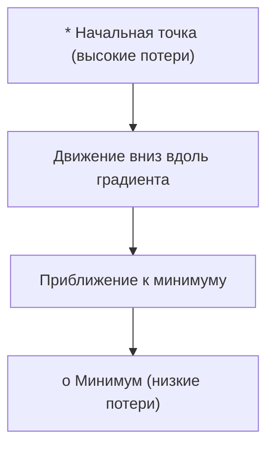
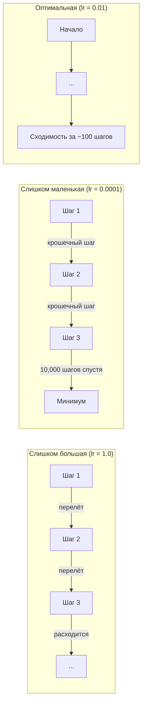
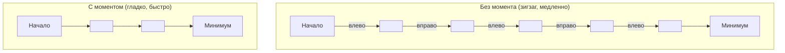
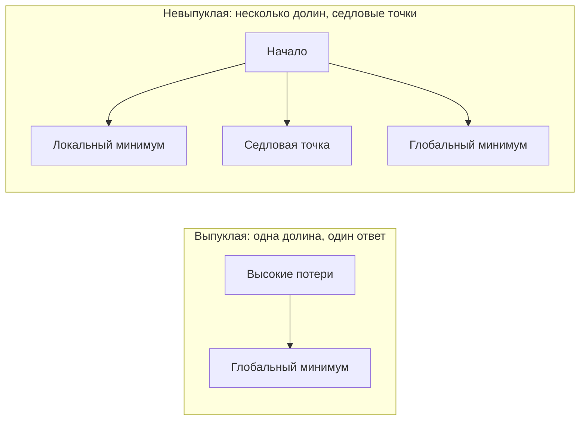
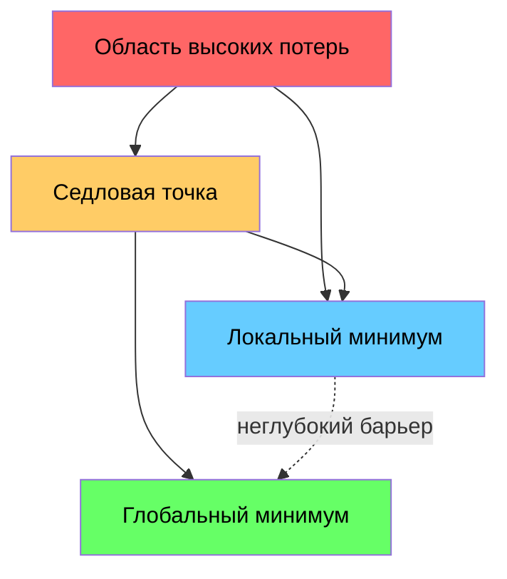

# Оптимизация

> Обучение нейронной сети — это не более чем поиск дна долины.

**Тип:** Практика
**Язык:** Python
**Предварительные требования:** Фаза 1, Уроки 04-05 (Производные, Градиенты)
**Время:** ~75 минут

## Цели обучения

- Реализовать ванильный градиентный спуск, SGD с моментом и Adam с нуля
- Сравнить сходимость оптимизаторов на функции Розенброка и объяснить, почему Adam адаптирует скорость обучения для каждого веса
- Различить выпуклые и невыпуклые ландшафты потерь и объяснить роль седловых точек в высоких размерностях
- Настроить расписания скорости обучения (пошаговое затухание, косинусное отжигание, разминка) для стабильности обучения

## Задача

У вас есть функция потерь. Она показывает, насколько неправильна ваша модель. У вас есть градиенты. Они показывают, в каком направлении потери становятся хуже. Теперь вам нужна стратегия спуска вниз.

Наивный подход прост: двигаться в направлении, противоположном градиенту. Масштабировать шаг некоторым числом, называемым скоростью обучения. Повторять. Это градиентный спуск, и он работает. Но «работает» имеет оговорки. Слишком большая скорость обучения, и вы перелетите долину полностью, прыгая между стенами. Слишком маленькая — и вы ползёте к ответу тысячи ненужных шагов. Попадите в седловую точку, и вы прекратите движение, хотя и не нашли минимум.

Каждый оптимизатор в глубоком обучении — это ответ на один и тот же вопрос: как вам быстрее и надёжнее добраться до дна долины?

## Концепция

### Что означает оптимизация

Оптимизация — это нахождение значений входов, которые минимизируют (или максимизируют) функцию. В машинном обучении функция — это функция потерь. Входы — это веса модели. Обучение — это оптимизация.

```
минимизировать L(w), где:
  L = функция потерь
  w = веса модели (может быть миллионы параметров)
```

### Градиентный спуск (ванильный)

Самый простой оптимизатор. Вычислить градиент потерь относительно каждого веса. Переместить каждый вес в направлении, противоположном его градиенту. Масштабировать шаг скоростью обучения.

```
w = w - lr * gradient
```

Это весь алгоритм. Одна строка.



### Скорость обучения: самый важный гиперпараметр

Скорость обучения контролирует размер шага. Она определяет всё о сходимости.



Нет формулы для правильной скорости обучения. Вы находите её экспериментированием. Общие начальные точки: 0.001 для Adam, 0.01 для SGD с моментом.

### SGD в сравнении с полным батчем и мини-батчем

Ванильный градиентный спуск вычисляет градиент по всему датасету перед тем как сделать один шаг. Это называется батч-градиентным спуском. Он стабилен, но медленен.

Стохастический градиентный спуск (SGD) вычисляет градиент на одном случайном образце и сразу же делает шаг. Он шумный, но быстрый.

Мини-батч-градиентный спуск разделяет разницу. Вычислить градиент по небольшому батчу (32, 64, 128, 256 образцов), затем сделать шаг. Это то, что на самом деле используют все.

| Вариант | Размер батча | Качество градиента | Скорость шага | Шум |
|---------|-----------|-----------------|---------------|-------|
| Батч GD | Весь датасет | Точный | Медленно | Нет |
| SGD | 1 образец | Очень шумный | Быстро | Высокий |
| Мини-батч | 32-256 | Хорошая оценка | Сбалансированно | Умеренный |

Шум в SGD и мини-батче — это не баг. Он помогает избежать неглубоких локальных минимумов и седловых точек.

### Момент: мяч катящийся вниз по склону

Ванильный градиентный спуск смотрит только на текущий градиент. Если градиент зигзагообразен (распространено в узких долинах), прогресс медленный. Момент решает это, накапливая прошлые градиенты в векторе скорости.

```
v = beta * v + gradient
w = w - lr * v
```

Аналогия: мяч, катящийся вниз по склону. Он не останавливается и не перезапускается на каждом препятствии. Он набирает скорость в согласованных направлениях и демпфирует колебания.



`beta` (обычно 0.9) контролирует, сколько истории сохранять. Больший beta означает больше момента, более гладкие пути, но медленнее реагирует на изменения направления.

### Adam: адаптивные скорости обучения

Разные веса нуждаются в разных скоростях обучения. Вес, который редко получает большие градиенты, должен делать большие шаги, когда наконец их получает. Вес, который постоянно получает огромные градиенты, должен делать меньшие шаги.

Adam (Adaptive Moment Estimation) отслеживает два параметра для каждого веса:

1. Первый момент (m): скользящее среднее градиентов (как момент)
2. Второй момент (v): скользящее среднее квадратов градиентов (величина градиента)

```
m = beta1 * m + (1 - beta1) * gradient
v = beta2 * v + (1 - beta2) * gradient^2

m_hat = m / (1 - beta1^t)    коррекция смещения
v_hat = v / (1 - beta2^t)    коррекция смещения

w = w - lr * m_hat / (sqrt(v_hat) + epsilon)
```

Деление на `sqrt(v_hat)` — это ключевое озарение. Веса с большими градиентами делятся на большое число (маленький эффективный шаг). Веса с маленькими градиентами делятся на маленькое число (большой эффективный шаг). Каждый вес получает свою собственную адаптивную скорость обучения.

Гиперпараметры по умолчанию: `lr=0.001, beta1=0.9, beta2=0.999, epsilon=1e-8`. Эти значения хорошо работают для большинства задач.

### Расписания скорости обучения

Фиксированная скорость обучения — это компромисс. Ранее в обучении вы хотите большие шаги для быстрого прогресса. Позже в обучении вы хотите маленькие шаги для доработки рядом с минимумом.

Распространённые расписания:

| Расписание | Формула | Используется когда |
|----------|---------|----------|
| Пошаговое затухание | lr = lr * factor каждые N эпох | Просто, ручной контроль |
| Экспоненциальное затухание | lr = lr_0 * decay^t | Гладкое снижение |
| Косинусное отжигание | lr = lr_min + 0.5 * (lr_max - lr_min) * (1 + cos(pi * t / T)) | Трансформеры, современное обучение |
| Разминка + затухание | Линейное увеличение, затем затухание | Большие модели, предотвращает ранние нестабильности |

### Выпуклое в сравнении с невыпуклым

Выпуклая функция имеет один минимум. Градиентный спуск всегда его находит. Квадратичная функция как `f(x) = x^2` выпуклая.

Функции потерь нейронных сетей невыпуклые. У них много локальных минимумов, седловых точек и плоских областей.



На практике локальные минимумы в высокомерных нейронных сетях редко являются проблемой. Большинство локальных минимумов имеют значения потерь близкие к глобальному минимуму. Седловые точки (плоские в некоторых направлениях, изогнутые в других) — это реальное препятствие. Момент и шум из мини-батчей помогают их преодолеть.

### Визуализация ландшафта потерь

Потери — это функция всех весов. Для модели с 1 миллионом весов ландшафт потерь живёт в 1,000,001-мерном пространстве. Мы визуализируем его, выбирая два случайных направления в пространстве весов и отображая потери вдоль этих направлений, создавая 2D поверхность.



Острые минимумы плохо обобщаются. Плоские минимумы хорошо обобщаются. Это одна из причин, почему SGD с моментом часто превосходит Adam по итоговой точности на тестовом наборе: его шум предотвращает осаждение в острые минимумы.

## Реализация

### Шаг 1: Определите тестовую функцию

Функция Розенброка — это классический бенчмарк оптимизации. Её минимум находится в (1, 1) внутри узкой изогнутой долины, которую легко найти, но сложно следовать.

```
f(x, y) = (1 - x)^2 + 100 * (y - x^2)^2
```

```python
def rosenbrock(params):
    x, y = params
    return (1 - x) ** 2 + 100 * (y - x ** 2) ** 2

def rosenbrock_gradient(params):
    x, y = params
    df_dx = -2 * (1 - x) + 200 * (y - x ** 2) * (-2 * x)
    df_dy = 200 * (y - x ** 2)
    return [df_dx, df_dy]
```

### Шаг 2: Ванильный градиентный спуск

```python
class GradientDescent:
    def __init__(self, lr=0.001):
        self.lr = lr

    def step(self, params, grads):
        return [p - self.lr * g for p, g in zip(params, grads)]
```

### Шаг 3: SGD с моментом

```python
class SGDMomentum:
    def __init__(self, lr=0.001, momentum=0.9):
        self.lr = lr
        self.momentum = momentum
        self.velocity = None

    def step(self, params, grads):
        if self.velocity is None:
            self.velocity = [0.0] * len(params)
        self.velocity = [
            self.momentum * v + g
            for v, g in zip(self.velocity, grads)
        ]
        return [p - self.lr * v for p, v in zip(params, self.velocity)]
```

### Шаг 4: Adam

```python
class Adam:
    def __init__(self, lr=0.001, beta1=0.9, beta2=0.999, epsilon=1e-8):
        self.lr = lr
        self.beta1 = beta1
        self.beta2 = beta2
        self.epsilon = epsilon
        self.m = None
        self.v = None
        self.t = 0

    def step(self, params, grads):
        if self.m is None:
            self.m = [0.0] * len(params)
            self.v = [0.0] * len(params)

        self.t += 1

        self.m = [
            self.beta1 * m + (1 - self.beta1) * g
            for m, g in zip(self.m, grads)
        ]
        self.v = [
            self.beta2 * v + (1 - self.beta2) * g ** 2
            for v, g in zip(self.v, grads)
        ]

        m_hat = [m / (1 - self.beta1 ** self.t) for m in self.m]
        v_hat = [v / (1 - self.beta2 ** self.t) for v in self.v]

        return [
            p - self.lr * mh / (vh ** 0.5 + self.epsilon)
            for p, mh, vh in zip(params, m_hat, v_hat)
        ]
```

### Шаг 5: Запустить и сравнить

```python
def optimize(optimizer, func, grad_func, start, steps=5000):
    params = list(start)
    history = [params[:]]
    for _ in range(steps):
        grads = grad_func(params)
        params = optimizer.step(params, grads)
        history.append(params[:])
    return history

start = [-1.0, 1.0]

gd_history = optimize(GradientDescent(lr=0.0005), rosenbrock, rosenbrock_gradient, start)
sgd_history = optimize(SGDMomentum(lr=0.0001, momentum=0.9), rosenbrock, rosenbrock_gradient, start)
adam_history = optimize(Adam(lr=0.01), rosenbrock, rosenbrock_gradient, start)

for name, history in [("GD", gd_history), ("SGD+M", sgd_history), ("Adam", adam_history)]:
    final = history[-1]
    loss = rosenbrock(final)
    print(f"{name:6s} -> x={final[0]:.6f}, y={final[1]:.6f}, loss={loss:.8f}")
```

Ожидаемый результат: Adam сходится быстрее всего. SGD с моментом следует более гладким путём. Ванильный GD делает медленный прогресс вдоль узкой долины.

## Использование

На практике используйте оптимизаторы PyTorch или JAX. Они обрабатывают группы параметров, затухание весов, обрезку градиентов и ускорение GPU.

```python
import torch

model = torch.nn.Linear(784, 10)

sgd = torch.optim.SGD(model.parameters(), lr=0.01, momentum=0.9)
adam = torch.optim.Adam(model.parameters(), lr=0.001)
adamw = torch.optim.AdamW(model.parameters(), lr=0.001, weight_decay=0.01)

scheduler = torch.optim.lr_scheduler.CosineAnnealingLR(adam, T_max=100)
```

Эмпирические правила:

- Начните с Adam (lr=0.001). Он работает для большинства задач без настройки.
- Переключитесь на SGD с моментом (lr=0.01, momentum=0.9), когда вам нужна лучшая итоговая точность и вы можете позволить себе больше настройки.
- Используйте AdamW (Adam с разделённым затуханием весов) для трансформеров.
- Всегда используйте расписание скорости обучения для запусков обучения дольше нескольких эпох.
- Если обучение нестабильно, уменьшите скорость обучения. Если обучение слишком медленное, увеличьте её.

## Развёртывание

Этот урок производит промпт для выбора правильного оптимизатора. См. `outputs/prompt-optimizer-guide.md`.

Классы оптимизаторов, созданные здесь, появляются снова в Фазе 3, когда мы обучаем нейронную сеть с нуля.

## Упражнения

1. **Поиск скорости обучения.** Запустить ванильный градиентный спуск на функции Розенброка со скоростями обучения [0.0001, 0.0005, 0.001, 0.005, 0.01]. Построить график или вывести итоговые потери после 5000 шагов для каждой. Найти наибольшую скорость обучения, которая всё ещё сходится.

2. **Сравнение момента.** Запустить SGD с значениями момента [0.0, 0.5, 0.9, 0.99] на функции Розенброка. Отслеживать потери на каждом шаге. Какое значение момента сходится быстрее всего? Какое перелетает?

3. **Выход из седловой точки.** Определить функцию `f(x, y) = x^2 - y^2` (седловая точка в начале координат). Начать с (0.01, 0.01). Сравнить как ванильный GD, SGD с моментом и Adam ведут себя. Какой выходит из седловой точки?

4. **Реализовать затухание скорости обучения.** Добавить расписание экспоненциального затухания в класс GradientDescent: `lr = lr_0 * 0.999^step`. Сравнить сходимость с затуханием и без него на функции Розенброка.

## Ключевые термины

| Термин | Что говорят люди | Что это на самом деле означает |
|------|----------------|----------------------|
| Градиентный спуск | «Идти вниз» | Обновить веса вычитанием градиента, масштабированного скоростью обучения. Самый базовый оптимизатор. |
| Скорость обучения | «Размер шага» | Скаляр, который контролирует, как далеко каждое обновление движет веса. Слишком большой вызывает расхождение. Слишком маленький тратит вычисления. |
| Момент | «Продолжай катиться» | Накопить прошлые градиенты в вектор скорости. Демпфирует колебания и ускоряет движение в согласованных направлениях. |
| SGD | «Случайная выборка» | Стохастический градиентный спуск. Вычислить градиент на случайном подмножестве вместо полного датасета. На практике почти всегда означает мини-батч SGD. |
| Мини-батч | «Кусок данных» | Небольшое подмножество обучающих данных (32-256 образцов), используемое для оценки градиента. Уравновешивает скорость и точность градиента. |
| Adam | «Оптимизатор по умолчанию» | Adaptive Moment Estimation. Отслеживает скользящие средние градиентов и квадратов градиентов для каждого веса, чтобы дать каждому весу свою скорость обучения. |
| Коррекция смещения | «Исправить холодный старт» | Первый и второй моменты Adam инициализируются нулём. Коррекция смещения делит на (1 - beta^t), чтобы компенсировать на ранних шагах. |
| Расписание скорости обучения | «Менять lr со временем» | Функция, которая настраивает скорость обучения во время обучения. Большие шаги в начале, маленькие в конце. |
| Выпуклая функция | «Одна долина» | Функция, где любой локальный минимум является глобальным минимумом. Градиентный спуск всегда его находит. Потери нейронных сетей не выпуклые. |
| Седловая точка | «Плоская, но не минимум» | Точка, где градиент равен нулю, но она является минимумом в некоторых направлениях и максимумом в других. Распространена в высоких размерностях. |
| Ландшафт потерь | «Местность» | Функция потерь, отображённая над пространством весов. Визуализируется срезом вдоль двух случайных направлений. |
| Сходимость | «Получить туда» | Оптимизатор достиг точки, где дальнейшие шаги не дают значительное снижение потерь. |

## Дальнейшее изучение

- [Sebastian Ruder: обзор алгоритмов оптимизации градиентного спуска](https://ruder.io/optimizing-gradient-descent/) - комплексный обзор всех основных оптимизаторов
- [Почему момент действительно работает (Distill)](https://distill.pub/2017/momentum/) - интерактивная визуализация динамики момента
- [Adam: метод стохастической оптимизации (Kingma & Ba, 2014)](https://arxiv.org/abs/1412.6980) - оригинальная статья Adam, читаемая и короткая
- [Визуализация ландшафта потерь нейронных сетей (Li et al., 2018)](https://arxiv.org/abs/1712.09913) - статья, которая показала острые в сравнении с плоскими минимумами
