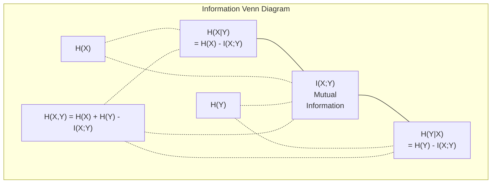

# Теория информации

> Теория информации измеряет неожиданность. На ней построены функции потерь.

**Тип:** Learn
**Язык:** Python
**Пререквизиты:** Фаза 1, урок 06 (Вероятность)
**Время:** ~60 минут

## Цели обучения

- Вычислять энтропию, кросс-энтропию и KL-дивергенцию с нуля и объяснять их связь
- Выводить, почему минимизация кросс-энтропийной функции потерь эквивалентна максимизации лог-правдоподобия
- Считать взаимную информацию между признаками и целевой переменной для ранжирования важности признаков
- Объяснять перплексию как эффективный размер словаря, из которого выбирает языковая модель

## Проблема

Вы вызываете `CrossEntropyLoss()` в каждой модели классификации, которую обучаете. Вы видите "perplexity" в каждой статье про языковые модели. Вы читаете про KL-дивергенцию в VAE, дистилляции и RLHF. Это не разрозненные понятия. Это одна и та же идея в разных ролях.

Теория информации дает язык, чтобы рассуждать о неопределенности, сжатии и предсказании. Клод Шеннон придумал ее в 1948 году для решения задач связи. Оказалось, что обучение нейросети тоже задача связи: модель пытается передать правильную метку через шумный канал выученных весов.

В этом уроке каждая формула строится с нуля, чтобы вы увидели, откуда она берется и почему работает.

## Концепция

### Количество информации (неожиданность)

Когда происходит маловероятное событие, оно несет больше информации. Монета выпала орлом? Не слишком неожиданно. Выигрыш в лотерею? Очень неожиданно.

Количество информации события с вероятностью p:

```
I(x) = -log(p(x))
```

Логарифм по основанию 2 дает биты. Натуральный логарифм дает наты. Идея та же, отличаются только единицы измерения.

```
Событие             Вероятность    Неожиданность (биты)
Орел честной монеты 0.5            1.0
Выпал 6 на кубике   0.167          2.58
Событие 1 из 1000   0.001          9.97
Достоверное событие 1.0            0.0
```

Достоверные события несут ноль информации. Вы и так знали, что они произойдут.

### Энтропия (средняя неожиданность)

Энтропия - это математическое ожидание неожиданности по всем возможным исходам распределения.

```
H(P) = -sum( p(x) * log(p(x)) )  for all x
```

У честной монеты максимальная энтропия для бинарной переменной: 1 бит. У смещенной монеты (99% орел) энтропия низкая: 0.08 бита. Вы почти заранее знаете исход, поэтому каждый бросок сообщает почти ничего.

```
Честная монета:   H = -(0.5 * log2(0.5) + 0.5 * log2(0.5)) = 1.0 бит
Смещенная монета: H = -(0.99 * log2(0.99) + 0.01 * log2(0.01)) = 0.08 бита
```

Энтропия измеряет несводимую неопределенность распределения. Сжать ниже нее невозможно.

### Кросс-энтропия (функция потерь, которую вы используете каждый день)

Кросс-энтропия измеряет среднюю неожиданность, когда вы используете распределение Q для кодирования событий, которые на самом деле приходят из распределения P.

```
H(P, Q) = -sum( p(x) * log(q(x)) )  for all x
```

P - истинное распределение (метки). Q - предсказания модели. Если Q идеально совпадает с P, кросс-энтропия равна энтропии. Любое несоответствие делает ее больше.

В классификации P - one-hot вектор (у истинного класса вероятность 1, у остальных 0). Тогда кросс-энтропия упрощается до:

```
H(P, Q) = -log(q(true_class))
```

Это и есть вся формула кросс-энтропийной функции потерь для классификации. Максимизируйте предсказанную вероятность правильного класса.

### KL-дивергенция (расстояние между распределениями)

KL-дивергенция измеряет, сколько дополнительной неожиданности вы получаете, используя Q вместо P.

```
D_KL(P || Q) = sum( p(x) * log(p(x) / q(x)) )  for all x
             = H(P, Q) - H(P)
```

Кросс-энтропия - это энтропия плюс KL-дивергенция. Поскольку энтропия истинного распределения во время обучения постоянна, минимизировать кросс-энтропию - то же самое, что минимизировать KL-дивергенцию. Вы приближаете распределение модели к истинному распределению.

KL-дивергенция несимметрична: D_KL(P || Q) != D_KL(Q || P). Это не настоящая метрика расстояния.

### Взаимная информация

Взаимная информация измеряет, насколько знание одной переменной сообщает о другой.

```
I(X; Y) = H(X) - H(X|Y)
        = H(X) + H(Y) - H(X, Y)
```

Если X и Y независимы, взаимная информация равна нулю. Знание одной ничего не говорит о другой. Если они идеально коррелируют, взаимная информация равна энтропии любой из переменных.

При отборе признаков высокая взаимная информация между признаком и целевой переменной означает, что признак полезен. Низкая взаимная информация означает, что это шум.

### Условная энтропия

H(Y|X) измеряет, сколько неопределенности о Y остается после наблюдения X.

```
H(Y|X) = H(X,Y) - H(X)
```

Два крайних случая:
- Если X полностью определяет Y, тогда H(Y|X) = 0. Знание X устраняет всю неопределенность о Y. Пример: X = температура по Цельсию, Y = температура по Фаренгейту.
- Если X ничего не говорит о Y, тогда H(Y|X) = H(Y). Знание X вообще не уменьшает неопределенность. Пример: X = бросок монеты, Y = погода завтра.

Условная энтропия всегда неотрицательна и никогда не превышает H(Y):

```
0 <= H(Y|X) <= H(Y)
```

В машинном обучении условная энтропия встречается в деревьях решений. На каждом разбиении алгоритм выбирает признак X, который минимизирует H(Y|X) -- признак, убирающий наибольшую неопределенность о метке Y.

### Совместная энтропия

H(X,Y) - это энтропия совместного распределения X и Y вместе.

```
H(X,Y) = -sum sum p(x,y) * log(p(x,y))   for all x, y
```

Ключевое свойство:

```
H(X,Y) <= H(X) + H(Y)
```

Равенство выполняется, когда X и Y независимы. Если они разделяют информацию, совместная энтропия меньше суммы индивидуальных энтропий. "Недостающая" энтропия - это ровно взаимная информация.



Связи:
- H(X,Y) = H(X) + H(Y|X) = H(Y) + H(X|Y)
- I(X;Y) = H(X) - H(X|Y) = H(Y) - H(Y|X)
- H(X,Y) = H(X) + H(Y) - I(X;Y)

### Взаимная информация (углубленно)

Взаимная информация I(X;Y) количественно показывает, насколько знание одной переменной уменьшает неопределенность о другой.

```
I(X;Y) = H(X) - H(X|Y)
       = H(Y) - H(Y|X)
       = H(X) + H(Y) - H(X,Y)
       = sum sum p(x,y) * log(p(x,y) / (p(x) * p(y)))
```

Свойства:
- I(X;Y) >= 0 всегда. Наблюдая что-то, вы не теряете информацию.
- I(X;Y) = 0 тогда и только тогда, когда X и Y независимы.
- I(X;Y) = I(Y;X). Это симметричная величина, в отличие от KL-дивергенции.
- I(X;X) = H(X). Переменная полностью делит информацию сама с собой.

**Взаимная информация для отбора признаков.** В ML вам нужны признаки, информативные относительно цели. Взаимная информация дает принципиальный способ ранжировать признаки:

1. Для каждого признака X_i вычислите I(X_i; Y), где Y - целевая переменная.
2. Отсортируйте признаки по значению MI.
3. Оставьте top-k признаков.

Это работает для любой связи между признаком и целью -- линейной, нелинейной, монотонной или нет. Корреляция ловит только линейные зависимости. MI ловит все.

| Метод | Что обнаруживает | Вычислительная стоимость | Поддерживает категориальные? |
|--------|------------------|--------------------------|------------------------------|
| Корреляция Пирсона | Линейные связи | O(n) | Нет |
| Корреляция Спирмена | Монотонные связи | O(n log n) | Нет |
| Взаимная информация | Любая статистическая зависимость | O(n log n) с биннингом | Да |

### Label Smoothing и кросс-энтропия

Стандартная классификация использует жесткие цели: [0, 0, 1, 0]. Истинный класс получает вероятность 1, остальные - 0. Label smoothing заменяет это мягкими целями:

```
soft_target = (1 - epsilon) * hard_target + epsilon / num_classes
```

При epsilon = 0.1 и 4 классах:
- Жесткая цель: [0, 0, 1, 0]
- Мягкая цель:  [0.025, 0.025, 0.925, 0.025]

С точки зрения теории информации label smoothing увеличивает энтропию целевого распределения. У жестких one-hot целей энтропия 0 -- неопределенности нет. У мягких целей энтропия положительная.

Почему это помогает:
- Не дает модели уводить логиты в экстремальные значения (для идеального совпадения с one-hot целью при кросс-энтропии нужны были бы бесконечные логиты)
- Работает как регуляризация: модель не может быть уверена на 100%
- Улучшает калибровку: предсказанные вероятности лучше отражают реальную неопределенность
- Уменьшает разрыв между поведением на обучении и на инференсе

Кросс-энтропийная функция потерь с label smoothing принимает вид:

```
L = (1 - epsilon) * CE(hard_target, prediction) + epsilon * H_uniform(prediction)
```

Второй член штрафует предсказания, далекие от равномерного распределения, -- это прямая регуляризация уверенности.

### Почему кросс-энтропия - ИМЕННО та функция потерь для классификации

Три точки зрения, один вывод.

**С точки зрения теории информации.** Кросс-энтропия измеряет, сколько бит вы тратите впустую, используя распределение модели вместо истинного. Минимизируя ее, вы делаете модель наиболее эффективным кодировщиком реальности.

**С точки зрения максимального правдоподобия.** Для N обучающих примеров с истинными классами y_i:

```
Likelihood     = product( q(y_i) )
Log-likelihood = sum( log(q(y_i)) )
Negative log-likelihood = -sum( log(q(y_i)) )
```

Последняя строка - это кросс-энтропийная функция потерь. Минимизировать кросс-энтропию = максимизировать правдоподобие обучающих данных под вашей моделью.

**С точки зрения градиента.** Градиент кросс-энтропии по логитам - это просто (predicted - true). Чисто, стабильно и быстро вычисляется. Поэтому она идеально сочетается с softmax.

### Биты и наты

Единственное различие - основание логарифма.

```
log base 2   -> bits      (традиция теории информации)
log base e   -> nats      (конвенция в машинном обучении)
log base 10  -> hartleys  (редко используется)
```

1 нат = 1/ln(2) бита = 1.4427 бита. В PyTorch и TensorFlow по умолчанию используется натуральный логарифм (наты).

### Перплексия

Перплексия - это экспонента от кросс-энтропии. Она показывает эффективное число равновероятных вариантов, между которыми модель не уверена.

```
Perplexity = 2^H(P,Q)   (если используете биты)
Perplexity = e^H(P,Q)   (если используете наты)
```

Языковая модель с перплексией 50 в среднем настолько же "запутана", как если бы ей приходилось равновероятно выбирать из 50 возможных следующих токенов. Меньше - лучше.

GPT-2 достигала перплексии около 30 на популярных бенчмарках. Современные модели в хорошо представленных доменах имеют однозначные значения.

## Собери это

### Шаг 1: Количество информации и энтропия

```python
import math

def information_content(p, base=2):
    if p <= 0 or p > 1:
        return float('inf') if p <= 0 else 0.0
    return -math.log(p) / math.log(base)

def entropy(probs, base=2):
    return sum(
        p * information_content(p, base)
        for p in probs if p > 0
    )

fair_coin = [0.5, 0.5]
biased_coin = [0.99, 0.01]
fair_die = [1/6] * 6

print(f"Энтропия честной монеты:   {entropy(fair_coin):.4f} bits")
print(f"Энтропия смещенной монеты: {entropy(biased_coin):.4f} bits")
print(f"Энтропия честного кубика:  {entropy(fair_die):.4f} bits")
```

### Шаг 2: Кросс-энтропия и KL-дивергенция

```python
def cross_entropy(p, q, base=2):
    total = 0.0
    for pi, qi in zip(p, q):
        if pi > 0:
            if qi <= 0:
                return float('inf')
            total += pi * (-math.log(qi) / math.log(base))
    return total

def kl_divergence(p, q, base=2):
    return cross_entropy(p, q, base) - entropy(p, base)

true_dist = [0.7, 0.2, 0.1]
good_model = [0.6, 0.25, 0.15]
bad_model = [0.1, 0.1, 0.8]

print(f"Энтропия истинного распр.:   {entropy(true_dist):.4f} bits")
print(f"КЭ (хорошая модель):          {cross_entropy(true_dist, good_model):.4f} bits")
print(f"КЭ (плохая модель):           {cross_entropy(true_dist, bad_model):.4f} bits")
print(f"KL-дивергенция (хорошая):     {kl_divergence(true_dist, good_model):.4f} bits")
print(f"KL-дивергенция (плохая):      {kl_divergence(true_dist, bad_model):.4f} bits")
```

### Шаг 3: Кросс-энтропия как функция потерь в классификации

```python
def softmax(logits):
    max_logit = max(logits)
    exps = [math.exp(z - max_logit) for z in logits]
    total = sum(exps)
    return [e / total for e in exps]

def cross_entropy_loss(true_class, logits):
    probs = softmax(logits)
    return -math.log(probs[true_class])

logits = [2.0, 1.0, 0.1]
true_class = 0

probs = softmax(logits)
loss = cross_entropy_loss(true_class, logits)

print(f"Логиты:      {logits}")
print(f"Softmax:     {[f'{p:.4f}' for p in probs]}")
print(f"Истинный класс: {true_class}")
print(f"Потеря:      {loss:.4f} nats")
print(f"Перплексия:  {math.exp(loss):.2f}")
```

### Шаг 4: Кросс-энтропия равна отрицательному лог-правдоподобию

```python
import random

random.seed(42)

n_samples = 1000
n_classes = 3
true_labels = [random.randint(0, n_classes - 1) for _ in range(n_samples)]
model_logits = [[random.gauss(0, 1) for _ in range(n_classes)] for _ in range(n_samples)]

ce_loss = sum(
    cross_entropy_loss(label, logits)
    for label, logits in zip(true_labels, model_logits)
) / n_samples

nll = -sum(
    math.log(softmax(logits)[label])
    for label, logits in zip(true_labels, model_logits)
) / n_samples

print(f"Кросс-энтропийная потеря:       {ce_loss:.6f}")
print(f"Отрицат. лог-правдоподобие:     {nll:.6f}")
print(f"Разница:                        {abs(ce_loss - nll):.2e}")
```

### Шаг 5: Взаимная информация

```python
def mutual_information(joint_probs, base=2):
    rows = len(joint_probs)
    cols = len(joint_probs[0])

    margin_x = [sum(joint_probs[i][j] for j in range(cols)) for i in range(rows)]
    margin_y = [sum(joint_probs[i][j] for i in range(rows)) for j in range(cols)]

    mi = 0.0
    for i in range(rows):
        for j in range(cols):
            pxy = joint_probs[i][j]
            if pxy > 0:
                mi += pxy * math.log(pxy / (margin_x[i] * margin_y[j])) / math.log(base)
    return mi

independent = [[0.25, 0.25], [0.25, 0.25]]
dependent = [[0.45, 0.05], [0.05, 0.45]]

print(f"MI (независимы): {mutual_information(independent):.4f} bits")
print(f"MI (зависимы):   {mutual_information(dependent):.4f} bits")
```

## Применяй

Те же концепции через NumPy, как вы будете использовать их на практике:

```python
import numpy as np

def np_entropy(p):
    p = np.asarray(p, dtype=float)
    mask = p > 0
    result = np.zeros_like(p)
    result[mask] = p[mask] * np.log(p[mask])
    return -result.sum()

def np_cross_entropy(p, q):
    p, q = np.asarray(p, dtype=float), np.asarray(q, dtype=float)
    mask = p > 0
    return -(p[mask] * np.log(q[mask])).sum()

def np_kl_divergence(p, q):
    return np_cross_entropy(p, q) - np_entropy(p)

true = np.array([0.7, 0.2, 0.1])
pred = np.array([0.6, 0.25, 0.15])
print(f"Энтропия:    {np_entropy(true):.4f} nats")
print(f"Кросс-энтр.: {np_cross_entropy(true, pred):.4f} nats")
print(f"KL-див.:     {np_kl_divergence(true, pred):.4f} nats")
```

Вы собрали с нуля то, что `torch.nn.CrossEntropyLoss()` делает внутри. Теперь вы знаете, почему во время обучения функция потерь падает: предсказанное моделью распределение становится ближе к истинному, в натах потерянной информации.

## Упражнения

1. Посчитайте энтропию английского алфавита при равномерном распределении (26 букв). Затем оцените ее, используя реальные частоты букв. Что выше и почему?

2. Модель выдает логиты [5.0, 2.0, 0.5] для примера с истинным классом 1. Посчитайте кросс-энтропийную потерю вручную, затем проверьте с помощью вашей функции `cross_entropy_loss`. Какие логиты дали бы нулевую потерю?

3. Покажите, что KL-дивергенция несимметрична. Выберите два распределения P и Q и вычислите D_KL(P || Q) и D_KL(Q || P). Объясните, почему они отличаются.

4. Напишите функцию, вычисляющую перплексию для последовательности предсказаний токенов. Даны пары (индекс истинного токена, предсказанные логиты); верните перплексию последовательности.

## Ключевые термины

| Термин | Как обычно говорят | Что это на самом деле означает |
|------|---------------------|--------------------------------|
| Количество информации | "Неожиданность" | Число битов (или натов), нужных для кодирования события: -log(p) |
| Энтропия | "Случайность" | Средняя неожиданность по всем исходам распределения. Измеряет несводимую неопределенность. |
| Кросс-энтропия | "Функция потерь" | Средняя неожиданность при кодировании событий из истинного распределения P с помощью распределения модели Q. |
| KL-дивергенция | "Расстояние между распределениями" | Дополнительные биты, потраченные из-за использования Q вместо P. Равна кросс-энтропии минус энтропия. Несимметрична. |
| Взаимная информация | "Насколько связаны X и Y" | Уменьшение неопределенности о X при знании Y. Ноль означает независимость. |
| Softmax | "Преобразовать логиты в вероятности" | Экспоненцирование и нормализация. Отображает любой вещественный вектор в корректное вероятностное распределение. |
| Перплексия | "Насколько модель запутана" | Экспонента от кросс-энтропии. Эффективный размер словаря, из которого модель выбирает на каждом шаге. |
| Биты | "Единица Шеннона" | Информация, измеряемая логарифмом по основанию 2. Один бит снимает неопределенность одного честного броска монеты. |
| Наты | "Единица в ML" | Информация, измеряемая натуральным логарифмом. По умолчанию используется в PyTorch и TensorFlow. |
| Отрицательное лог-правдоподобие | "NLL loss" | Идентично кросс-энтропийной потере для one-hot меток. Минимизация максимизирует вероятность правильных предсказаний. |

## Что почитать дальше

- [Shannon 1948: A Mathematical Theory of Communication](https://people.math.harvard.edu/~ctm/home/text/others/shannon/entropy/entropy.pdf) - оригинальная статья, до сих пор читается
- [Visual Information Theory (Chris Olah)](https://colah.github.io/posts/2015-09-Visual-Information/) - лучшее визуальное объяснение энтропии и KL-дивергенции
- [PyTorch CrossEntropyLoss docs](https://pytorch.org/docs/stable/generated/torch.nn.CrossEntropyLoss.html) - как фреймворк реализует то, что вы только что собрали
