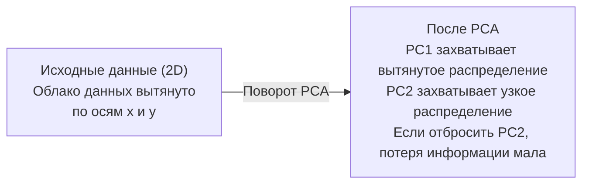

# Понижение размерности

> Высокомерные данные имеют структуру. Ее находят, если смотреть под правильным углом.

**Тип:** Build
**Язык:** Python
**Пререквизиты:** Фаза 1, уроки 01 (Интуиция линейной алгебры), 02 (Векторы, матрицы и операции), 03 (Собственные значения и собственные векторы), 06 (Вероятность и распределения)
**Время:** ~90 минут

## Цели обучения

- Реализовать PCA с нуля: центрировать данные, вычислить ковариационную матрицу, выполнить собственное разложение и спроецировать данные
- Использовать долю объясненной дисперсии и метод локтя, чтобы выбрать число главных компонент
- Сравнить PCA, t-SNE и UMAP для визуализации цифр MNIST в 2D и объяснить их компромиссы
- Применять kernel PCA с RBF-ядром для разделения нелинейных структур данных, с которыми обычный PCA не справляется

## Проблема

У вас есть набор данных с 784 признаками на объект. Возможно, это значения пикселей рукописных цифр. Возможно, это уровни экспрессии генов. Возможно, это сигналы поведения пользователей. Вы не можете визуализировать 784 измерения. Вы не можете их построить на графике. Вы не можете даже толком о них думать.

Но большая часть этих 784 признаков избыточна. Реальная информация живет на гораздо меньшей поверхности. Рукописной "7" не нужны 784 независимых числа, чтобы ее описать. Ей нужно несколько: угол штриха, длина поперечной черты, насколько она наклонена. Остальное - шум.

Понижение размерности находит эту меньшую поверхность. Оно берет ваши данные в 784-мерном пространстве и сжимает их до 2, 10 или 50 измерений, сохраняя важную структуру.

## Концепция

### Проклятие размерности

Высокомерные пространства неинтуитивны. С ростом размерности ломаются три вещи.

**Расстояние становится бессмысленным.** В высоких размерностях расстояние между любыми двумя случайными точками сходится к одному и тому же значению. Если каждая точка примерно на одинаковом расстоянии от любой другой, поиск ближайших соседей перестает работать.

```
Размерность    Среднее отношение расстояний (max/min между случайными точками)
2            ~5.0
10           ~1.8
100          ~1.2
1000         ~1.02
```

**Объем концентрируется в углах.** Гиперкуб со стороной 1 в d измерениях имеет 2^d углов. В 100 измерениях почти весь объем находится в углах, далеко от центра. Точки данных расползаются к краям, и вашим моделям не хватает данных в середине.

**Вам нужно экспоненциально больше данных.** Чтобы сохранить ту же плотность точек в пространстве, переход от 2D к 20D означает, что вам нужно в 10^18 раз больше данных. У вас никогда не будет достаточно. Снижение размерности возвращает плотность данных к чему-то пригодному для работы.

### PCA: найдите направления, которые важны

Метод главных компонент (PCA) находит оси, вдоль которых ваши данные изменяются сильнее всего. Он поворачивает систему координат так, чтобы первая ось захватывала максимальную дисперсию, вторая - следующую по величине и так далее.

Алгоритм:

```
1. Центрировать данные     (вычесть среднее из каждого признака)
2. Вычислить ковариацию    (как признаки изменяются вместе)
3. Выполнить собственное разложение  (найти главные направления)
4. Отсортировать по собственным значениям  (сначала наибольшая дисперсия)
5. Спроецировать           (оставить top k собственных векторов, отбросить остальные)
```

Почему именно собственное разложение? Ковариационная матрица симметрична и неотрицательно полуопределена. Ее собственные векторы - ортогональные направления в пространстве признаков. Собственные значения показывают, сколько дисперсии захватывает каждое направление. Собственный вектор с наибольшим собственным значением указывает в направлении максимальной дисперсии.



- **До PCA:** облако данных вытянуто по диагонали относительно обеих осей x и y
- **После PCA:** система координат поворачивается так, что PC1 выравнивается по направлению максимальной дисперсии (вытянутое распределение), а PC2 - по направлению минимальной дисперсии (узкое распределение)
- **Понижение размерности:** если отбросить PC2 и спроецировать данные на PC1, теряется очень мало информации

### Доля объясненной дисперсии

Каждая главная компонента захватывает долю общей дисперсии. Доля объясненной дисперсии показывает, насколько большую.

```
Компонента    Собственное значение    Доля объясненной дисперсии    Накопленная
PC1          4.73          0.473              0.473
PC2          2.51          0.251              0.724
PC3          1.12          0.112              0.836
PC4          0.89          0.089              0.925
...
```

Когда накопленная объясненная дисперсия достигает 0.95, вы понимаете, что многие компоненты захватывают 95% информации. Все после этого - в основном шум.

### Как выбрать число компонент

Три стратегии:

1. **Порог.** Оставьте столько компонент, чтобы объяснить 90-95% дисперсии.
2. **Метод локтя.** Постройте график дисперсии по компонентам. Ищите резкое падение.
3. **Качество на downstream-задаче.** Используйте PCA как предобработку. Перебирайте k и измеряйте точность модели. Лучшее k - там, где точность выходит на плато.

### t-SNE: сохраняйте окрестности

t-распределенное стохастическое вложение соседей (t-SNE) предназначено для визуализации. Оно отображает данные из высоких размерностей в 2D (или 3D), сохраняя то, какие точки находятся рядом друг с другом.

Интуиция такая: в исходном пространстве строится вероятностное распределение по парам точек на основе их расстояний. Близкие точки получают высокую вероятность. Далекие - низкую. Затем находится 2D-расположение, в котором сохраняется то же самое распределение вероятностей. Точки, которые были соседями в 784 измерениях, остаются соседями в 2D.

Ключевые свойства t-SNE:
- Нелинейный метод. Он может "развернуть" сложные многообразия, с которыми PCA не справляется.
- Стохастический. Разные запуски дают разные раскладки.
- Параметр perplexity управляет тем, сколько соседей учитывать (типичный диапазон: 5-50).
- Расстояния между кластерами на выходе не имеют смысла. Значимы только сами кластеры.
- Медленный на больших наборах данных. По умолчанию O(n^2).

### UMAP: быстрее, лучше сохраняет глобальную структуру

Uniform Manifold Approximation and Projection (UMAP) работает похоже на t-SNE, но с двумя преимуществами:
- Быстрее. Он использует графы приближенных ближайших соседей вместо вычисления всех попарных расстояний.
- Лучше сохраняет глобальную структуру. Относительные позиции кластеров на выходе обычно осмысленнее, чем у t-SNE.

UMAP строит взвешенный граф в высокомерном пространстве ("нечеткое топологическое представление") и затем находит низкоразмерную раскладку, которая как можно лучше сохраняет этот граф.

Ключевые параметры:
- `n_neighbors`: сколько соседей определяют локальную структуру (похоже на perplexity). Более высокие значения сохраняют больше глобальной структуры.
- `min_dist`: насколько плотно точки могут собираться на выходе. Меньшие значения создают более плотные кластеры.

### Когда что использовать

| Метод | Когда использовать | Что сохраняет | Скорость |
|--------|-------------------|---------------|----------|
| PCA | Предобработка перед обучением | Глобальную дисперсию | Быстро (точно), работает на миллионах объектов |
| PCA | Быстрая разведочная визуализация | Линейную структуру | Быстро |
| t-SNE | Публикационные 2D-графики | Локальные окрестности | Медленно (идеально < 10k объектов) |
| UMAP | 2D-визуализация на больших данных | Локальную + часть глобальной структуры | Средне (работает на миллионах) |
| PCA | Сокращение признаков для моделей | Признаки, ранжированные по дисперсии | Быстро |
| t-SNE / UMAP | Понимание структуры кластеров | Разделение кластеров | От средне до медленно |

Правило: используйте PCA для предобработки и сжатия данных. Используйте t-SNE или UMAP, когда нужно визуализировать структуру в 2D.

### Kernel PCA

Обычный PCA находит линейные подпространства. Он поворачивает систему координат и отбрасывает оси. Но что если данные лежат на нелинейном многообразии? Круг в 2D нельзя разделить никакой прямой. Обычный PCA здесь не поможет.

Kernel PCA применяет PCA в высокоразмерном пространстве признаков, заданном ядровой функцией, не вычисляя координаты в этом пространстве явно. Это трюк с ядром - та же идея, что и в SVM.

Алгоритм:
1. Вычислить матрицу ядра K, где K_ij = k(x_i, x_j)
2. Центрировать матрицу ядра в пространстве признаков
3. Выполнить собственное разложение центрированной матрицы ядра
4. Первые собственные векторы (масштабированные на 1/sqrt(собственное значение)) и есть проекции

Распространенные функции ядра:

| Ядро | Формула | Для чего подходит |
|--------|---------|-------------------|
| RBF (Gaussian) | exp(-gamma * \\|x - y\\|^2) | Большинство нелинейных данных, гладкие многообразия |
| Polynomial | (x . y + c)^d | Полиномиальные зависимости |
| Sigmoid | tanh(alpha * x . y + c) | Отображения, похожие на нейросети |

Когда использовать kernel PCA вместо обычного PCA:

| Критерий | Обычный PCA | Kernel PCA |
|-----------|-------------|------------|
| Структура данных | Линейное подпространство | Нелинейное многообразие |
| Скорость | O(min(n^2 d, d^2 n)) | O(n^2 d + n^3) |
| Интерпретируемость | Компоненты - линейные комбинации признаков | У компонент нет прямой интерпретации через признаки |
| Масштабируемость | Работает на миллионах объектов | Матрица ядра n x n, ограничение по памяти |
| Восстановление | Прямое обратное преобразование | Требует аппроксимации pre-image |

Классический пример: концентрические окружности в 2D. Два кольца точек, одно внутри другого. Обычный PCA проецирует оба на одну и ту же прямую - бесполезно для классификации. Kernel PCA с RBF-ядром отображает внутреннюю и внешнюю окружности в разные области, делая их линейно разделимыми.

### Ошибка реконструкции

Насколько хорошее у вас понижение размерности? Вы сжали 784 измерения до 50. Что вы потеряли?

Измеряйте ошибку реконструкции:
1. Спроецируйте данные в k измерений: X_reduced = X @ W_k
2. Восстановите: X_hat = X_reduced @ W_k^T
3. Посчитайте MSE: mean((X - X_hat)^2)

Для PCA ошибка реконструкции связана с объясненной дисперсией очень просто:

```
Ошибка реконструкции = сумма не включенных собственных значений
Общая дисперсия = сумма ВСЕХ собственных значений
Доля потерянного = (сумма отброшенных собственных значений) / (сумма всех собственных значений)
```

Доля объясненной дисперсии для каждой компоненты:

```
explained_ratio_k = eigenvalue_k / sum(all eigenvalues)
```

График накопленной объясненной дисперсии от числа компонент дает "кривую локтя". Правильное число компонент там, где:
- Кривая выравнивается (убывающая отдача)
- Накопленная дисперсия пересекает ваш порог (обычно 0.90 или 0.95)
- Производительность downstream-задачи выходит на плато

Ошибка реконструкции полезна не только для выбора k. Ее можно использовать для обнаружения аномалий: объекты с высокой ошибкой реконструкции - это выбросы, которые не вписываются в выученное подпространство. На этом основано PCA-based anomaly detection в production-системах.

## Соберите это

### Шаг 1: PCA с нуля

```python
import numpy as np

class PCA:
    def __init__(self, n_components):
        self.n_components = n_components
        self.components = None
        self.mean = None
        self.eigenvalues = None
        self.explained_variance_ratio_ = None

    def fit(self, X):
        self.mean = np.mean(X, axis=0)
        X_centered = X - self.mean

        cov_matrix = np.cov(X_centered, rowvar=False)

        eigenvalues, eigenvectors = np.linalg.eigh(cov_matrix)

        sorted_idx = np.argsort(eigenvalues)[::-1]
        eigenvalues = eigenvalues[sorted_idx]
        eigenvectors = eigenvectors[:, sorted_idx]

        self.components = eigenvectors[:, :self.n_components].T
        self.eigenvalues = eigenvalues[:self.n_components]
        total_var = np.sum(eigenvalues)
        self.explained_variance_ratio_ = self.eigenvalues / total_var

        return self

    def transform(self, X):
        X_centered = X - self.mean
        return X_centered @ self.components.T

    def fit_transform(self, X):
        self.fit(X)
        return self.transform(X)
```

### Шаг 2: Проверка на синтетических данных

```python
np.random.seed(42)
n_samples = 500

t = np.random.uniform(0, 2 * np.pi, n_samples)
x1 = 3 * np.cos(t) + np.random.normal(0, 0.2, n_samples)
x2 = 3 * np.sin(t) + np.random.normal(0, 0.2, n_samples)
x3 = 0.5 * x1 + 0.3 * x2 + np.random.normal(0, 0.1, n_samples)

X_synthetic = np.column_stack([x1, x2, x3])

pca = PCA(n_components=2)
X_reduced = pca.fit_transform(X_synthetic)

print(f"Исходная форма: {X_synthetic.shape}")
print(f"Сниженная форма:  {X_reduced.shape}")
print(f"Доли объясненной дисперсии: {pca.explained_variance_ratio_}")
print(f"Общая захваченная дисперсия: {sum(pca.explained_variance_ratio_):.4f}")
```

### Шаг 3: MNIST в 2D

```python
from sklearn.datasets import fetch_openml

mnist = fetch_openml("mnist_784", version=1, as_frame=False, parser="auto")
X_mnist = mnist.data[:5000].astype(float)
y_mnist = mnist.target[:5000].astype(int)

pca_mnist = PCA(n_components=50)
X_pca50 = pca_mnist.fit_transform(X_mnist)
print(f"50 компонент захватывают {sum(pca_mnist.explained_variance_ratio_):.2%} дисперсии")

pca_2d = PCA(n_components=2)
X_pca2d = pca_2d.fit_transform(X_mnist)
print(f"2 компоненты захватывают {sum(pca_2d.explained_variance_ratio_):.2%} дисперсии")
```

### Шаг 4: Сравнение со sklearn

```python
from sklearn.decomposition import PCA as SklearnPCA
from sklearn.manifold import TSNE

sklearn_pca = SklearnPCA(n_components=2)
X_sklearn_pca = sklearn_pca.fit_transform(X_mnist)

print(f"\nНаша PCA explained variance:     {pca_2d.explained_variance_ratio_}")
print(f"Sklearn PCA explained variance: {sklearn_pca.explained_variance_ratio_}")

diff = np.abs(np.abs(X_pca2d) - np.abs(X_sklearn_pca))
print(f"Максимальная абсолютная разница: {diff.max():.10f}")

tsne = TSNE(n_components=2, perplexity=30, random_state=42)
X_tsne = tsne.fit_transform(X_mnist)
print(f"\nФорма выхода t-SNE: {X_tsne.shape}")
```

### Шаг 5: Сравнение UMAP

```python
try:
    from umap import UMAP

    reducer = UMAP(n_components=2, n_neighbors=15, min_dist=0.1, random_state=42)
    X_umap = reducer.fit_transform(X_mnist)
    print(f"Форма выхода UMAP: {X_umap.shape}")
except ImportError:
    print("Установите umap-learn: pip install umap-learn")
```

## Применяйте

PCA как предобработку перед классификатором:

```python
from sklearn.decomposition import PCA as SklearnPCA
from sklearn.linear_model import LogisticRegression
from sklearn.model_selection import train_test_split
from sklearn.metrics import accuracy_score

X_train, X_test, y_train, y_test = train_test_split(
    X_mnist, y_mnist, test_size=0.2, random_state=42
)

results = {}
for k in [10, 30, 50, 100, 200]:
    pca_k = SklearnPCA(n_components=k)
    X_tr = pca_k.fit_transform(X_train)
    X_te = pca_k.transform(X_test)

    clf = LogisticRegression(max_iter=1000, random_state=42)
    clf.fit(X_tr, y_train)
    acc = accuracy_score(y_test, clf.predict(X_te))
    var_captured = sum(pca_k.explained_variance_ratio_)
    results[k] = (acc, var_captured)
    print(f"k={k:>3d}  accuracy={acc:.4f}  variance={var_captured:.4f}")
```

Производительность выходит на плато задолго до 784 измерений. Это плато и есть ваш рабочий режим.

## Поставьте в прод

Этот урок создает:
- `outputs/skill-dimensionality-reduction.md` - навык для выбора правильного метода понижения размерности под конкретную задачу

## Упражнения

1. Измените класс PCA так, чтобы он поддерживал `inverse_transform`. Восстановите цифры MNIST из 10, 50 и 200 компонент. Для каждого случая выведите ошибку реконструкции (средний квадрат разницы с оригиналом).

2. Запустите t-SNE на том же подмножестве MNIST со значениями perplexity 5, 30 и 100. Опишите, как меняется результат. Почему perplexity влияет на плотность кластеров?

3. Возьмите набор данных с 50 признаками, где только 5 информативны (сгенерируйте его с помощью `sklearn.datasets.make_classification`). Примените PCA и проверьте, правильно ли кривая объясненной дисперсии показывает, что данные фактически 5-мерные.

## Ключевые термины

| Термин | Как обычно говорят | Что это на самом деле означает |
|------|--------------------|--------------------------------|
| Проклятие размерности | "Слишком много признаков" | Расстояния, объемы и плотность данных ведут себя неинтуитивно при росте размерности. Моделям нужно экспоненциально больше данных, чтобы это компенсировать. |
| PCA | "Снизить размерность" | Повернуть систему координат так, чтобы оси совпали с направлениями максимальной дисперсии, а затем отбросить оси с низкой дисперсией. |
| Главная компонента | "Важное направление" | Собственный вектор ковариационной матрицы. Направление в пространстве признаков, вдоль которого данные изменяются сильнее всего. |
| Доля объясненной дисперсии | "Сколько информации у этой компоненты" | Доля общей дисперсии, захваченная одной главной компонентой. Сумма top k долей показывает, сколько сохраняют k компонент. |
| Ковариационная матрица | "Как коррелируют признаки" | Симметричная матрица, где элемент (i,j) показывает, как признак i и признак j изменяются вместе. Диагональные элементы - это индивидуальные дисперсии. |
| t-SNE | "Вот тот график кластеров" | Нелинейный метод, отображающий высокоразмерные данные в 2D путем сохранения вероятностей соседства. Хорош для визуализации, но не для предобработки. |
| UMAP | "Быстрый t-SNE" | Нелинейный метод на основе топологического анализа данных. Сохраняет как локальную, так и часть глобальной структуры. Масштабируется лучше, чем t-SNE. |
| Perplexity | "Регулятор t-SNE" | Управляет эффективным числом соседей, которое учитывает каждая точка. Низкий perplexity фокусируется на очень локальной структуре. Высокий захватывает более широкие закономерности. |
| Многообразие | "Поверхность, на которой живут данные" | Низкоразмерная поверхность, вложенная в более высокоразмерное пространство. Лист бумаги, смятый в 3D, - это 2D-многообразие. |

## Что почитать дальше

- [A Tutorial on Principal Component Analysis](https://arxiv.org/abs/1404.1100) (Shlens) - понятный вывод PCA с нуля
- [How to Use t-SNE Effectively](https://distill.pub/2016/misread-tsne/) (Wattenberg et al.) - интерактивный разбор типичных ошибок t-SNE и выбора параметров
- [UMAP documentation](https://umap-learn.readthedocs.io/) - теория и практические рекомендации от авторов UMAP
