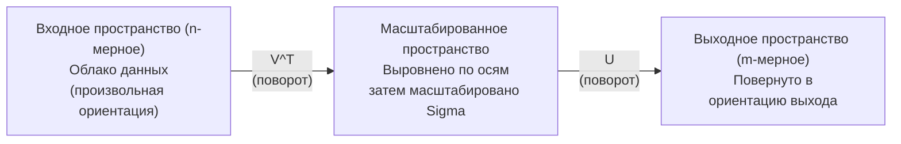
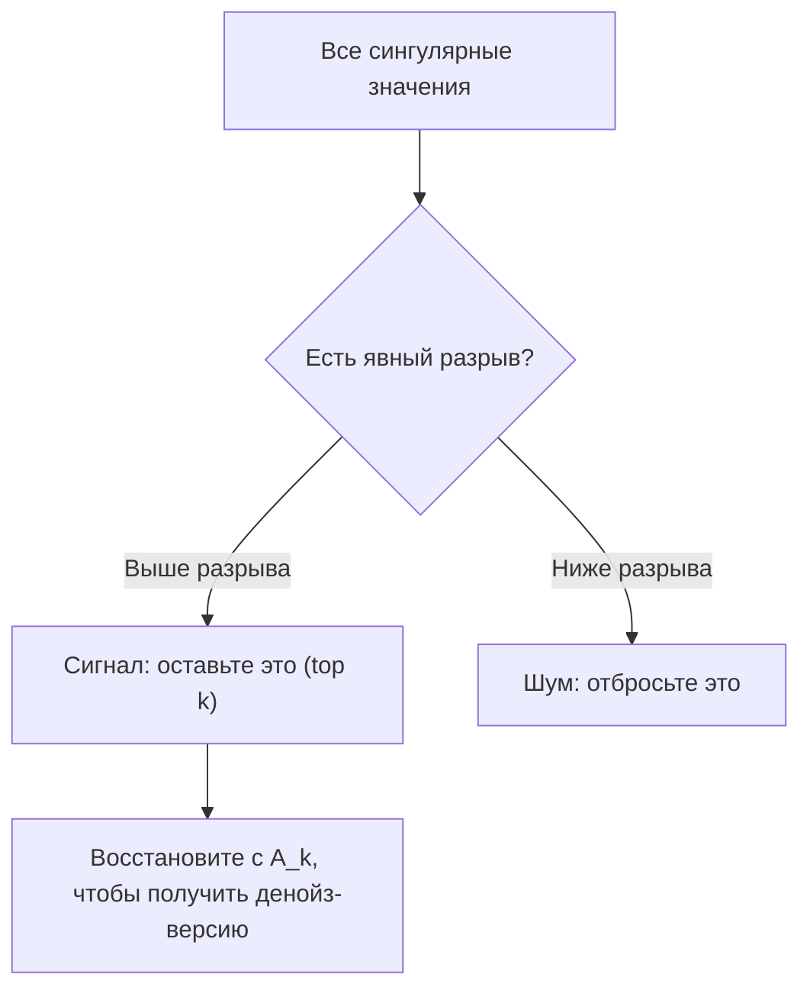

# Сингулярное разложение

> SVD - это швейцарский нож линейной алгебры. Оно есть у каждой матрицы. Оно нужно каждому дата-сайентисту.

**Тип:** Build
**Языки:** Python, Julia
**Пререквизиты:** Фаза 1, уроки 01 (Интуиция линейной алгебры), 02 (Операции с векторами и матрицами), 03 (Преобразования матриц)
**Время:** ~120 минут

## Цели обучения

- Реализовать SVD через степенной метод и объяснить геометрический смысл U, Sigma и V^T
- Применять усеченное SVD для сжатия изображений и измерять компромисс между степенью сжатия и ошибкой реконструкции
- Вычислять псевдообратную Мура-Пенроуза через SVD для решения переопределенных систем наименьших квадратов
- Связать SVD с PCA, рекомендательными системами (латентные факторы) и латентно-семантическим анализом в NLP

## Проблема

У вас есть матрица 1000x2000. Возможно, это оценки пользователей для фильмов. Возможно, это таблица частот терминов в документах. Возможно, это значения пикселей изображения. Вам нужно сжать ее, убрать шум, найти в ней скрытую структуру или решить с ее помощью систему наименьших квадратов. Собственное разложение работает только для квадратных матриц. И даже тогда требует, чтобы у матрицы был полный набор линейно независимых собственных векторов.

SVD работает для любой матрицы. Любой формы. Любого ранга. Без условий. Оно раскладывает матрицу на три множителя, которые показывают геометрию того, как матрица действует на пространство. Это самое общее и самое полезное разложение во всей линейной алгебре.

## Концепция

### Что SVD делает геометрически

Любая матрица, независимо от формы, выполняет три операции подряд: поворот, масштабирование, поворот. SVD делает это разложение явным.

```
A = U * Sigma * V^T

      m x n     m x m    m x n    n x n
     (любая)   (поворот)(масштаб)(поворот)
```

Для любой матрицы A SVD раскладывает ее на:
- V^T поворачивает векторы во входном пространстве (n-мерном)
- Sigma масштабирует вдоль каждой оси (растягивает или сжимает)
- U поворачивает результат в выходное пространство (m-мерное)



Представьте это так. Вы передаете матрицу SVD. Она отвечает: "Эта матрица берет сферу входов, сначала поворачивает ее с помощью V^T, затем растягивает ее в эллипсоид с помощью Sigma, затем поворачивает эллипсоид с помощью U". Сингулярные значения - это длины осей эллипсоида.

### Полное разложение

Для матрицы A размера m x n:

```
A = U * Sigma * V^T

where:
  U     is m x m, orthogonal (U^T U = I)
  Sigma is m x n, diagonal (singular values on the diagonal)
  V     is n x n, orthogonal (V^T V = I)

The singular values sigma_1 >= sigma_2 >= ... >= sigma_r > 0
where r = rank(A)
```

Столбцы U называются левыми сингулярными векторами. Столбцы V называются правыми сингулярными векторами. Диагональные элементы Sigma называются сингулярными значениями. Они всегда неотрицательны и обычно упорядочены по убыванию.

### Левые сингулярные векторы, сингулярные значения, правые сингулярные векторы

Каждая часть SVD имеет свой геометрический смысл.

**Правые сингулярные векторы (столбцы V):** Они образуют ортонормированный базис входного пространства (R^n). Это направления во входном пространстве, которые матрица отображает в ортогональные направления в выходном пространстве. Думайте о них как о естественной системе координат для области определения.

**Сингулярные значения (диагональ Sigma):** Это коэффициенты масштабирования. i-е сингулярное значение показывает, насколько матрица растягивает векторы вдоль i-го правого сингулярного вектора. Сингулярное значение, равное нулю, означает, что матрица полностью сминает это направление.

**Левые сингулярные векторы (столбцы U):** Они образуют ортонормированный базис выходного пространства (R^m). i-й левый сингулярный вектор - это направление в выходном пространстве, куда попадает i-й правый сингулярный вектор (после масштабирования).

Связь между ними:

```
A * v_i = sigma_i * u_i

Матрица A берет i-й правый сингулярный вектор v_i,
масштабирует его на sigma_i и отображает в i-й левый сингулярный вектор u_i.
```

Это дает покоординатную картину того, что делает любая матрица.

### Форма через внешнее произведение

SVD можно записать как сумму матриц ранга 1:

```
A = sigma_1 * u_1 * v_1^T + sigma_2 * u_2 * v_2^T + ... + sigma_r * u_r * v_r^T

Каждый член sigma_i * u_i * v_i^T - это матрица ранга 1 (внешнее произведение).
Полная матрица - это сумма r таких матриц, где r - ранг.
```

Это основа низкорангового приближения. Каждый член добавляет один слой структуры. Первый член захватывает самый важный паттерн. Второй - следующий по важности. И так далее. Усечение этой суммы дает наилучшее возможное приближение заданного ранга.

```
Приближение ранга 1:    A_1 = sigma_1 * u_1 * v_1^T
                        (захватывает доминирующий паттерн)

Приближение ранга 2:    A_2 = sigma_1 * u_1 * v_1^T + sigma_2 * u_2 * v_2^T
                        (захватывает два самых важных паттерна)

Приближение ранга k:    A_k = сумма top k членов
                        (оптимально по теореме Эккарта-Юнга)
```

### Связь с собственным разложением

SVD и собственное разложение тесно связаны. Сингулярные значения и векторы A напрямую получаются из собственных значений и собственных векторов A^T A и A A^T.

```
A^T A = V * Sigma^T * U^T * U * Sigma * V^T
      = V * Sigma^T * Sigma * V^T
      = V * D * V^T

where D = Sigma^T * Sigma is a diagonal matrix with sigma_i^2 on the diagonal.

So:
- The right singular vectors (V) are eigenvectors of A^T A
- The singular values squared (sigma_i^2) are eigenvalues of A^T A

Similarly:
A A^T = U * Sigma * V^T * V * Sigma^T * U^T
      = U * Sigma * Sigma^T * U^T

So:
- The left singular vectors (U) are eigenvectors of A A^T
- The eigenvalues of A A^T are also sigma_i^2
```

Эта связь говорит вам три вещи:
1. Сингулярные значения всегда вещественные и неотрицательные (это квадратные корни из собственных значений положительно полуопределенной матрицы).
2. Можно вычислять SVD через собственное разложение A^T A, но это возводит число обусловленности в квадрат и теряет численную точность. Специальные алгоритмы SVD обходят это.
3. Когда A квадратная и симметричная положительно полуопределенная, SVD и собственное разложение - это одно и то же.

### Усеченное SVD: низкоранговое приближение

Теорема Эккарта-Юнга-Мирского утверждает, что лучшее приближение ранга k к A (как в норме Фробениуса, так и в спектральной норме) получается, если оставить только top k сингулярных значений и соответствующие векторы:

```
A_k = U_k * Sigma_k * V_k^T

where:
  U_k     is m x k  (first k columns of U)
  Sigma_k is k x k  (top-left k x k block of Sigma)
  V_k     is n x k  (first k columns of V)

Approximation error = sigma_{k+1}  (in spectral norm)
                    = sqrt(sigma_{k+1}^2 + ... + sigma_r^2)  (in Frobenius norm)
```

Это не просто "хорошее" приближение. Это доказуемо лучшее возможное приближение ранга k. Никакая другая матрица ранга k не ближе к A.

| Компонента | Относительная величина | Оставляется в приближении ранга 3? |
|-----------|-----------------------|------------------------------------|
| sigma_1 | Наибольшая | Да |
| sigma_2 | Большая | Да |
| sigma_3 | Средне-большая | Да |
| sigma_4 | Средняя | Нет (ошибка) |
| sigma_5 | Средне-малая | Нет (ошибка) |
| sigma_6 | Малая | Нет (ошибка) |
| sigma_7 | Очень малая | Нет (ошибка) |
| sigma_8 | Крошечная | Нет (ошибка) |

Оставьте top 3: A_3 захватывает три наибольших сингулярных значения. Ошибка = оставшиеся значения (от sigma_4 до sigma_8).

Если сингулярные значения убывают быстро, маленький k захватывает большую часть матрицы. Если они убывают медленно, у матрицы нет низкоранговой структуры.

### Сжатие изображений с помощью SVD

Изображение в градациях серого - это матрица интенсивностей пикселей. Изображение 800x600 содержит 480000 значений. SVD позволяет приблизить его гораздо меньшим числом.

```
Исходное изображение: 800 x 600 = 480,000 значений

SVD с рангом k:
  U_k:      800 x k значений
  Sigma_k:  k значений
  V_k:      600 x k значений
  Итого:    k * (800 + 600 + 1) = k * 1401 значений

  k=10:   14,010 значений   (2.9% от исходного)
  k=50:   70,050 значений  (14.6% от исходного)
  k=100: 140,100 значений  (29.2% от исходного)

  Чем меньше k, тем лучше коэффициент сжатия,
  но тем хуже визуальное качество.
```

Ключевая идея: у естественных изображений сингулярные значения быстро убывают. Первые несколько сингулярных значений захватывают общую структуру (формы, градиенты). Последующие - мелкие детали и шум. Усечение до ранга 50 часто дает изображение, почти неотличимое от исходного, при этом экономит 85% памяти.

### SVD для рекомендательных систем

Это стало знаменитым благодаря Netflix Prize. У вас есть матрица оценок пользователей фильмов, где большинство элементов отсутствует.

```
             Movie1  Movie2  Movie3  Movie4  Movie5
  User1      [  5      ?       3       ?       1  ]
  User2      [  ?      4       ?       2       ?  ]
  User3      [  3      ?       5       ?       ?  ]
  User4      [  ?      ?       ?       4       3  ]

  ? = неизвестная оценка
```

Идея: эта матрица оценок имеет низкий ранг. У пользователей нет полностью независимых вкусов. Есть несколько латентных факторов (боевик против драмы, старое против нового, интеллектуальное против зрелищного), которые объясняют большую часть предпочтений.

SVD на (заполненной) матрице оценок раскладывает ее на:
- U: профили пользователей в пространстве латентных факторов
- Sigma: важность каждого латентного фактора
- V^T: профили фильмов в пространстве латентных факторов

Предсказанная оценка пользователя для фильма - это скалярное произведение его профиля с профилем фильма (с весами по сингулярным значениям). Низкоранговое приближение заполняет пропуски.

На практике используют варианты вроде инкрементального SVD Саймона Фанка или ALS (alternating least squares), которые напрямую работают с пропущенными данными. Но основная идея та же: разложение на латентные факторы через SVD.

### SVD в NLP: латентно-семантический анализ

Latent Semantic Analysis (LSA), также называемый Latent Semantic Indexing (LSI), применяет SVD к матрице термин-документ.

```
             Doc1   Doc2   Doc3   Doc4
  "cat"      [  3      0      1      0  ]
  "dog"      [  2      0      0      1  ]
  "fish"     [  0      4      1      0  ]
  "pet"      [  1      1      1      1  ]
  "ocean"    [  0      3      0      0  ]

После SVD с рангом k=2:

  Каждый документ становится точкой в 2D "пространстве концептов".
  Каждый термин становится точкой в том же 2D-пространстве.
  Документы на похожие темы группируются вместе.
  Термины с похожим смыслом группируются вместе.

  "cat" и "dog" оказываются рядом (домашние животные на суше).
  "fish" и "ocean" оказываются рядом (водные понятия).
  Doc1 и Doc3 кластеризуются, если у них похожие темы.
```

LSA был одним из первых успешных методов, который извлекал семантическое сходство из сырого текста. Он работает, потому что синонимичные термины, как правило, встречаются в похожих документах, поэтому SVD группирует их в одни и те же латентные измерения. Современные word embeddings (Word2Vec, GloVe) можно рассматривать как потомков этой идеи.

### SVD для подавления шума

Шумные данные концентрируют сигнал в верхних сингулярных значениях, а шум распределяют по всем сингулярным значениям. Усечение убирает шумовой пол.

**Сингулярные значения чистого сигнала:**

| Компонента | Величина | Тип |
|-----------|---------|-----|
| sigma_1 | Очень большая | Сигнал |
| sigma_2 | Большая | Сигнал |
| sigma_3 | Средняя | Сигнал |
| sigma_4 | Почти ноль | Пренебрежимо |
| sigma_5 | Почти ноль | Пренебрежимо |

**Сингулярные значения шумного сигнала (шум добавляется ко всем):**

| Компонента | Величина | Тип |
|-----------|---------|-----|
| sigma_1 | Очень большая | Сигнал |
| sigma_2 | Большая | Сигнал |
| sigma_3 | Средняя | Сигнал |
| sigma_4 | Малая | Шум |
| sigma_5 | Малая | Шум |
| sigma_6 | Малая | Шум |
| sigma_7 | Малая | Шум |



Это используется в обработке сигналов, научных измерениях и очистке данных. Всякий раз, когда у вас есть матрица, искаженная аддитивным шумом, усеченное SVD - это принципиальный способ отделить сигнал от шума.

### Псевдообратная через SVD

Псевдообратная Мура-Пенроуза A+ обобщает обращение матриц на неквадратные и вырожденные матрицы. SVD делает ее вычисление тривиальным.

```
Если A = U * Sigma * V^T, тогда:

A+ = V * Sigma+ * U^T

где Sigma+ строится так:
  1. Транспонируйте Sigma (поменяйте строки и столбцы местами)
  2. Замените каждый ненулевой диагональный элемент sigma_i на 1/sigma_i
  3. Оставьте нули как нули

Для A (m x n):      A+ имеет размер (n x m)
Для Sigma (m x n):  Sigma+ имеет размер (n x m)
```

Псевдообратная решает задачи наименьших квадратов. Если Ax = b не имеет точного решения (переопределенная система), то x = A+ b - это решение наименьших квадратов (минимизирует ||Ax - b||).

```
Переопределенная система (больше уравнений, чем неизвестных):

  [1  1]         [3]
  [2  1] x   =   [5]       Точного решения не существует.
  [3  1]         [6]

  x_ls = A+ b = V * Sigma+ * U^T * b

  Это дает x, который минимизирует сумму квадратов остатков.
  Тот же результат, что и нормальные уравнения (A^T A)^(-1) A^T b,
  но численно устойчивее.
```

### Преимущества численной устойчивости

Вычисление собственного разложения A^T A возводит сингулярные значения в квадрат (собственные значения A^T A равны sigma_i^2). Это возводит число обусловленности в квадрат, усиливая численные ошибки.

```
Пример:
  У A сингулярные значения [1000, 1, 0.001]
  Число обусловленности A: 1000 / 0.001 = 10^6

  У A^T A собственные значения [10^6, 1, 10^{-6}]
  Число обусловленности A^T A: 10^6 / 10^{-6} = 10^{12}

  Прямое вычисление SVD: работает с числом обусловленности 10^6
  Через A^T A:          работает с числом обусловленности 10^{12}
                        (потеря 6 дополнительных знаков точности)
```

Современные алгоритмы SVD (бидиагонализация Голуба-Кахана) работают напрямую с A, никогда не формируя A^T A. Поэтому всегда лучше использовать `np.linalg.svd(A)`, а не `np.linalg.eig(A.T @ A)`.

### Связь с PCA

PCA - ЭТО SVD на центрированных данных. Это не аналогия. Это буквально одно и то же вычисление.

```
Дана матрица данных X (n_samples x n_features), центрированная (с вычитанием среднего):

Ковариационная матрица: C = (1/(n-1)) * X^T X

PCA находит собственные векторы C. Но:

  X = U * Sigma * V^T    (SVD матрицы X)

  X^T X = V * Sigma^2 * V^T

  C = (1/(n-1)) * V * Sigma^2 * V^T

Значит, главные компоненты - это ровно правые сингулярные векторы V.
Объясненная дисперсия для каждой компоненты - это sigma_i^2 / (n-1).

В sklearn PCA реализован через SVD, а не через собственное разложение.
Это быстрее и численно устойчивее.
```

Это означает, что все, что вы узнали о понижении размерности в уроке 10, внутри опирается на SVD. PCA - самое распространенное применение SVD в машинном обучении.

## Соберите это

### Шаг 1: SVD с нуля через степенной метод

Идея: чтобы найти наибольшее сингулярное значение и его векторы, используйте степенной метод для A^T A (или A A^T). Затем занулите найденный вклад и повторите для следующего сингулярного значения.

```python
import numpy as np

def power_iteration(M, num_iters=100):
    n = M.shape[1]
    v = np.random.randn(n)
    v = v / np.linalg.norm(v)

    for _ in range(num_iters):
        Mv = M @ v
        v = Mv / np.linalg.norm(Mv)

    eigenvalue = v @ M @ v
    return eigenvalue, v

def svd_from_scratch(A, k=None):
    m, n = A.shape
    if k is None:
        k = min(m, n)

    sigmas = []
    us = []
    vs = []

    A_residual = A.copy().astype(float)

    for _ in range(k):
        AtA = A_residual.T @ A_residual
        eigenvalue, v = power_iteration(AtA, num_iters=200)

        if eigenvalue < 1e-10:
            break

        sigma = np.sqrt(eigenvalue)
        u = A_residual @ v / sigma

        sigmas.append(sigma)
        us.append(u)
        vs.append(v)

        A_residual = A_residual - sigma * np.outer(u, v)

    U = np.column_stack(us) if us else np.empty((m, 0))
    S = np.array(sigmas)
    V = np.column_stack(vs) if vs else np.empty((n, 0))

    return U, S, V
```

### Шаг 2: Проверка и сравнение с NumPy

```python
np.random.seed(42)
A = np.random.randn(5, 4)

U_ours, S_ours, V_ours = svd_from_scratch(A)
U_np, S_np, Vt_np = np.linalg.svd(A, full_matrices=False)

print("Наши сингулярные значения:", np.round(S_ours, 4))
print("Сингулярные значения NumPy:", np.round(S_np, 4))

A_reconstructed = U_ours @ np.diag(S_ours) @ V_ours.T
print(f"Ошибка реконструкции: {np.linalg.norm(A - A_reconstructed):.8f}")
```

### Шаг 3: Демонстрация сжатия изображения

```python
def compress_image_svd(image_matrix, k):
    U, S, Vt = np.linalg.svd(image_matrix, full_matrices=False)
    compressed = U[:, :k] @ np.diag(S[:k]) @ Vt[:k, :]
    return compressed

image = np.random.seed(42)
rows, cols = 200, 300
image = np.random.randn(rows, cols)

for k in [1, 5, 10, 20, 50]:
    compressed = compress_image_svd(image, k)
    error = np.linalg.norm(image - compressed) / np.linalg.norm(image)
    original_size = rows * cols
    compressed_size = k * (rows + cols + 1)
    ratio = compressed_size / original_size
    print(f"k={k:>3d}  error={error:.4f}  storage={ratio:.1%}")
```

### Шаг 4: Уменьшение шума

```python
np.random.seed(42)
clean = np.outer(np.sin(np.linspace(0, 4*np.pi, 100)),
                 np.cos(np.linspace(0, 2*np.pi, 80)))
noise = 0.3 * np.random.randn(100, 80)
noisy = clean + noise

U, S, Vt = np.linalg.svd(noisy, full_matrices=False)
denoised = U[:, :5] @ np.diag(S[:5]) @ Vt[:5, :]

print(f"Ошибка noisy:    {np.linalg.norm(noisy - clean):.4f}")
print(f"Ошибка denoised: {np.linalg.norm(denoised - clean):.4f}")
print(f"Улучшение:    {(1 - np.linalg.norm(denoised - clean) / np.linalg.norm(noisy - clean)):.1%}")
```

### Шаг 5: Псевдообратная

```python
A = np.array([[1, 1], [2, 1], [3, 1]], dtype=float)
b = np.array([3, 5, 6], dtype=float)

U, S, Vt = np.linalg.svd(A, full_matrices=False)
S_inv = np.diag(1.0 / S)
A_pinv = Vt.T @ S_inv @ U.T

x_svd = A_pinv @ b
x_lstsq = np.linalg.lstsq(A, b, rcond=None)[0]
x_pinv = np.linalg.pinv(A) @ b

print(f"Решение через SVD-псевдообратную:  {x_svd}")
print(f"Решение np.linalg.lstsq:           {x_lstsq}")
print(f"Решение np.linalg.pinv:            {x_pinv}")
```

## Применяйте

Полные рабочие демонстрации находятся в `code/svd.py`. Запустите его, чтобы увидеть SVD в задачах сжатия изображений, рекомендательных систем, латентно-семантического анализа и подавления шума.

```bash
python svd.py
```

Версия на Julia в `code/svd.jl` демонстрирует те же концепции с использованием встроенной функции `svd()` языка Julia и пакета `LinearAlgebra`.

```bash
julia svd.jl
```

## Поставьте в прод

Этот урок создает:
- `outputs/skill-svd.md` - навык для понимания, когда и как применять SVD в реальных проектах

## Упражнения

1. Реализуйте полное SVD с нуля без использования степенного метода. Вместо этого вычислите собственное разложение A^T A, чтобы получить V и сингулярные значения, затем вычислите U = A V Sigma^{-1}. Сравните численную точность с вашей версией на степенном методе и с NumPy.

2. Загрузите реальное изображение в градациях серого (или преобразуйте его в такое). Сожмите его на рангах 1, 5, 10, 25, 50, 100. Для каждого ранга вычислите коэффициент сжатия и относительную ошибку. Найдите ранг, при котором изображение становится визуально приемлемым.

3. Постройте небольшую рекомендательную систему. Создайте матрицу оценок пользователей фильмов 10x8 с частью известных значений. Заполните пропуски средними по строкам. Вычислите SVD и восстановите приближение ранга 3. Используйте восстановленную матрицу для предсказания пропущенных оценок. Проверьте, что предсказания разумны.

4. Создайте матрицу термин-документ 100x50 с 3 синтетическими темами. У каждой темы есть 5 связанных терминов. Добавьте шум. Примените SVD и проверьте, что top 3 сингулярных значения намного больше остальных. Спроецируйте документы в 3D латентное пространство и проверьте, что документы одной темы кластеризуются вместе.

5. Сгенерируйте чистую низкоранговую матрицу (ранг 3, размер 50x40) и добавьте гауссов шум разных уровней (sigma = 0.1, 0.5, 1.0, 2.0). Для каждого уровня шума найдите оптимальный ранг усечения, перебирая k от 1 до 40 и измеряя ошибку реконструкции относительно чистой матрицы. Постройте график того, как оптимальный k меняется с уровнем шума.

## Ключевые термины

| Термин | Как обычно говорят | Что это на самом деле означает |
|------|--------------------|--------------------------------|
| SVD | "Разложить любую матрицу" | Разложить A на U Sigma V^T, где U и V ортогональны, а Sigma диагональна и содержит неотрицательные элементы. Работает для любой матрицы любой формы. |
| Сингулярное значение | "Насколько важна эта компонента" | i-й диагональный элемент Sigma. Измеряет, насколько матрица растягивает вдоль i-го главного направления. Всегда неотрицательно, упорядочено по убыванию. |
| Левый сингулярный вектор | "Направление выхода" | Столбец U. Направление в выходном пространстве, в которое отображается i-й правый сингулярный вектор (после масштабирования на sigma_i). |
| Правый сингулярный вектор | "Направление входа" | Столбец V. Направление во входном пространстве, которое матрица отображает в i-й левый сингулярный вектор (после масштабирования на sigma_i). |
| Усеченное SVD | "Низкоранговое приближение" | Оставить только top k сингулярных значений и их векторы. Дает доказуемо лучшее приближение ранга k к исходной матрице (теорема Эккарта-Юнга). |
| Ранг | "Истинная размерность" | Число ненулевых сингулярных значений. Показывает, сколько независимых направлений матрица действительно использует. |
| Псевдообратная | "Обобщенная обратная" | V Sigma+ U^T. Обращает ненулевые сингулярные значения, оставляет нули нулями. Решает задачи наименьших квадратов для неквадратных или вырожденных матриц. |
| Число обусловленности | "Насколько чувствительно к ошибкам" | sigma_max / sigma_min. Большое число обусловленности означает, что малые изменения входа вызывают большие изменения выхода. SVD показывает это напрямую. |
| Латентный фактор | "Скрытая переменная" | Измерение в низкоранговом пространстве, обнаруженное SVD. В рекомендациях такой фактор может соответствовать предпочтению по жанру. В NLP - теме. |
| Норма Фробениуса | "Общий размер матрицы" | Квадратный корень из суммы квадратов элементов. Равна квадратному корню из суммы квадратов сингулярных значений. Используется для измерения ошибки аппроксимации. |
| Теорема Эккарта-Юнга | "SVD дает лучшее сжатие" | Для любого целевого ранга k усеченное SVD минимизирует ошибку аппроксимации среди всех возможных матриц ранга k. |
| Степенной метод | "Найти наибольший собственный вектор" | Многократно умножать случайный вектор на матрицу и нормализовать его. Сходится к собственному вектору с наибольшим собственным значением. Базовый блок многих алгоритмов SVD. |

## Что почитать дальше

- [Gilbert Strang: Linear Algebra and Its Applications, Chapter 7](https://math.mit.edu/~gs/linearalgebra/) - подробный разбор SVD с приложениями
- [3Blue1Brown: But what is the SVD?](https://www.youtube.com/watch?v=vSczTbgc8Rc) - геометрическая интуиция SVD
- [We Recommend a Singular Value Decomposition](https://www.ams.org/publicoutreach/feature-column/fcarc-svd) - доступный обзор от American Mathematical Society
- [Netflix Prize and Matrix Factorization](https://sifter.org/~simon/journal/20061211.html) - исходный пост Саймона Фанка о применении SVD в рекомендациях
- [Latent Semantic Analysis](https://en.wikipedia.org/wiki/Latent_semantic_analysis) - исходное NLP-приложение SVD
- [Numerical Linear Algebra by Trefethen and Bau](https://people.maths.ox.ac.uk/trefethen/text.html) - эталон для понимания алгоритмов SVD и их численных свойств
